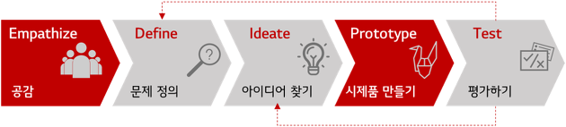
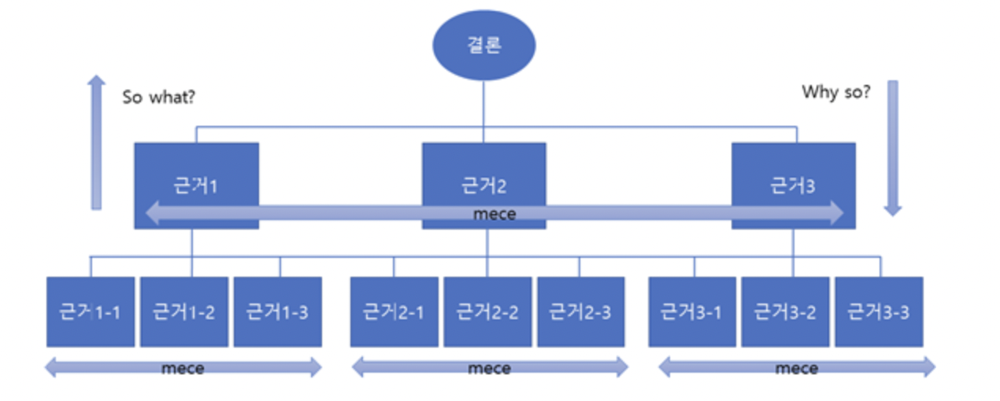

### 디자인 씽킹 Design Thinking

문제 정의를 중요시하는 프로세스

공감 : 관찰, 경험, 인터뷰 등을 통해 문제 원인 분석

문제 정의 : 실질적, 가치전달, 영감의 단계

 

### 피라미드 구조

내용이 어떻게 그룹핑 되었는지 보고받는 사람을 위한 구조화

과제 -> 결론 -> 결론의 근거 -> 근거의 요지

결론에 집중하게 도와준다

**세로의 법칙**

- 위에서 아래로 내려올땐 Why so?
- 아래에서 위로 갈땐 So what?

**가로의 법칙**

- MECE : 중복없이, 누락없이

**열거형 구조**

- **결론을 먼저 말하고자 할때, 상대가 쉽게 동의할 거라 생각될때**
- 결론 - 근거 1,2,3

**해설형 구조**

- **결론을 나중에, 논쟁이 예상될때**
- <결론> 사실 -> 판단 근거 -> 판단내용(정반합)

 

### AIDMA

Attention

Interest

Desire

Memory

Action

 

### 콘셉트를 잘 뽑는 4가지 방법

PACT

문제정의 -> 대안 및 해결책 도출 -> 대안의 핵심 발견 -> 프레이즈화(천둥처럼 울리는 문구)

 

### 4P 3C

4P : 상품, 가격, 유통경로(장소), 판촉활동(promotion)

3C : 자사, 고객, 경쟁사

-> MECE한 생각의 습관화 중요