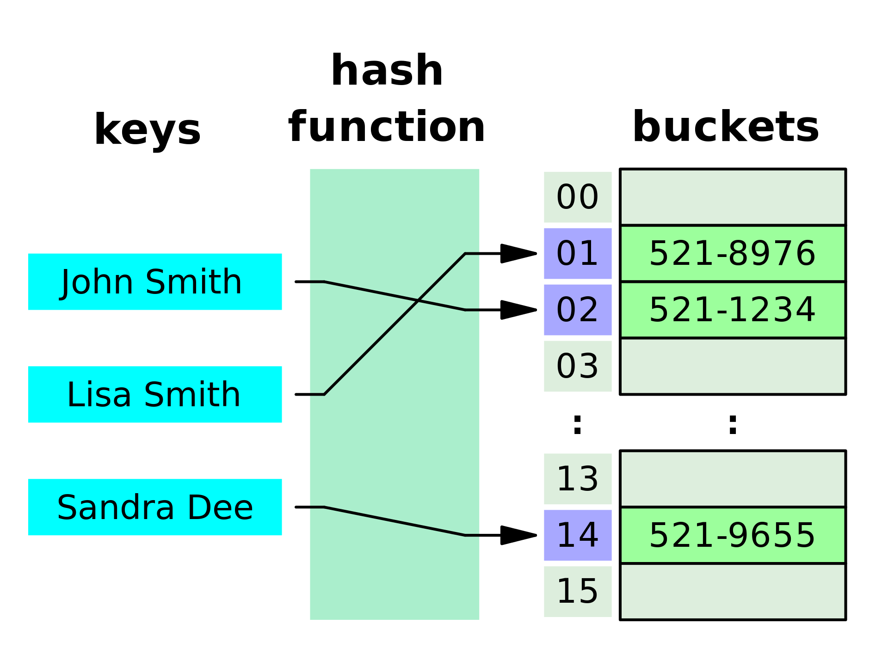
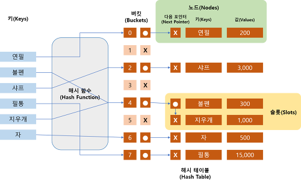

## 해쉬 테이블



Key에 Value를 저장하는 데이터 구조

파이썬의 딕셔너리 타입 예이다 -> 보통 배열로 사이즈 생성 후 사용한다

<br/>

<br/>

## 해쉬 테이블 용어

- **해쉬(Hash)** : 임의 값을 고정 길이로 변환하는 것
- **해쉬 테이블(Hash Table)** : 키값의 연산에 의해 직접 접근이 가능한 데이터 구조
- **해싱 함수(Hashing Function)** : Key에 대해 산술 연산을 이용해 데이터 위치를 찾을 수 있는 함수
- **해쉬 값(Hash Value) 또는 해쉬 주소(Hash Address)** : Key를 해싱 함수로 연산해서 해쉬 값을 알아내고, 이를 기반으로 해쉬 테이블에서 해당 Key에 대한 데이터 위치를 일관성 있게 찾을 수 있음
- **슬롯(Slot)** : 한 개의 데이터를 저장할 수 있는 공간
- 저장할 데이터에 대해 Key를 추출할 수 있는 별도 함수도 존재할 수 있음

<br/>

### 리스트 Comprehension

```python
# 해쉬 테이블 생성
hash_table = list([i for i in range(10)])
# [출력표현식 for 요소 in 입력 Sequence [if 조건식]]

# 종류가 다른 데이터에서 정수 리스트만 가져오기
dataset = [False, 49, "seunghye", 31.43, 6, 10]
int_data = [num for num in dataset if type(num)==int]
print(int_data) # [49, 6, 10]
```

<br/>

### 연습1: 리스트 변수를 활용해서 해쉬 테이블 구현해보기

- 해쉬 함수 : key ^% 8
- 해쉬 키 생성 : hash(data)

```python
hash_table = list([0 for i in range(8)])

def get_key(data):
  return hash(data)

def hash_function(key):
  return key % 8

def save_data(data, value):
  hash_address = hash_function(get_key(data))
  hash_table[hash_address] = value
  
def read_data(data):
  hash_address = hash_function(get_key(data))
  return hash_table[hash_address]

save_data('seunghye', '01043005555') 
save_data('cy', '01045778844') 

read_data('seunghye') # 2 # 01043005555
read_data('cy') # 0 # 01045778844

print(hash_table) ['01045778844', 0, '01043005555', 0, 0, 0, 0, 0]
```

<br/>

### 연습2 : 연습1의 해쉬 테이블 코드에 Chaining 기법으로 충돌해결 코드 추가해보기



> **Chaining 방식**은 Linked List를 이용하는 방법으로 저장하려는 **해시테이블에 이미 같은 키값의 데이터가 있다면, 노드를 추가**하여 다음 노드를 가르키는 방식으로 구현하는 것

```python
hash_table = list([0 for i in range(8)])

def get_key(data):
  return hash(data)

def hash_function(key):
  return key % 8

def save_data(data, value):
  index_key = gey_key(data)
  hash_address = hash_function(index_key)
  if hash_table[hash_address] != 0:
    for index in range(len(hash_table[hash_address])):
      if hash_table[hash_address][index][0] == index_key:
        hash_table[hash_address][index][1] = value
        return
    	hash_table[hash_address] = [[index_key, value]]
 
def read_data(data):
  index_key = get_key(data)
  hash_address = hash_function(index_key)
  
  if hash_table[hash_address] != 0:
    for index in range(len(hash_table[hash_address])):
      if hash_table[hash_address][index][0] == index_key:
        return hash_table[hash_address][index][1]
    return None
  else:
    return None

save_data('sh','01043885555')
save_data('st','01044998855')
save_data('sn','01033226666')

print(hash_table) # 
[
0, 
[[-7316118316409785375, '01043885555'], [-2016450872523258815, '01033226666']], << 충돌된 부분 chaining 처리
0, 
[[-6747111481167668693, '01044998855']], 
0, 
0, 
0, 
0
]
```

<br/>

### Linear Probing 기법

저장공간 안에서 충돌 문제를 해결하는 방법.

충돌이 일어나면 hash address의 다음 address부터 맨 처음 나오는 빈 공간에 저장하는 방법

```python
hash_table = list([0 for i in range(8)])

def get_key(data):
  return hash(data)

def hash_function(key):
  return key % 8

def save_data(data, value):
  index_key = get_key(data)
  hash_address = hash_function(index_key)
  if hash_table[hash_address] != 0:
    for index in range(hash_address, len(hash_table)):
      if hash_table[index] == 0:
        hash_table[index] = [index_key, value]
        return
      elif hash_table[index][0] == index_key:
        hash_table[index][1] = value
        return
  else:
    hash_table[hash_address] = [index_key, value]
    
def read_data(data):
  index_key = get_key(data)
  hash_address = hash_function(index_key)
  
  if hash_table[hash_address] != 0:
    for index in range(hash_address, len(hash_table)):
      if hash_table[index] == 0:
        return None
    	elif hash_table[index][0] == index_key:
        return hash_table[index][1]
  else:
    return None
```


