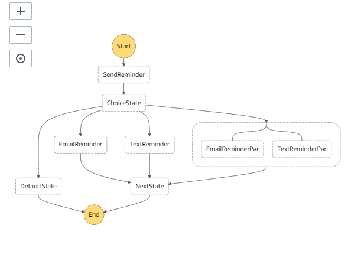

## Building a Serverless Application Using Step Functions, API Gateway, Lambda, and S3 in AWS


람다 함수 생성 > 상태머신 만들기 > API Gateway 설정 > S3 WebSite 


sms연동 람다함수 역할 정책

CloudWatch Logs : 제한쓰기

Pinpoint Email, SES, SNS, Step Functions : 모든 엑세스

```
{
    "Version": "2012-10-17",
    "Statement": [
        {
            "Action": [
                "logs:CreateLogGroup",
                "logs:CreateLogStream",
                "logs:PutLogEvents"
            ],
            "Resource": "arn:aws:logs:*:*:*",
            "Effect": "Allow"
        },
        {
            "Action": [
                "ses:*",
                "states:*",
                "sns:*"
            ],
            "Resource": "*",
            "Effect": "Allow"
        }
    ]
}
```


### Create a Step Function State Machine




**RoleForStepFunction** 

```
{
    "Version": "2012-10-17",
    "Statement": [
        {
            "Action": [
                "lambda:InvokeFunction"
            ],
            "Resource": "*",
            "Effect": "Allow"
        }
    ]
}
```


