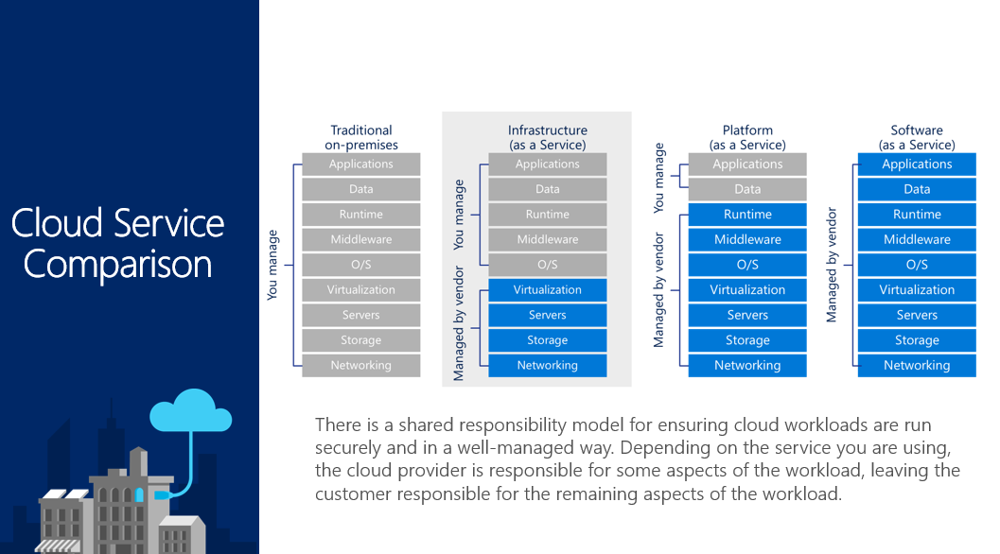
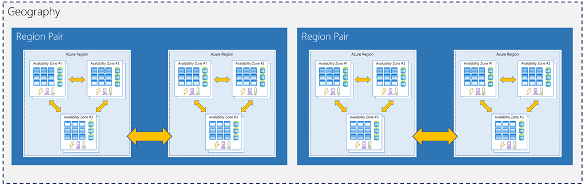
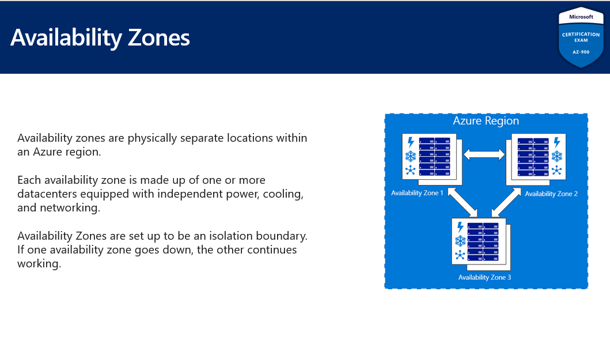
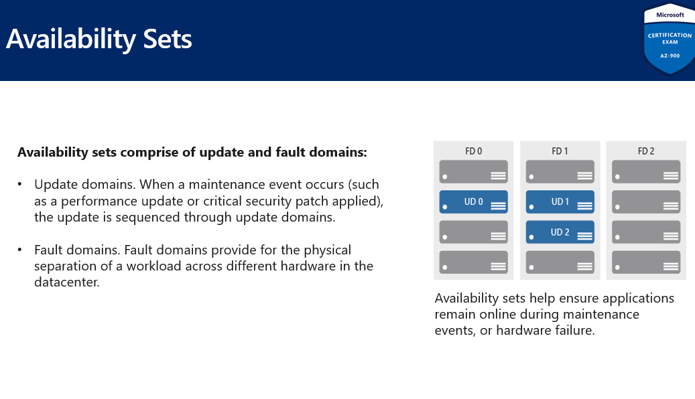

# DP-900

 

## 클라우드 개념 이해

`가용성` : 서비스가 중단없이 가동되고 실행되는 시간

`Agility(복원력)` : 지정상적인 조건에서 작동을 유지하는 시스템의 능력으로 자연재해, 시스템 유지관리, 사이트 트래픽 급증, DDos(분산 서비스 거부) 공격과 같은 위협이 포함

`대역폭` : 연결에 들어갈 수 있는 데이터의 양

- 대기시간 : 데이터가 대상에 도달하는 데 걸리는 시간

`확장성` : 주어진 시간의 수요나 작업량에 따라 사용되는 리소스와 서비스를 늘리거나 줄이는 개념

- 수직확장 - 기존 서버에 더 많은 리소스를 추가
- 수평확장 - 더 많은 서버를 추가

`민첩성` : 비즈니스 기회에 신속하게 적응하는 능력, 새로운 버전을 빠르게 출시

`Fault Tolerance(결함허용)` : 한 구성요소에 장애가 발생하면 백업이 그 자리를 대신, 예기치 못한 사고에서 고객이 영향받지 않게 한다

`재해복구` 

 

**규모의 경제** : 대규모로 운영할 때 효율적으로 또는 단위 당 더 낮은 비용으로 작업을 수행할 수 있는 능력

 

 

### 자본 지출과 운영지출의 차이

자본지출(CapEx) : 물리적인프라에 먼저 지출 후 추후 비용지불. 초기 비용

운영지출(OpEx) : 해당 서비스 또는 제품에 지출하고 있으며 현재 청구 되고 있다. 클라우드.

 

### 관리도구

- GUI(그래픽 사용자 인터페이스)를 통해 Azure와 상호작용하기 위한 **Azure Potal**
- **Azure** 와의 명령줄 및 자동화 기반 상호 작용을 위한 **Azure PowerShell** 및 **Azure** CLI( **명령줄 인터페이스** )
- 웹 기반 명령줄 인터페이스용 **Azure Cloud Shell**
- 모바일 장치에서 리소스를 모니터링하고 관리하기 위한 **Azure 모바일 앱**

 

### Azure Advisor

고가용성, 보안, 성능 및 보안에 대한 권장 사항을 제공하는 Azure에 내장된 무료 서비스. 배포된 서비스를 분석하고 이러한 4개의 영역에서 환경을 개선할 수 있는 방법을 찾는다

\- Azure Advisor를 사용하여 다음을 수행할 수 있습니다.

1. 사전 예방적이고 실행 가능하며 **개인화된 모범 사례 권장 사항**을 얻습니다.
2. 전체 Azure 비용을 줄일 기회를 식별하여 **리소스의 성능, 보안 및 고가용성을 개선**합니다.
3. 제안된 조치가 포함된 권장 사항을 인라인으로 가져옵니다.

 

 

### IaaS(Infrastructure-as-a-Service), PaaS(Platform-as-a-Service) 및 SaaS(Software-as-a-Service) 간의 차이점 설명

- ### IaaS(Infrastructure as a Service)

  클라우드 컴퓨팅 서비스의 가장 기본적인 범주입니다. IaaS를 사용할 경우 클라우드 공급자로부터 종량제 방식으로 서버와 VM(가상 머신), 스토리지, 네트워크, 운영 체제 등의 IT 인프라를 대여합니다.

  

- ### PaaS(Platform as a Service)

  PaaS(Platform-as-a-Service)는 소프트웨어 애플리케이션을 개발, 테스트, 제공 및 관리하기 위한 주문형 환경을 제공하는 클라우드 컴퓨팅 서비스를 의미합니다. **PaaS는 개발자가 개발에 필요한 서버, 스토리지, 네트워크 및 데이터베이스의 기본 인프라를 설정하거나 관리할 필요 없이 더 쉽고 빠르게 웹앱이나 모바일 앱을 만들 수 있도록 디자인**되었습니다.

  

- ### 서버리스 컴퓨팅

  PaaS와 중첩된 서버리스 컴퓨팅은 필요한 서버와 인프라를 지속해서 관리하는 데 시간을 소비하지 않고 앱 기능을 빌드하는 데 초점을 맞추고 있습니다. 클라우드 공급자가 설정, 용량 계획 및 서버 관리를 처리합니다. **서버리스 아키텍처는 확장성이 높고 이벤트를 기반으로 하며 특정 함수 또는 트리거가 발생하는 경우에만 리소스를 사용**합니다.

  

- ### SaaS(Software as a Service)

  SaaS(Software-as-a-Service)는 **인터넷을 통해 주문형과 일반적인 구독 방식으로 소프트웨어 애플리케이션을 제공하는 방법**입니다. SaaS를 사용할 경우 클라우드 공급자는 소프트웨어 애플리케이션과 기본 인프라를 호스트하고 관리하며 소프트웨어 업그레이드 및 보안 패치와 같은 유지 관리를 처리합니다. 사용자는 일반적으로 휴대폰, 태블릿 또는 PC에서 웹 브라우저를 사용하여 인터넷을 통해 애플리케이션에 연결합니다.

 

## 핵심 Azure 아키텍처 구성 요소 이해

**계층 구조** : 지리 > 리전 > 가용 영역 > 가용 세트(장애 도메인/업데이트 도메인)

- 특별 Azure지역 : ***US DoD Central\* , \*US Gov Virginia\* , \*US Gov Iowa\* 등:** " **미국 정부 기관 및 파트너"**, 중국 동부 북부, 독일 중부 북동부

 

`Region Pair(리전페어)` : **가용 영역은 하나 이상의 데이터 센터를 사용하여 생성되며 단일 지역 내에 최소 3개의 영역이 있습니다** . 그러나 **충분히 큰 재해로 인해 두 개의 데이터 센터에도 영향을 줄 수 있을 만큼 큰 정전이 발생할 수 있습니다** . 이것이 Azure에서 ***지역 쌍\*** 도 만드는 이유 입니다.

한 쌍의 지역은 직접 연결되어 있고 재해로 부터 격리될 만큼 충분히 떨어져 있으므로 안정적인 서비스와 데이터 이중화를 제공.

 

**가용성 영역** 은 **Azure 지역 내에서 물리적으로 별도의 위치입니다.** 각 가용 영역은 **독립적인 전원, 냉각 및 네트워킹을 갖춘 하나 이상의 데이터 센터로 구성**됩니다.

***가용 영역은 주로 VM, 관리 디스크, 로드 밸런서 및 SQL 데이터베이스용*** 

가용성 집합은 **업데이트 및 오류 도메인으로 구성**

1. **업데이트 도메인 —** 유지 관리 이벤트(예: 성능 업데이트 또는 중요한 보안 패치 적용)가 발생하면 업데이트는 업데이트 도메인을 통해 순서가 지정됩니다.
2. **장애 도메인 —** 장애 도메인은 데이터 센터의 여러 하드웨어에서 워크로드를 물리적으로 분리합니다.

 

 

### 리소스 그룹 설명

**리소스 그룹** 은 Azure 플랫폼의 기본 요소입니다. 리소스 그룹은 Azure에 배포된 리소스의 논리적 컨테이너입니다. 이러한 리소스는 가상 머신, Application Gateway 및 CosmosDB 인스턴스와 같은 Azure 구독에서 만드는 모든 것입니다. **모든 리소스는 리소스 그룹에 있어야 하며 리소스는 단일 리소스 그룹의 구성원만 될 수 있습니다**. **리소스는 언제든지 리소스 그룹 간에 이동할 수 있습니다**. **리소스 그룹은 중첩될 수 없습니다**. 리소스를 프로비저닝하려면 먼저 리소스 그룹을 배치해야 합니다.

1. **논리적 그룹화** — Azure 리소스를 관리하고 구성하는 데 도움이 되는 리소스 그룹이 있습니다. 비슷한 용도, 유형 또는 위치의 리소스를 배치하여 Azure에서 만드는 리소스에 몇 가지 순서와 조직을 제공할 수 있습니다.
2. **수명 주기** — 리소스 그룹을 삭제하면 그 안에 포함된 모든 리소스도 삭제됩니다.
3. **권한 부여** — 리소스 그룹은 RBAC(역할 기반 액세스 제어) 권한을 적용하기 위한 범위이기도 합니다. 리소스 그룹에 RBAC 권한을 적용하여 관리를 용이하게 하고 필요한 항목만 허용하도록 액세스를 제한할 수 있습니다.

