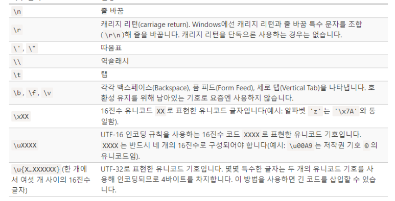

# 모던 자바스크립트 딥다이브#1


### 호이스팅

변수 선언문이 코드의 선두로 끌어 올려진 것처럼 동작하는 자바스크립트 고유의 특징

``` javascript
console.log(score); // undefined로 할당
var score = 50;
console.log(score); // 50
```

<br/>

불필요한 값들은 가비지 콜렉터에 의해 메모리에서 자동 해제된다

<br/>

### WeakRef (ES2021)

약한 참조

```javascript
var a = new WeakRef({a : 1});
a.deref();
```

<br/>

### 값

식이 평가되어 생성된 결과

모든 값은 데이터 타입을 가진다

### 리터럴

사람이 이해할 수 있는 문자 또는 약속된 기호를 통해 값을 생성하는 표기법

<br/>

### 문 statement

문은 프로그램을 구성하는 기본 단위이자 최소 실행 단위이다

<br/>

### 숫자타입

숫자타입은 모두 실수로 처리된다

```javascript
console.log(1 === 1.0) //true;
Object.is(0, -0) //false
```

<br/>

### 템플릿 리터럴

```javascript
var temp =.`Template Literal`;
console.log(temp);
```

본래 개행을 위해서 \를 사용하는데 템플릿 리터럴에서는 가능하다



<br/>

### Symbol Type

변경 불가능한 원시 타입 값으로 다른 값과 중복되지 않는 유일무이한 값

```javascript
var key = Symbol('key');

// 이름 충돌의위험이 없으므로 유일무이한 값인 심벌을 프로퍼티의 키로 사용한다
var obj = {};
obj[key] = 'value';
```

<br/>

typeof null -> Object

<br/>

### 드모르간 법칙

```javascript
!(x || y) === (!x && !y)
```

<br/>

### 지수 연산자

Math.pow(2,2) == 2**2

<br/>

### 그외

옵셔널 체이닝

```javascript
const obj = {
  a: {
    b: {
      c: {
        d :1
      }
    }
  }
}

obj?.a?.b?.c?.d	//1
```

