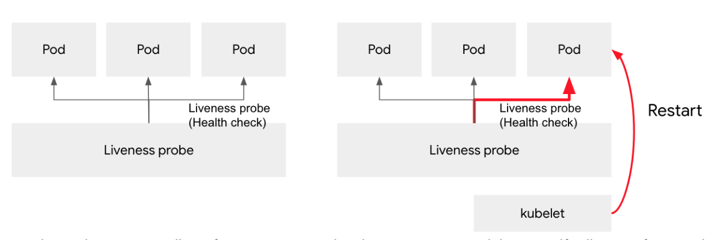
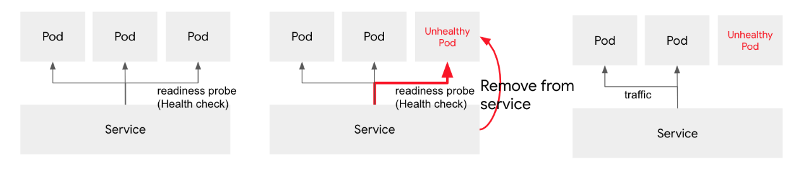
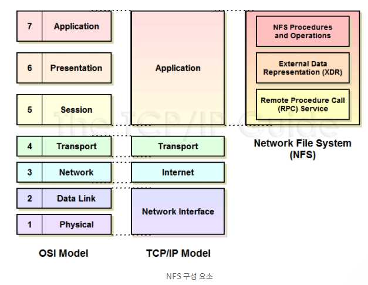
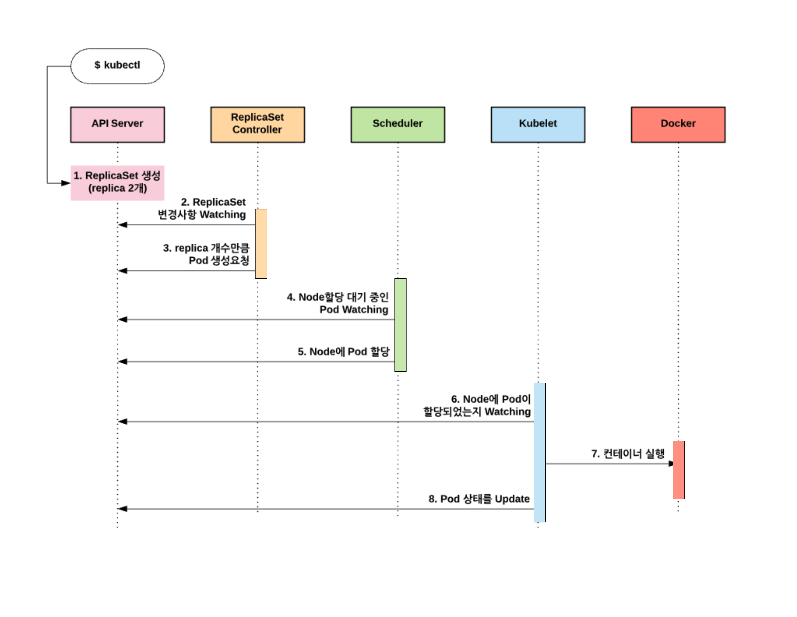

## Liveness and Readiness Healthchecks

<br>

## Probe types

Liveness probe와 readiness probe는 컨테이너가 정상적인지 아닌지를 체크하는 방법으로 다음과 같이 3가지 방식을 제공한다.

- Command probe
- HTTP probe
- TCP probe

## Liveness Probe

Liveness probe는 컨테이너의 상태를 주기적으로 체크해서, 응답이 없으면 컨테이너를 자동으로 재시작해준다. 컨테이너가 정상적으로 기동중인지를 체크하는 기능이다.


Liveness probe는 Pod의 상태를 체크하다가, Pod의 상태가 비정상인 경우 kubelet을 통해서 재 시작한다.



<br>

## Readiness probe

컨테이너의 상태 체크중에 liveness의 경우에는 컨테이너가 비정상적으로 작동이 불가능한 경우도 있지만, Configuration을 로딩하거나, 많은 데이타를 로딩하거나, 외부 서비스를 호출하는 경우에는 일시적으로 서비스가 불가능한 상태가 될 수 있다. 이런 경우에는 컨테이너를 재시작한다 하더라도 정상적으로 서비스가 불가능할 수 있다. 이런 경우에는 컨테이너를 일시적으로 서비스가 불가능한 상태로 마킹해주면 되는데, 이러한 기능은 쿠버네티스의 서비스와 함께 사용하면 유용하게 이용할 수 있다. 


예를 들어 쿠버네티스 서비스에서 아래와 같이 3개의 Pod를 로드밸런싱으로 서비스를 하고 있을때, Readiness probe 를 이용해서 서비스 가능 여부를 주기적으로 체크한다고 하자. 이 경우 하나의 Pod가 서비스가 불가능한 상태가 되었을때, 즉 Readiness Probe에 대해서 응답이 없거나 실패 응답을 보냈을때는 해당 Pod를 사용 불가능한 상태로 체크하고 서비스 목록에서 제외한다. 




<br><br>

Liveness probe와 차이점은 Liveness probe는 컨테이너의 상태가 비정상이라고 판단하면, 해당 Pod를 재시작하는데 반해, Readiness probe는 컨테이너가 비정상일 경우에는 해당 Pod를 사용할 수 없음으로 표시하고, 서비스등에서 제외한다. 


<br><br>

<br>

## **Running Stateful Services on Kubernetes**

**Learn how to run stateful services on Kubernetes**


### 시나리오

- **Persistent Volume(PV) 만들기(NFS 이용)**

- **Persistent Volume Claim(PVC) 만들기**

- **PV와 PVC 매핑하기**

- **PV에 작성된 데이터 확인하기**

  - PV에 변경된 데이터 확인

  - 작성된 데이터를 다른 파드에서 확인


<br><br><br>


### 개념이해

볼륨은 쿠버네티스의 디스크 서비스이다


시스템 관리자는 실제 물리 디스크 생성 후 이 디스크를 PersistentVolume이라는 이름으로 쿠버네티스에 등록

개발자는 Pod를 생성할때, 볼륨을 정의하고, 이 볼륨 정의 부분에 물리적 디스크에 대한 특성을 정의하는 것이 아니라 PVC를 지정하여, 관리자가 생성한 PV와 연결

시스템 관리자가 생성한 **물리 디스크를 쿠버네티스 클러스터에 표현한것이 PV**이고, **Pod의 볼륨과 이 PV를 연결하는 관계가 PVC**가 된다

<br><br>

**NFS 프로토콜(Network File System Protocol)**




클라이언트가 네트워크 상에 있는 파일을 접근할 때 사용하는 프로토콜

클라이언트 호스트가 원격 서버에 마치 로컬 파일 처럼 접근하기 위해 개발

구조적으로 TCP/IP 어플리케이션 계층에 존재

- **작동원리**
  - NFS 데몬을 실행하는 마스터 노드를 사용해서 데이터를 조작
  - 클라이언트는 드라이브 마운트를 통해 공유된 마스터에 접근
  - 애플리케이션 관점에선 로컬 디스크에 쓰는 것처럼 보인다
  - 내부적으로는 NFS 프로토콜이 마스터 노드에 데이터를 쓴다.

- **단점** : 전체적인 파일을 같이 공유 하기 때문에 보안에는 취약점이 존재한다.

<br>

<br>

<br>

## Use Kubernetes To Manage Secrets And Passwords

### 개념이해

**시크릿**

**쿠버네티스 시크릿**을 사용하면 비밀번호, OAuth 토큰, ssh 키와 같은 **민감한 정보**를 **저장**하고 **관리**할 수 있다.

-기밀 정보를 시크릿에 저장하는 것이 파드(Pod) 정의나 컨테이너 이미지 내에 그대로 두는 것보다 안전하고 유연하다.

-시크릿은 암호, 토큰 또는 키와 같은 소량의 중요한 데이터를 포함하는 오브젝트이다.

-쿠버네티스 시크릿은 기본적으로 **암호화되지 않은 base64 인코딩 문자열로 저장**된다.

- **장점**
  - 민감 데이터에 대해 리스크를 줄일 수 있다.
  - Pods 밖에 만들어서 운영 관리가 쉽다.
  - Kubernetes Master에 ETCD DB(민감 정보 DB)에 저장해 관리 가능하다.
  - Volumes 나 Env variables, 사용해 운영한다.
  - 오직 타겟 노드 하나에만 전송하기 때문에 보안에 좋다.

<br>

**base64 인코딩**

**인코딩**(encoding)

정보의 형태나 형식을 표준화, 보안, 처리 속도 향상, 저장 공간 절약 등을 위해서 다른 형태나 형식으로 변환하는 처리 혹은 그 처리 방식

Base64란 Binary Data를 Text로 바꾸는 Encoding의 하나로써 Binary Data를 Character set에 영향을 받지 않는 공통 ASCII 영역의 문자로만 이루어진 문자열로 바꾸는 Encoding

**Base64 Encoding은 Binary Data를 Text로 변경하는 Encoding**

<br><br><br>

<br>

## Logging with EFK




*블로그 참조 이미지*


EFK(Elasticsearch + Fluentd + Kibana) STACK을 구축

로그 데이터들을 수집하고 분석하여 시각화 해주는 것    

E : ElasticSearch (DB & 검색엔진) 설치

```
$kubectl create namespace logs

#elastic search 다운 
$kubectl repo add elastic https://helm.elastic.co  

#elastic search 설치
$helm install elasticsearch elastic/elasticesearch \
  --version=7.9.0 \
  --namespace=logs \
  -f elastic-values.yaml
```

<br>

F : Fluntd (데이터 수집기) 설치

```
$helm repo add fluent https://fluent.github.io/helm-charts

$helm install fluent-bit fluent/fluent-bit \
  --version 0.6.3 \
  --namespace=logs
```

<br>

K : Kibana (데이터 시각화, 대시보드) 설치

```
$helm install kibana elastic/kibana \
  --version=7.9.0 \
  --namespace=logs \
  --set service.type=NodePort \
  --set service.nodePort=31000
```


 **Fluentd** : 데이터(로그)를 수집해서 Elasticsearch로 전달

> Fluentd란 오픈소스 데이터(로그) 수집기이다. 보통 로그를 수집하는데 사용하지만, 다양한 데이터 소스(HTTP, TCP)로부터 데이터를 받아올 수 있다. Fluentd로 전달된 데이터는 tag, time, record(JSON) 로 구성된 이벤트로 처리되며, 원하는 형태로 가공되어 다양한 목적지(ElasticSearch, S3 등)로 전달될 수 있으며 Fail-Over를 위한 HA(High Availability) 구성도 가능

<br>

2) **Elasticsearch** : Fluentd로부터 받은 데이터를 검색 및 집계하여 필요한 정보 획득

> Elasticsearch는 아파치 루씬 기반의 확장성이 좋은 JAVA 오픈소스 분산 검색엔진이다. 많은 양의 데이터를 보관하고 실시간으로 저장, 검색, 분석할 수 있게 해준다.
>
> Elasticsearch는 다음과 같은 특징을 가지고 있다.
>
> 1) 테이블과 스키마 대신에 문서 형식(JSON)으로 저장한다.
>
> 2) 쿼리 속도가 매우 빠르며 확장성이 뛰어나다
>
> 3) 에러에 대한 높은 탄성을 가지고 있으며 데이터 타입에 유연하다
>
> 4) 빅데이터를 처리할 때 매우 유리하다.

<br>

3) **Kibana** : Elasticsearch의 빠른 검색능력을 통해 **데이터 시각화 및 모니터링**

> Kibana는 Elasticsearch에서 색인된 데이터를 검색하고 시각화하는 오픈소스 도구이다. Elasticsearch의 데이터(로그)를 차트와 그래프 등을 활용하여 대쉬보드 형태로 시각화 할 수 있다. 

<br>

<br><br>


## Getting Started with Kubeless


<br>


### what is kubeless?

Kubeless는 기본 인프라에 대해 걱정할 필요없이 작은 코드 (함수)를 배포 할 수있는 

Kubernetes 네이티브 서버리스 프레임 워크

<br>

서버리스의 개념으로 서버 없이, 빌드 없이 function을 배포한다는 점에서

●AWS Lambda

●Azure Functions

●Google Cloud Functions

와 비슷한 기능 역할을 한다고 볼 수 있다.

<br>

### Kubeless의 3가지 개념

- functions — 실행해야하는 사용자 코드. 함수에는 런타임 종속성 및 빌드 지시문같은 기타 정보도 포함
- triggers — 기능과 관련된 이벤트 소스. 이벤트 소스를 생산자와 비교하고 함수를 실행자와 비교하는 경우 트리거는 이들을 서로 연결하는 다리 역할.
- runtime - 기능을 실행하는 데 필요한 환경.

<br>

### 개념이해

네임스페이스란 쿠버네티스 클러스터 내의 논리적인 구분단위이다

> 예를 들어 하나의 클러스터에 개발/운영/테스트 환경이 있다. 하나의 클러스터 환경에서 위의 세 환경을 모두 운영하면 분리가 되어있지 않기 때문에 혼란이 생길 수 있다. 이럴 때 네임스페이스를 사용하여 각각의 환경마다 논리적인 분리를 통한 구분이 가능하다. 또한 ResourceQuota를 사용하여 네임스페이스마다 CPU, MEMORY등의 개별적인 리소스 할당이 가능하다.

