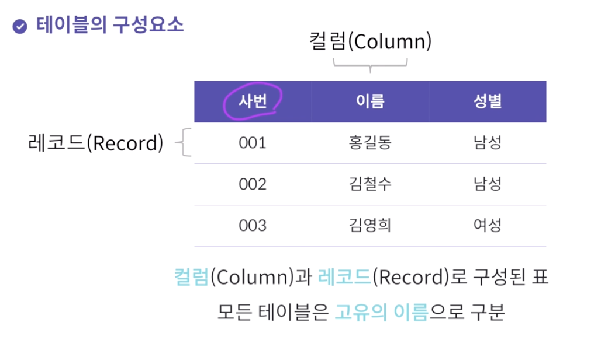
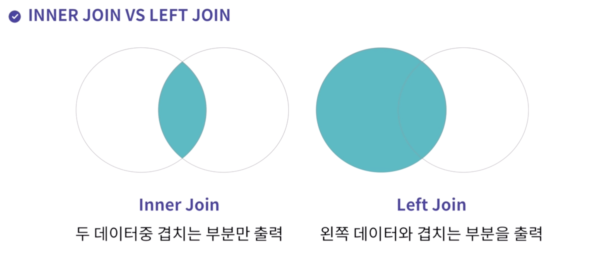
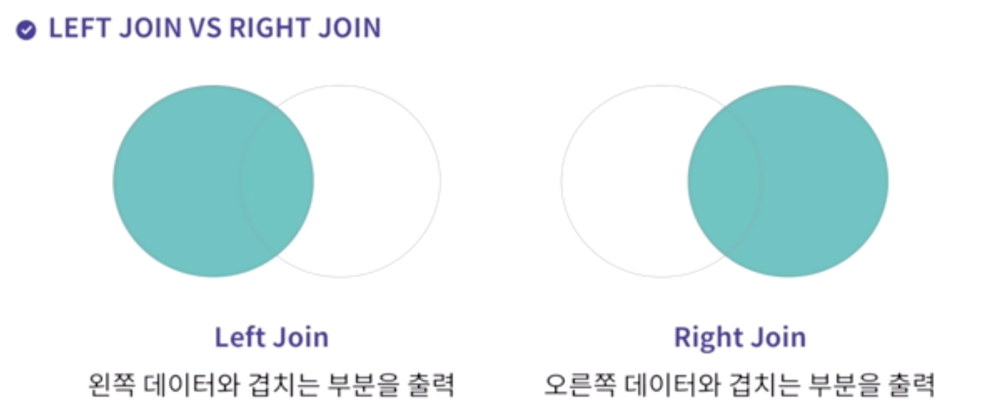

# SQL 정리
#TIL/velog

## 테이블구조

*desc* : 테이블 구조를 출력

*관계형 데이터베이스* : SQL로 제어
*비관계형 데이터베이스*



칼럼 : 주제, 제목	/	레코드 : 내용, 값

* SELECT + 검색할 대상(칼럼) + FROM + 테이블명 + WHERE + 조건
* SELECT * FROM book -> 모든 데이터를 검색한다

<br />


### DISTINCT 
::뒤에 나오는 칼럼의 중복을 제거하고 보여준다::
2개 이상의 칼럼을 적으면 한쪽 중복이 있어도 다른 쪽 칼럼 값이 다르면 다르게 취급한다

검색할 데이터 앞에 *DISTINCT*를 입력하여 사용한다

```sql
SELECT DISTINCT title, author
FROM book;
```

<br />

### IN

```sql
-- 해당하는 작가가 쓴 책만 골라서 출력합니다.
SELECT * FROM book
WHERE author in ('William Shakespeare', 'John Ronald Reuel Tolkien', 'Joanne Kathleen Rowling');
```

<br /><br />

## SQL 명령어

DML : 데이터 조작어
DDL : 데이터 정의어
DCL : 데이터 제어어
TCL : 트랜잭션 제어어

*키워드 검색*
`SELECT * FROM book WHERE title LIKE ‘어린왕자’;`
LIKE의 다양한 형태(와일드카드)
`SELECT * FROM book WHERE title LIKE ‘%왕자';`

<br />

### ORDER BY

`SELECT * FROM score ORDER BY math DESC;`
값이 높은 데이터부터 정렬하여 검색
ASC - 오름차순 / DESC - 내림차순

<br />

### INSERT

`INSERT INTO book(id, title, author, publisher) VALUES('3', '햄릿', '윌리엄', '엘리스 출판');`
컬럼에 맞는 value를 작성해준다

<br />

### UPDATE

`UPDATE book SET title='돈키호테 1' WHERE title='돈키호테';`

<br />

### DELETE

`DELETE FROM book WHERE title = '돈키호테 1';`

<br /><br />

## SQL과 함수
* 데이터 값을 계산하거나 조작 : 행 함수
* 행의 그룹을 계산하거나 요약 : 그룹 함수
* 열의 데이터 ㅌ타입을 변환

<br />

### COUNT
검색한 결과의 데이터의 개수를 가져오는 내장함수
NULL인 데이터는 제외

`SELECT COUNT(id) FROM book;`
book 테이블 안에 있는 id 칼럼의 개수를 개수
`*` : 모든 데이터를 검색하는 와일드 카드

### LIMIT
데이터의 일부만 보고 싶다면, 출력하고자하는 데이터 개수를 제한
```sql
//book 테이블에서 데이터를 5개만 가져오기
SELECT * FROM book LIMIT 5;
//2번째 데이터부터 5개를 가져오기
SELECT * FROM book LIMIT 1, 5;
```

`LIMIT 1, 5` 는 2번째 칼럼부터 5개를 가져오라는 의미이다

<br />

### SUM & AVG

SUM : 지정한 *컬럼값*을 모두 더하여 총점을 구해주는 내장함수
AVG : 지정한 *컬럼*들의 평균값을 구해주는 내장함수

```sql
SELECT SUM(math) FROM book;
SELECT AVG(korean), AVG(english) FROM grade;
```

<br /><br />

## 데이터 그룹 짓기
### 다수의 테이블 제어하기
데이터를 그룹화한다면?
```sql
SELECT user_id, COUNT(*)
FROM rental
GROUP BY user_id;
```
<br />

그룹의 기준칼럼으로 테이블 내의 컬럼을 그룹짓는다

```sql
SELECT user_id, SUM(칼럼명) FROM rental GROUP BY user_id;
-- user_id가 같은 열에서 컬럼의 내용을 다 더한 값을 출력
```

<br />

두번 이상 대여한 사람들을 그룹화 된 것에서 그룹화를 어떻게?
**1번 이상의 대여를 한 사람을 구하는 sql문**

```sql
SELECT user_id, COUNT(*)
FROM rental
GROUP BY user_id
HAVING COUNT(user_id) > 1;
```

<br />

여러 테이블의 정보를 한번에 조회한다면?

```sql
SELECT *
FROM rental
INNER JOIN user;
```
JOIN : 여러 테이블을 서로 연결한다
inner join, left join, right join

조건을 적용하여 두개의 테이블을 조회하기
*테이블이름.컬럼명*으로 구분한다
```sql
SELECT *
FROM rental
INNER JOIN user
ON user.id = rental.user_id;
```

<br />

*LEFT JOIN*
왼쪽 테이블의 모든 값을 포함하여 연결하기

```sql
SELECT *
FROM user
LEFT JOIN rental
ON user.id = rental.user_id;
```



<br />

*RIGHT JOIN*
오른쪽 테이블의 모든 값을 포함하여 연결하기

```sql
SELECT *
FROM user
RIGHT JOIN rental
ON user.id = rental.user_id;
```




> 데이터 그룹 짓기 : group by
> 데이터 그룹 + 조건 추가하기 : having
> 두 개의 테이블 조회하기 : inner join, left join, right join
> 두 개의 테이블 + 조건 추가하기 : on
> on A테이블.컬럼 = B테이블.컬럼