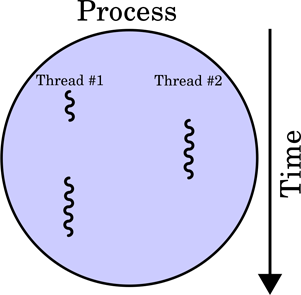

## words

`동기` : 어떤 요청을 보낸 뒤, 그 요청의 결과값을 얻기까지 `작업을 멈추는 것`

`비동기` : 어떤 요청을 보낸 뒤, 그 요청의 결과값을 얻기까지 멈추지 않고 다른 일을 수행

- 자바스크립트의 비동기
- [자바스크립트 비동기 처리와 콜백 함수 • 캡틴판교 (joshua1988.github.io)](https://joshua1988.github.io/web-development/javascript/javascript-asynchronous-operation/)

 

## Start Line

프로그램 : 파일이 저장 장치에 저장되어있지만 메모리에는 올라가 있지 않은 정적인 상태

즉 독립적인 메모리 공간을 할당하지 않은 상태

프로그램이 복잡해지고 프로세스 하나만을 사용해서 

 

 

## Process with Thread

> **Process** : 보조기억 장치의 프로그램이 **메모리 상으로 적재되어 실행되면 프로세스**
>
> **Thread** : 같은 프로세스 내에서 실행되는 **여러 작업(흐름)의 단위**

**프로세스**는 독립된 영역인 **힙**을 할당받는다

**쓰레드**는 프로세스 하위에 종속되는 보다 작은 단위이다. 각각의 쓰레드는 독립된 메모리 영역인 **스택**을 가진다. (하나의 스택 메모리=하나의 쓰레드 생성) 각 쓰레드는 다른 쓰레드에게 스택 메모리를 공유할 수 없다. 하지만 프로세스의 힙은 속한 모든 쓰레드가 공유할 수 있다.

 

 

## 동시성 vs 병렬성

### 동시성

동시성 프로그래밍은 말 그래도 동시에 여러 작업을 수행하는 것이다. **시분할 기법**을 사용하여 **조금씩 번갈아가며 실행**하는 것

### 병렬성

병렬성 프로그래밍은 시분할 기법없이 찐으로 여러 작업을 한 번에 동시에 수행하는 것. 즉 **CPU코어**가 여러개 일 때 가능하다.

 

 

## Thread vs Coroutine

### 개요

- 쓰레드는 **각 태스크에 해당하는 스택 메모리를 할당**받는다. 그리고 **여러 작업을 동시에 수행**해야할 때 OS 는 **어떤 쓰레드 작업을 먼저 수행**할지, **어떤 쓰레드를 더 많이 수행**해야 **효율적**인지에 대한 **스케쥴링** (**선점 스케쥴링, Preempting Scheduling**) 을 해야 한다.
- **Coroutuine** 은 **Lightweight Thread** 라고 부른다. (코틀린 기준, 공식 문서에도 이렇게 설명되어 있다) 마찬가지로 **작업 하나하나를 효율적으로 분배해서 동시성을 보장하는 것을 목표**로 하지만, 작업 하나하나에 **Thread 를 할당하는 것이 아닌** '**Object**' 를 **할당**해주고, 이 **Object** 를 자유롭게 **스위칭함으로써 Context Switching 비용을 대폭 줄인** 것이다.

 

### 쓰레드

- 작업 하나하나의 단위
  - 각 쓰레드가 독립적인 스택 메모리를 할당 받는다
- 동시성 보장 수단 : Context Switching(문맥 교환)
  - 운영체제 커널에 의한 문맥교환을 통해 동시성 보장
  - 블록킹(Blocking) : 쓰레드 A가 쓰레드 B의 결과가 나오기까지 기다려야한다면, A는 블로킹되어 B결과가 나올때까지 자원을 사용하지 못한다

### Coroutine

- 작업 하나하나의 단위 : Coroutine Object
  - 여러 작업 각각에 Object 를 할당함
  - Coroutine Object 도 엄연한 객체이기 때문에 **JVM Heap 에 적재** 됨 (코틀린 기준)
- 동시성 보장 수단 : Programmer Switching (No-Context Switching)
  - 프로그래머의 코드를 통해 **Switching** 시점을 **마음대로** 정함 (OS 관여 X)
  - **Suspend** (Non-Blocking) : Object 1 이 Object 2 의 **결과가 나오기까지 기다려야 한다**면, Object 1 은 **Suspend** 되지만, Object 1 을 수행하던 **Thread 는 그대로 유효하기** 때문에 Object 2 도 Object 1 과 **동일한 Thread 에서 실행**될 수 있음

 

> ### 💡 여기서 알 수 있는 점
>
> **Coroutine 은 Thread 의 대안이 아니라, Thread 를 더 잘게 쪼개어 사용하기 위한 개념이다.**
>
> - 작업의 단위를 **Object** 로 축소하면서 하나의 **Thread** 가 다**수의 코루틴을 다룰 수 있기 때문에,** 작업 하나하나에 Thread 를 할당하며 **메모리 낭비, Context Switching 비용 낭비를 할 필요가 없음**
> - 같은 프로세스 내의 **Heap 에 대한 Locking 걱정 또한 사라짐**

 

