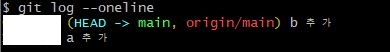

## 01. 작업공간 확장

**하나의 GitHub 레포지토리를 이용하여 서로 다른 장소에서 작업하기**

GitHub 내부에서도 Edit, New를 통하여 `commit` 이 가능하다


> 그림은 특강 자료


로컬(집)에서 `commit` → 깃허브에서 변경시 `pull` 하여 연동

→ 다른 장소(회사)에서 받아올 때 다시 `pull(clone)` 연동 → 작업 후 깃허브에 `commit`

→ 집으로 돌아와서 `pull` 을 통해 연동


### 예시 순서

**강의장 깃-깃허브 연동**

`git init` → `touch a.txt` → `git add a.txt` → `git commit -m 'a 추가'`

`git remote add origin (주소)` → `git remote -v` → `git push origin main(master)`

*master를 main*으로 변경

`git config --global init.defaultBranch 'main'` 을 사용하여 변경해 준다

`git push origin main:master`


**집에서 commit으로 받아오기**

깃허브에 만든 레포지토리의 Clone 을 이용해서 작업해보자


`git clone [https://github.com/aaa/TIL-test.git](https://github.com/eumdengs/TIL-test.git)` → `touch b.txt` → `git add b.txt`

→ `git commit -m 'b 추가'`  → `git push origin main`

- git clone을 통해 init과 remote add를 생략가능


**다시 강의장으로**

`git pull origin main` 을 통하여 집에서 한 작업을 가져와서 마저 이어간다




**HEAD**는 가장 최근 commit을 뜻한다. c 추가를 해주게 되면


위와같이 나오고 origin/main을 통해 깃허브 main 브랜치의 최신 위치를 알 수 있다


## **02. Push Error**

- Pull을 빠뜨린 경우
- e를 commit 하고 push 하게되면 아래와 같은 오류가 발생한다

```
$ git push origin main
To https://github.com/aaa/TIL-test.git
 ! [rejected]        main -> main (fetch first)
error: failed to push some refs to 'https://github.com/aaa/TIL-test.git'
# push 실패
hint: Updates were rejected because the remote contains work that you do
# 업데이트가 실패했는데, remote가 너가 local에 가지고 있지 않은 작업들이 존재한다
hint: not have locally. This is usually caused by another repository pushing
# 지금 같은 경우 다른 Repo로 push 하려고 시도한 것이거나 
hint: to the same ref. You may want to first integrate the remote changes
# remote에서 발생한 변경 사항을 먼저 통합/반영해야 할 수 있다
hint: (e.g., 'git pull ...') before pushing again.
hint: See the 'Note about fast-forwards' in 'git push --help' for details.

```

- `git pull origin main`

    ```

    ```

    오류 메시지가 생성되고 `merge commit message`를 작성해주어야한다

    - vim 에디터 생성
        - esc -> : -> wq -> enter
    - 순으로 빠져나오면 된다


## **03. 취소하기**

1. git add 취소하기
    - git add가 된 상황

        ```
        $ git status
        On branch main
        Changes to be committed:
          (use "git restore --staged <file>..." to unstage)
                new file:   f.txt

        ```

        ```
        git restore --staged f.txt
        ```

    - 구버전

        ```
        git reset HEAD f.txt
        ```

        ```
        $ git status
        On branch main
        Untracked files:
          (use "git add <file>..." to include in what will be committed)
                f.txt

        nothing added to commit but untracked files present (use "git add" to track)
        ```

2. git commit 취소하기(되돌아가기)

    ```
    $ git reset (--mixed) [돌아갈 commit의 hash (d0fc2de같은)]
    ```

    ```
    $ git reset d0fc2de
    ```

    - 옵션

        ```
        $ git reset --mixed [hash]
        ```

        - staging 없임 + 작업한 것은 남아있음

        ```
        $ git reset --soft [hash]
        ```

        - staging 그대로 유지 + 작업한 것은 남아있음

        ```
        $ git reset --hard [hash]
        ```

        - **[주의]** 완전히 취소하는 것(작업한 것도 삭제)
        
          
    - hash

        ```
        $ git log
        commit c9a8984ba3f0796167b57d7a29c78f5c5870fa9d (HEAD -> main, origin/main)
        ```

        commit을 구분하는 용도로 사용된다

        

    - `HEAD`의 상대적 위치
        - `HEAD~(숫자)`
            - HEAD~1 = HEAD~
            - HEAD~2

        ```
        $ git reset HEAD~
        ```

        - commit 되돌리기
            - HEAD~1 (1단계 전으로 되돌리고)
            - `-mixed` (staging은 취소, 작업 내용은 유지)
    - `git log`시 내용이 너무 많이 잘리는 경우
        - q로 종료
        
        - 방향키로 위아래 이동이 가능하다
        
          

3. WD(Working Directory) 변경 내용 취소(삭제)하기, 원상복구
    - WD
        - 우리가 지금 작업 중인 공간
        - Git이 관리하고 있는 공간
        - 기록이 한 번이라도 된 파일이 있는 공간

    ```
    $ git restore [파일명]
    $ git restore a.txt
    ```

    - 구버전

    ```
    $ git checkout --[파일명]
    ```


## **04. gitignore**

- 우리가 git으로 관리하고 싶지 않은 파일들을 제외시키는 방법(**중요!**)
    - 우리가 원하지 않는 파일들을 제외
    - 외부에 공개되면 안되는 것들
    - **처음부터 관리가 들어가야한다**(기록되기 전에 이용해야한다)
    
- `.gitignore`
    - `.gitignore`에 작성된 파일들은 git으로 관리하지 않겠다..무시하자는 의미

    ```
    .DS_Store
    # Mac OS에서만 사용되는 파일
    ```

- 작성법

    ```
    f.txt #특정파일
    secret/ #특정폴더, 하위 파일들도 제외된다
    *.png #특정 확장자를 제외 가능, 모든 png는 제외한다
    !profile.png #모든 png는 빼고, profile.png는 포함시킨다
    ```

- 처음부터 git으로 관리한 적이 없을 때부터 관리를 해줘야한다

- 그렇다면 이미 commit을 한 파일들은 어떻게 제외할 수 있을까?
    1. `.gitignore` 에다가 파일을 명시
    2. `git rm --cached [파일명]`
        - git에서 더 이상 관리하지 않겠다는 의미
        - WD에서 삭제해서 더 이상 쳐다보지 않는 것! 관리X
    
- `.DS_Store` : Mac OS

- `Thumbs.db` : Windows


## 05. Branch

**branch : 가지(치기)**

1. 협업시 문제
    1. 충돌
    2. 기다림 → `push`를 상대에게 알려야한다

`git pull` = `fetch` + `merge`

fetch는 다운로드만 한다

merge는 commit들과 download된 것을 합쳐주는 역할을 한다

Branch를 이용해서 충돌방지와 기다림의 문제를 해결할 수 잇다


2. 명령어

- `git branch` : 브랜치 목록 확인
- `git branch login` : `login` 브랜치를 생성
- `git switch login` : `login` 브랜치로 이동

    ```
    $ git switch login
    Switched to branch 'login'
    ```

- `git log --oneline --graph --all`
    
    - 한줄로, 그래프포함, 브랜치 모두
- `git switch -c login` : 브랜치를 만들면서 바로 이동
    - `git branch login` + `git switch login`
    - 구버전
        - 이동 : `git checkout login`
        - 생성하면서 이동 : `git checkout -b login`


## 06. Merge Branch

1. Fast-Forward

   

   

    메인을 아무 작업하지 않고 가지작업을 합치면 원래 main처럼 적용된다

    ```bash
    (main)  $ git switch -c login
    (login) $ git touch login.txt -> add/commit
    (login) $ git switch main
    ```

    ```bash
    $ git merge login
    Updating f5dd448..7bc49d8
    Fast-forward
     login.txt | 0
     1 file changed, 0 insertions(+), 0 deletions(-)
     create mode 100644 login.txt
    ```

    ```bash
    $ git log --oneline --graph --all
    * 7bc49d8 (HEAD -> main, login) login add
    * f5dd448 c추가
    * 96d5453 a 추가
    ```

    `git branch -d login` : login 브랜치를 삭제

   

2. 3-Way Merge


3. Merge Conflict

  - 3-Way 상황에서 충돌이 발생한 상황
  - 특정 지점에서 같은 부분을 건드리다가 충돌발생

    

    같은 이름의 파일을 만들고 merge를 시도하면...

    ```bash
    ************** ~/multicampus/git-merge (main)
    $ git merge signup
    CONFLICT (add/add): Merge conflict in README.md
    Auto-merging README.md
    Automatic merge failed; fix conflicts and then commit the result.

    ************** ~/multicampus/git-merge (main|MERGING)
    $
    ```

    README.md로 들어가면

    ```bash
    # Merge Branch

    <<<<<<< HEAD
    - main에서 작성한 코드!
    =======
    - signup에서 작성한 코드!
    >>>>>>> signup
    ```

    → 이후 코드를 수정해서 합의, 삭제, 선정을 한다

    ```bash
    # Merge Branch

    - main과 signup이 합의해서 작성한 코드!
    ```


>gitignore.io	https://www.toptal.com/developers/gitignore