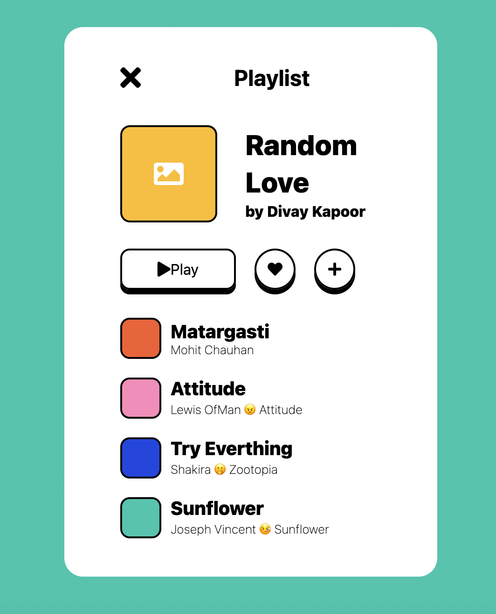
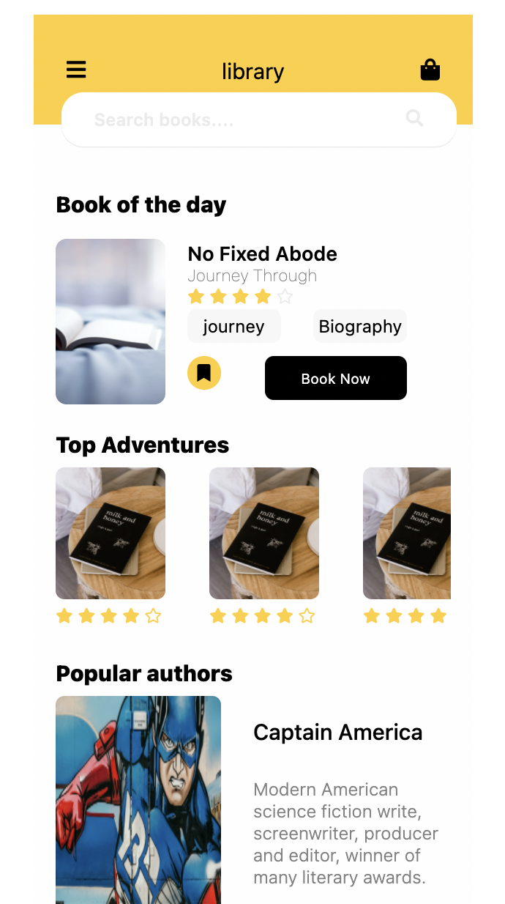

#TIL/html
#TIL/css

<br />

## ShortCut Vscode
`!` + tap -> html문서 자동 생성
`shift + alt(option) + 아래방향키` : 해당 줄 복사

* div.id + tap -> id라는 class명의 div 생성
* div#id + tap -> id라는 id명의 div 생성

<br />

## Kokoa-Clone
클래스 명은 길게 써주면 좋다(부모의 클래스명을 참조)
```html
<div id="status-bar">
      <div class="status-bar__column">
		</div>
</div>
```

주석 처리 : `<!-- -->`

<br />

<br />


## Block Element Modifier
기본 구조 : ::block__element—modifier::

### Block
Block은 `card`와 같이 하나의 독립된 영역을 말한다. 
이 외, header, footer, menu 등 누가 봐도 하나로 묶을 수 있는 것
블록 간의 중첩 가능하다
```html
<section class="section-tours" id="section-tours">
  <div class="card">
    ...
  </div>
</section>
<!-- section이라는 block 아래 card 라는 block이 존재한다 -->
```

<br />

### Element

Element는 `card__heading`, `card__details`처럼 어떤 목적인지 나타낸다. 이 외, input, text 등에도 사용 가능하다.
Element도 중첩이 가능하지만, Block과 마찬가지로 한 번만 사용이 가능하다.
```html
<div class="card__details">
  <ul class="card__ul">
    <li class="card__li1"></li>
    <li class="card__li2"></li>
    <li class="card__li3"></li>
  </ul>
</div>
```
이것처럼 하나의 Block에서 하나의 Element만 받는다. 하지만 Block에 속해 있는 상태에서 밖에서 사용할 수 없다.

<br />

### Modifier

Modifier는 `card__side—front`와 같이 해당 요소의 형태(style)를 나타낸다.
Modifier는 Block 다음에 바로 올 수도 있다. 예를 들면 card—large, card—hidden이 있다.

결론적으로 BEM 규칙을 통해서 거대한 프로젝트에서 파악을 용이하게 해준다.
```html
<a class="btn btn--big btn--orange" href="https:///cssa.com">
	<span class="btn__price">$9.99</span>
	<span class="btn__text">Subscribe</span>
</a>
```

<br /><br />

## Icons

HeroIcons
*Font Awesome*
code kit : `<script src="https://kit.fontawesome.com/d4409a116e.js" crossorigin="anonymous"></script>`

사이즈 변경 : fa-2x를 뒤에다 붙이면 커진다

<br />


## Css hack
이상하지만 동작하는 방식

`justify-content: space-between;` 
컨텐츠를 끝으로 보내어 정렬가능하나 일정하지는 않다

아래와 같은 방법으로 3개의 div를 일정하게 정렬할 수 있다
```css
.status-bar {
  display: flex;
  justify-content: center;
}

.status-bar__column {
  width: 33%;
}

.status-bar__column:first-child span {
  margin-right: 5px;
}

.status-bar__column:nth-child(2) {
  display: flex;
  justify-content: center;
}

.status-bar__column:last-child {
  display: flex;
  justify-content: flex-end;
  align-items: center;
}
```

<br />

## box-shadow

선택한 요소에 그림자 효과를 만들어주는 속성!
`box-shadow: none | x-position y-position blur spread color | inset | initial | inherit`

* none: 그림자 제거
* x-position : 가로 위치입니다. 양수면 오른쪽에, 음수면 왼쪽에 그림자가 만들어집니다. (필수)
* y-position : 세로 위치입니다. 양수면 아래쪽에, 음수면 위쪽에 그림자가 만들어집니다. (필수)
* blur : 그림자를 흐릿하게 만듭니다. 값이 클 수록 더욱 흐려집니다.
* spread : 양수면 그림자를 확장하고, 음수면 축소합니다.
* color : 그림자 색을 정합니다.
* inset : 그림자를 요소의 안쪽에 만듭니다.
* initial : 기본값으로 설정합니다.
* inherit : 부모 요소의 속성값을 상속받습니다.

<br /><br />

## day9 챌린지



index.html

```html
<!DOCTYPE html>
<html lang="en">
  <head>
    <link rel="stylesheet" href="style.css" />
    <meta charset="UTF-8" />
    <meta http-equiv="X-UA-Compatible" content="IE=edge" />
    <meta name="viewport" content="width=device-width, initial-scale=1.0" />
    <title>Playlist</title>
    <script
      src="https://kit.fontawesome.com/d4409a116e.js"
      crossorigin="anonymous"
    ></script>
  </head>
  <body>
    <div class="playlist-container">
      <div class="playlist-header">
        <i class="fas fa-times fa-2x"></i>
        <h2>Playlist</h2>
      </div>
      <div class="playlist-name">
        <div class="playlist-pic">
          <i class="fas fa-image fa-2x"></i>
        </div>
        <div class="playlist-title">
          <span>Random</span>
          <span>Love</span>
          <span>by Divay Kapoor</span>
        </div>
      </div>
      <div class="playlist-btn">
        <div class="playlist-btn__play">
          <i class="fas fa-play"></i>
          <span>Play</span>
        </div>
        <div class="playlist-btn__love">
          <i class="fas fa-heart"></i>
        </div>
        <div class="playlist-btn__plus">
          <i class="fas fa-plus"></i>
        </div>
      </div>
      <div class="playlist-contents">
        <div class="playlist-content">
          <div
            class="playlist-content__color playlist-content__color--red"
          ></div>
          <div class="playlist-content__title">
            <span>Matargasti</span>
            <span>Mohit Chauhan</span>
          </div>
        </div>
        <div class="playlist-content">
          <div
            class="playlist-content__color playlist-content__color--pink"
          ></div>
          <div class="playlist-content__title">
            <span>Attitude</span>
            <span>Lewis OfMan 😠 Attitude</span>
          </div>
        </div>
        <div class="playlist-content">
          <div
            class="playlist-content__color playlist-content__color--blue"
          ></div>
          <div class="playlist-content__title">
            <span>Try Everthing</span>
            <span>Shakira 🤭 Zootopia</span>
          </div>
        </div>
        <div class="playlist-content">
          <div
            class="playlist-content__color playlist-content__color--gray"
          ></div>
          <div class="playlist-content__title">
            <span>Sunflower</span>
            <span>Joseph Vincent 🤒 Sunflower</span>
          </div>
        </div>
      </div>
    </div>
  </body>
</html>
```

<br />

style.css

```css
body {
  font-family: -apple-system, BlinkMacSystemFont, "Segoe UI", Roboto, Oxygen,
    Ubuntu, Cantarell, "Open Sans", "Helvetica Neue", sans-serif;
  width: 100vw;
  height: 100vh;
  background-color: #00c6ac;
  display: flex;
  justify-content: center;
  align-items: center;
}

.playlist-container {
  width: 400px;
  height: 80vh;
  background-color: white;
  border-radius: 20px;
  display: flex;
  flex-direction: column;
  justify-content: center;
  align-items: center;
}

.playlist-header {
  width: 70%;
  display: flex;
  flex-direction: row;
  align-items: center;
  margin-bottom: 20px;
}

.playlist-header i {
  margin-right: 100px;
}

.playlist-name {
  width: 70%;
  height: 100px;
  display: flex;
  flex-direction: row;
  align-items: center;
  margin-bottom: 30px;
}

.playlist-pic {
  width: 100px;
  height: 100px;
  background-color: #ffbc12;
  border-radius: 10%;
  border: 2px solid black;
  display: flex;
  justify-content: center;
  align-items: center;
  margin-right: 30px;
}

.playlist-pic i {
  color: white;
}

.playlist-title {
  display: flex;
  flex-direction: column;
}

.playlist-title span:first-child,
.playlist-title span:nth-child(2) {
  font-size: 30px;
  font-weight: 800;
  margin-bottom: 5px;
}

.playlist-title span:last-child {
  font-weight: 800;
}

.playlist-btn {
  width: 70%;
  display: flex;
  flex-direction: row;
  margin-bottom: 30px;
}

.playlist-btn div {
  height: 40px;
  box-shadow: 0px 5px;
  border: 2px solid black;
  display: flex;
  justify-content: center;
  align-items: center;
}

.playlist-btn__play {
  width: 120px;
  border-radius: 10px;
  margin-right: 20px;
}

.playlist-btn__love {
  width: 40px;
  border-radius: 50%;
  margin-right: 20px;
}

.playlist-btn__plus {
  width: 40px;
  border-radius: 50%;
}

.playlist-contents {
  width: 70%;
  display: flex;
  flex-direction: column;
}

.playlist-content {
  display: flex;
  flex-direction: row;
  align-items: center;
  margin-bottom: 20px;
}

.playlist-content__color {
  width: 40px;
  height: 40px;
  border: 2px solid black;
  border-radius: 10px;
  margin-right: 10px;
}

.playlist-content__color--red {
  background-color: #f85a2a;
}

.playlist-content__color--pink {
  background-color: #fe89bb;
}

.playlist-content__color--blue {
  background-color: #1947e4;
}

.playlist-content__color--gray {
  background-color: #00c6ac;
}

.playlist-content__title {
  display: flex;
  flex-direction: column;
}

.playlist-content__title span:first-child {
  font-size: 20px;
  font-weight: 800;
}

.playlist-content__title span:last-child {
  font-size: 13px;
  font-weight: 200;
}
```


## day10



style.css

```css
body {
  font-family: -apple-system, BlinkMacSystemFont, "Segoe UI", Roboto, Oxygen,
    Ubuntu, Cantarell, "Open Sans", "Helvetica Neue", sans-serif;
  width: 100vw;
  height: 150vh;
  display: flex;
  flex-direction: column;
  justify-content: center;
  align-items: center;
}

.library {
  width: 400px;
  height: 900px;
  background-color: #fefefe;
  position: relative;
  display: flex;
  flex-direction: column;
  align-items: center;
}

.library-header {
  width: 100%;
  height: 100px;
  background-color: #ffce33;
  display: flex;
  flex-direction: row;
  justify-content: space-between;
  align-items: center;
  font-size: 20px;
}

.library-header i:first-child {
  margin-left: 30px;
}

.library-header i:last-child {
  margin-right: 30px;
}

.library-header--search {
  width: 90%;
  height: 50px;
  background-color: white;
  position: absolute;
  top: 70px;
  left: 25px;
  display: flex;
  justify-content: space-between;
  align-items: center;
  border-radius: 20px;
  font-weight: 600;
  box-shadow: 0px 1px #ebebeb;
}

.library-header--search span {
  color: #ebebeb;
  margin-left: 30px;
}

.library-header--search i {
  color: #ebebeb;
  margin-right: 30px;
}

.library-day {
  margin-top: 60px;
  width: 90%;
}

.library-day > span {
  font-size: 20px;
  font-weight: 800;
}

.day-container {
  display: flex;
  flex-direction: row;
  margin-top: 20px;
}

.day-container__pic img {
  width: 100px;
  height: 150px;
  border-radius: 10px;
  margin-right: 20px;
}

.day-container__detail {
  height: 150px;
  width: 200px;
  display: flex;
  flex-direction: column;
  justify-content: space-evenly;
}

.detail__title {
  display: flex;
  flex-direction: column;
}

.detail__title span:first-child {
  font-size: 18px;
  font-weight: 600;
}

.detail__title span:nth-child(2) {
  font-size: 15px;
  font-weight: 100;
  color: gray;
}

.detail__title--rate i {
  color: #ffce33;
}

.detail__title--rate i:last-child {
  color: #ebebeb;
}

.detail__genere {
  width: 200px;
  display: flex;
}

.detail__genere div {
  width: 100px;
  height: 30px;
  background-color: #f7f7f7;
  display: flex;
  align-items: center;
  justify-content: center;
  border-radius: 8px;
  margin-bottom: 10px;
}

.detail__genere div:nth-child(2) {
  margin-left: 30px;
}

.detail__btn {
  display: flex;
  flex-direction: row;
}

.detail__btn--yellow {
  width: 30px;
  height: 30px;
  background-color: #ffce33;
  border-radius: 50%;
  display: flex;
  justify-content: center;
  align-items: center;
  margin-right: 40px;
}

.detail__btn--now {
  width: 130px;
  height: 40px;
  background-color: black;
  border-radius: 8px;
  display: flex;
  justify-content: center;
  align-items: center;
  color: white;
  font-size: 13px;
}

.libaray-top {
  width: 90%;
  margin-top: 20px;
}

.libaray-top span:first-child {
  font-size: 20px;
  font-weight: 800;
}

.top-container {
  display: flex;
  flex-direction: row;
  overflow-x: scroll;
}

.top-container__pic img {
  width: 100px;
  height: 120px;
  margin-top: 10px;
  margin-right: 40px;
  border-radius: 8px;
}

.top-container__rate i {
  color: #ffce33;
}

.libaray-author {
  width: 90%;
  margin-top: 30px;
}

.libaray-author > span {
  font-size: 20px;
  font-weight: 800;
}

.author-container {
  display: flex;
  flex-direction: row;
}

.author-container__pic img {
  width: 150px;
  height: 200px;
  border-radius: 8px;
  margin-top: 10px;
}

.author-container__content {
  width: 300px;
  display: flex;
  flex-direction: column;
  justify-content: space-evenly;
  margin-left: 30px;
}

.author-container__content span:first-child {
  font-size: 20px;
  font-weight: 500;
}

.author-container__content span:last-child {
  font-weight: 300;
  color: gray;
}
```

index.html

```html
<!DOCTYPE html>
<html lang="en">
  <head>
    <meta charset="UTF-8" />
    <meta http-equiv="X-UA-Compatible" content="IE=edge" />
    <meta name="viewport" content="width=device-width, initial-scale=1.0" />
    <title>book library</title>
    <link rel="stylesheet" href="style.css" />
    <script
      src="https://kit.fontawesome.com/d4409a116e.js"
      crossorigin="anonymous"
    ></script>
  </head>
  <body>
    <div class="library">
      <div class="library-header">
        <i class="fas fa-bars"></i>
        <span>library</span>
        <i class="fas fa-shopping-bag"></i>
      </div>
      <div class="library-header--search">
        <span>Search books....</span>
        <i class="fas fa-search"></i>
      </div>
      <div class="library-day">
        <span>Book of the day</span>
        <div class="day-container">
          <div class="day-container__pic">
            
          </div>
          <div class="day-container__detail">
            <div class="detail__title">
              <span>No Fixed Abode</span>
              <span>Journey Through</span>
              <div class="detail__title--rate">
                <i class="fas fa-star fa-sm"></i>
                <i class="fas fa-star fa-sm"></i>
                <i class="fas fa-star fa-sm"></i>
                <i class="fas fa-star fa-sm"></i>
                <i class="far fa-star fa-sm"></i>
              </div>
            </div>
            <div class="detail__genere">
              <div class="detail__genere--j">journey</div>
              <div class="detail__genere--b">Biography</div>
            </div>
            <div class="detail__btn">
              <div class="detail__btn--yellow">
                <i class="fas fa-bookmark"></i>
              </div>
              <div class="detail__btn--now">
                <span>Book Now</span>
              </div>
            </div>
          </div>
        </div>
      </div>
      <div class="libaray-top">
        <span>Top Adventures</span>
        <div class="top-container">
          <div class="top-container--1">
            <div class="top-container__pic">
              
            </div>
            <div class="top-container__rate">
              <i class="fas fa-star fa-sm"></i>
              <i class="fas fa-star fa-sm"></i>
              <i class="fas fa-star fa-sm"></i>
              <i class="fas fa-star fa-sm"></i>
              <i class="far fa-star fa-sm"></i>
            </div>
          </div>
          <div class="top-container--2">
            <div class="top-container__pic">
              
            </div>
            <div class="top-container__rate">
              <i class="fas fa-star fa-sm"></i>
              <i class="fas fa-star fa-sm"></i>
              <i class="fas fa-star fa-sm"></i>
              <i class="fas fa-star fa-sm"></i>
              <i class="far fa-star fa-sm"></i>
            </div>
          </div>
          <div class="top-container--3">
            <div class="top-container__pic">
              
            </div>
            <div class="top-container__rate">
              <i class="fas fa-star fa-sm"></i>
              <i class="fas fa-star fa-sm"></i>
              <i class="fas fa-star fa-sm"></i>
              <i class="fas fa-star fa-sm"></i>
              <i class="far fa-star fa-sm"></i>
            </div>
          </div>
          <div class="top-container--4">
            <div class="top-container__pic">
              
            </div>
            <div class="top-container__rate">
              <i class="fas fa-star fa-sm"></i>
              <i class="fas fa-star fa-sm"></i>
              <i class="fas fa-star fa-sm"></i>
              <i class="fas fa-star fa-sm"></i>
              <i class="far fa-star fa-sm"></i>
            </div>
          </div>
        </div>
      </div>
      <div class="libaray-author">
        <span>Popular authors</span>
        <div class="author-container">
          <div class="author-container__pic">
            
          </div>
          <div class="author-container__content">
            <span>Captain America <br /></span>
            <span
              >Modern American science fiction write, screenwriter, producer and
              editor, winner of many literary awards.</span
            >
          </div>
        </div>
      </div>
    </div>
  </body>
</html>
```

