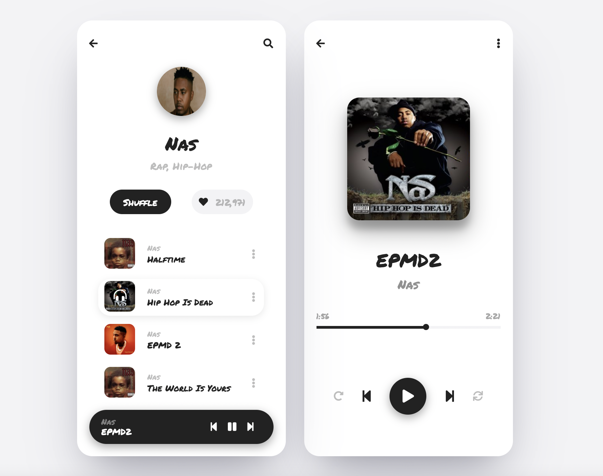

#TIL/html
#TIL/css

<br />

## ShortCut Vscode
`!` + tap -> html문서 자동 생성
`shift + alt(option) + 아래방향키` : 해당 줄 복사

* div.id + tap -> id라는 class명의 div 생성
* div#id + tap -> id라는 id명의 div 생성

<br />

## Kokoa-Clone
클래스 명은 길게 써주면 좋다(부모의 클래스명을 참조)
```html
<div id="status-bar">
      <div class="status-bar__column">
		</div>
</div>
```

주석 처리 : `<!-- -->`

<br />

<br />


## Block Element Modifier
기본 구조 : ::block__element—modifier::

### Block
Block은 `card`와 같이 하나의 독립된 영역을 말한다. 
이 외, header, footer, menu 등 누가 봐도 하나로 묶을 수 있는 것
블록 간의 중첩 가능하다
```html
<section class="section-tours" id="section-tours">
  <div class="card">
    ...
  </div>
</section>
<!-- section이라는 block 아래 card 라는 block이 존재한다 -->
```

<br />

### Element

Element는 `card__heading`, `card__details`처럼 어떤 목적인지 나타낸다. 이 외, input, text 등에도 사용 가능하다.
Element도 중첩이 가능하지만, Block과 마찬가지로 한 번만 사용이 가능하다.
```html
<div class="card__details">
  <ul class="card__ul">
    <li class="card__li1"></li>
    <li class="card__li2"></li>
    <li class="card__li3"></li>
  </ul>
</div>
```
이것처럼 하나의 Block에서 하나의 Element만 받는다. 하지만 Block에 속해 있는 상태에서 밖에서 사용할 수 없다.

<br />

### Modifier

Modifier는 `card__side—front`와 같이 해당 요소의 형태(style)를 나타낸다.
Modifier는 Block 다음에 바로 올 수도 있다. 예를 들면 card—large, card—hidden이 있다.

결론적으로 BEM 규칙을 통해서 거대한 프로젝트에서 파악을 용이하게 해준다.
```html
<a class="btn btn--big btn--orange" href="https:///cssa.com">
	<span class="btn__price">$9.99</span>
	<span class="btn__text">Subscribe</span>
</a>
```

<br /><br />

## Icons

HeroIcons
*Font Awesome*
code kit : `<script src="https://kit.fontawesome.com/d4409a116e.js" crossorigin="anonymous"></script>`

사이즈 변경 : fa-2x를 뒤에다 붙이면 커진다

<br />


## Css hack
이상하지만 동작하는 방식

`justify-content: space-between;` 
컨텐츠를 끝으로 보내어 정렬가능하나 일정하지는 않다

아래와 같은 방법으로 3개의 div를 일정하게 정렬할 수 있다
```css
.status-bar {
  display: flex;
  justify-content: center;
}

.status-bar__column {
  width: 33%;
}

.status-bar__column:first-child span {
  margin-right: 5px;
}

.status-bar__column:nth-child(2) {
  display: flex;
  justify-content: center;
}

.status-bar__column:last-child {
  display: flex;
  justify-content: flex-end;
  align-items: center;
}
```

<br />

## box-shadow

선택한 요소에 그림자 효과를 만들어주는 속성!
`box-shadow: none | x-position y-position blur spread color | inset | initial | inherit`

* none: 그림자 제거
* x-position : 가로 위치입니다. 양수면 오른쪽에, 음수면 왼쪽에 그림자가 만들어집니다. (필수)
* y-position : 세로 위치입니다. 양수면 아래쪽에, 음수면 위쪽에 그림자가 만들어집니다. (필수)
* blur : 그림자를 흐릿하게 만듭니다. 값이 클 수록 더욱 흐려집니다.
* spread : 양수면 그림자를 확장하고, 음수면 축소합니다.
* color : 그림자 색을 정합니다.
* inset : 그림자를 요소의 안쪽에 만듭니다.
* initial : 기본값으로 설정합니다.
* inherit : 부모 요소의 속성값을 상속받습니다.

<br /><br />

## day9 챌린지


index.html

```html
<!DOCTYPE html>
<html lang="en">
  <head>
    <link rel="stylesheet" href="style.css" />
    <meta charset="UTF-8" />
    <meta http-equiv="X-UA-Compatible" content="IE=edge" />
    <meta name="viewport" content="width=device-width, initial-scale=1.0" />
    <title>Playlist</title>
    <script
      src="https://kit.fontawesome.com/d4409a116e.js"
      crossorigin="anonymous"
    ></script>
  </head>
  <body>
    <div class="playlist-container">
      <div class="playlist-header">
        <i class="fas fa-times fa-2x"></i>
        <h2>Playlist</h2>
      </div>
      <div class="playlist-name">
        <div class="playlist-pic">
          <i class="fas fa-image fa-2x"></i>
        </div>
        <div class="playlist-title">
          <span>Random</span>
          <span>Love</span>
          <span>by Divay Kapoor</span>
        </div>
      </div>
      <div class="playlist-btn">
        <div class="playlist-btn__play">
          <i class="fas fa-play"></i>
          <span>Play</span>
        </div>
        <div class="playlist-btn__love">
          <i class="fas fa-heart"></i>
        </div>
        <div class="playlist-btn__plus">
          <i class="fas fa-plus"></i>
        </div>
      </div>
      <div class="playlist-contents">
        <div class="playlist-content">
          <div
            class="playlist-content__color playlist-content__color--red"
          ></div>
          <div class="playlist-content__title">
            <span>Matargasti</span>
            <span>Mohit Chauhan</span>
          </div>
        </div>
        <div class="playlist-content">
          <div
            class="playlist-content__color playlist-content__color--pink"
          ></div>
          <div class="playlist-content__title">
            <span>Attitude</span>
            <span>Lewis OfMan 😠 Attitude</span>
          </div>
        </div>
        <div class="playlist-content">
          <div
            class="playlist-content__color playlist-content__color--blue"
          ></div>
          <div class="playlist-content__title">
            <span>Try Everthing</span>
            <span>Shakira 🤭 Zootopia</span>
          </div>
        </div>
        <div class="playlist-content">
          <div
            class="playlist-content__color playlist-content__color--gray"
          ></div>
          <div class="playlist-content__title">
            <span>Sunflower</span>
            <span>Joseph Vincent 🤒 Sunflower</span>
          </div>
        </div>
      </div>
    </div>
  </body>
</html>
```

<br />

style.css

```css
body {
  font-family: -apple-system, BlinkMacSystemFont, "Segoe UI", Roboto, Oxygen,
    Ubuntu, Cantarell, "Open Sans", "Helvetica Neue", sans-serif;
  width: 100vw;
  height: 100vh;
  background-color: #00c6ac;
  display: flex;
  justify-content: center;
  align-items: center;
}

.playlist-container {
  width: 400px;
  height: 80vh;
  background-color: white;
  border-radius: 20px;
  display: flex;
  flex-direction: column;
  justify-content: center;
  align-items: center;
}

.playlist-header {
  width: 70%;
  display: flex;
  flex-direction: row;
  align-items: center;
  margin-bottom: 20px;
}

.playlist-header i {
  margin-right: 100px;
}

.playlist-name {
  width: 70%;
  height: 100px;
  display: flex;
  flex-direction: row;
  align-items: center;
  margin-bottom: 30px;
}

.playlist-pic {
  width: 100px;
  height: 100px;
  background-color: #ffbc12;
  border-radius: 10%;
  border: 2px solid black;
  display: flex;
  justify-content: center;
  align-items: center;
  margin-right: 30px;
}

.playlist-pic i {
  color: white;
}

.playlist-title {
  display: flex;
  flex-direction: column;
}

.playlist-title span:first-child,
.playlist-title span:nth-child(2) {
  font-size: 30px;
  font-weight: 800;
  margin-bottom: 5px;
}

.playlist-title span:last-child {
  font-weight: 800;
}

.playlist-btn {
  width: 70%;
  display: flex;
  flex-direction: row;
  margin-bottom: 30px;
}

.playlist-btn div {
  height: 40px;
  box-shadow: 0px 5px;
  border: 2px solid black;
  display: flex;
  justify-content: center;
  align-items: center;
}

.playlist-btn__play {
  width: 120px;
  border-radius: 10px;
  margin-right: 20px;
}

.playlist-btn__love {
  width: 40px;
  border-radius: 50%;
  margin-right: 20px;
}

.playlist-btn__plus {
  width: 40px;
  border-radius: 50%;
}

.playlist-contents {
  width: 70%;
  display: flex;
  flex-direction: column;
}

.playlist-content {
  display: flex;
  flex-direction: row;
  align-items: center;
  margin-bottom: 20px;
}

.playlist-content__color {
  width: 40px;
  height: 40px;
  border: 2px solid black;
  border-radius: 10px;
  margin-right: 10px;
}

.playlist-content__color--red {
  background-color: #f85a2a;
}

.playlist-content__color--pink {
  background-color: #fe89bb;
}

.playlist-content__color--blue {
  background-color: #1947e4;
}

.playlist-content__color--gray {
  background-color: #00c6ac;
}

.playlist-content__title {
  display: flex;
  flex-direction: column;
}

.playlist-content__title span:first-child {
  font-size: 20px;
  font-weight: 800;
}

.playlist-content__title span:last-child {
  font-size: 13px;
  font-weight: 200;
}
```


## day10


style.css

```css
body {
  font-family: -apple-system, BlinkMacSystemFont, "Segoe UI", Roboto, Oxygen,
    Ubuntu, Cantarell, "Open Sans", "Helvetica Neue", sans-serif;
  width: 100vw;
  height: 150vh;
  display: flex;
  flex-direction: column;
  justify-content: center;
  align-items: center;
}

.library {
  width: 400px;
  height: 900px;
  background-color: #fefefe;
  position: relative;
  display: flex;
  flex-direction: column;
  align-items: center;
}

.library-header {
  width: 100%;
  height: 100px;
  background-color: #ffce33;
  display: flex;
  flex-direction: row;
  justify-content: space-between;
  align-items: center;
  font-size: 20px;
}

.library-header i:first-child {
  margin-left: 30px;
}

.library-header i:last-child {
  margin-right: 30px;
}

.library-header--search {
  width: 90%;
  height: 50px;
  background-color: white;
  position: absolute;
  top: 70px;
  left: 25px;
  display: flex;
  justify-content: space-between;
  align-items: center;
  border-radius: 20px;
  font-weight: 600;
  box-shadow: 0px 1px #ebebeb;
}

.library-header--search span {
  color: #ebebeb;
  margin-left: 30px;
}

.library-header--search i {
  color: #ebebeb;
  margin-right: 30px;
}

.library-day {
  margin-top: 60px;
  width: 90%;
}

.library-day > span {
  font-size: 20px;
  font-weight: 800;
}

.day-container {
  display: flex;
  flex-direction: row;
  margin-top: 20px;
}

.day-container__pic img {
  width: 100px;
  height: 150px;
  border-radius: 10px;
  margin-right: 20px;
}

.day-container__detail {
  height: 150px;
  width: 200px;
  display: flex;
  flex-direction: column;
  justify-content: space-evenly;
}

.detail__title {
  display: flex;
  flex-direction: column;
}

.detail__title span:first-child {
  font-size: 18px;
  font-weight: 600;
}

.detail__title span:nth-child(2) {
  font-size: 15px;
  font-weight: 100;
  color: gray;
}

.detail__title--rate i {
  color: #ffce33;
}

.detail__title--rate i:last-child {
  color: #ebebeb;
}

.detail__genere {
  width: 200px;
  display: flex;
}

.detail__genere div {
  width: 100px;
  height: 30px;
  background-color: #f7f7f7;
  display: flex;
  align-items: center;
  justify-content: center;
  border-radius: 8px;
  margin-bottom: 10px;
}

.detail__genere div:nth-child(2) {
  margin-left: 30px;
}

.detail__btn {
  display: flex;
  flex-direction: row;
}

.detail__btn--yellow {
  width: 30px;
  height: 30px;
  background-color: #ffce33;
  border-radius: 50%;
  display: flex;
  justify-content: center;
  align-items: center;
  margin-right: 40px;
}

.detail__btn--now {
  width: 130px;
  height: 40px;
  background-color: black;
  border-radius: 8px;
  display: flex;
  justify-content: center;
  align-items: center;
  color: white;
  font-size: 13px;
}

.libaray-top {
  width: 90%;
  margin-top: 20px;
}

.libaray-top span:first-child {
  font-size: 20px;
  font-weight: 800;
}

.top-container {
  display: flex;
  flex-direction: row;
  overflow-x: scroll;
}

.top-container__pic img {
  width: 100px;
  height: 120px;
  margin-top: 10px;
  margin-right: 40px;
  border-radius: 8px;
}

.top-container__rate i {
  color: #ffce33;
}

.libaray-author {
  width: 90%;
  margin-top: 30px;
}

.libaray-author > span {
  font-size: 20px;
  font-weight: 800;
}

.author-container {
  display: flex;
  flex-direction: row;
}

.author-container__pic img {
  width: 150px;
  height: 200px;
  border-radius: 8px;
  margin-top: 10px;
}

.author-container__content {
  width: 300px;
  display: flex;
  flex-direction: column;
  justify-content: space-evenly;
  margin-left: 30px;
}

.author-container__content span:first-child {
  font-size: 20px;
  font-weight: 500;
}

.author-container__content span:last-child {
  font-weight: 300;
  color: gray;
}
```

index.html

```html
<!DOCTYPE html>
<html lang="en">
  <head>
    <meta charset="UTF-8" />
    <meta http-equiv="X-UA-Compatible" content="IE=edge" />
    <meta name="viewport" content="width=device-width, initial-scale=1.0" />
    <title>book library</title>
    <link rel="stylesheet" href="style.css" />
    <script
      src="https://kit.fontawesome.com/d4409a116e.js"
      crossorigin="anonymous"
    ></script>
  </head>
  <body>
    <div class="library">
      <div class="library-header">
        <i class="fas fa-bars"></i>
        <span>library</span>
        <i class="fas fa-shopping-bag"></i>
      </div>
      <div class="library-header--search">
        <span>Search books....</span>
        <i class="fas fa-search"></i>
      </div>
      <div class="library-day">
        <span>Book of the day</span>
        <div class="day-container">
          <div class="day-container__pic">
            
          </div>
          <div class="day-container__detail">
            <div class="detail__title">
              <span>No Fixed Abode</span>
              <span>Journey Through</span>
              <div class="detail__title--rate">
                <i class="fas fa-star fa-sm"></i>
                <i class="fas fa-star fa-sm"></i>
                <i class="fas fa-star fa-sm"></i>
                <i class="fas fa-star fa-sm"></i>
                <i class="far fa-star fa-sm"></i>
              </div>
            </div>
            <div class="detail__genere">
              <div class="detail__genere--j">journey</div>
              <div class="detail__genere--b">Biography</div>
            </div>
            <div class="detail__btn">
              <div class="detail__btn--yellow">
                <i class="fas fa-bookmark"></i>
              </div>
              <div class="detail__btn--now">
                <span>Book Now</span>
              </div>
            </div>
          </div>
        </div>
      </div>
      <div class="libaray-top">
        <span>Top Adventures</span>
        <div class="top-container">
          <div class="top-container--1">
            <div class="top-container__pic">
              
            </div>
            <div class="top-container__rate">
              <i class="fas fa-star fa-sm"></i>
              <i class="fas fa-star fa-sm"></i>
              <i class="fas fa-star fa-sm"></i>
              <i class="fas fa-star fa-sm"></i>
              <i class="far fa-star fa-sm"></i>
            </div>
          </div>
          <div class="top-container--2">
            <div class="top-container__pic">
              
            </div>
            <div class="top-container__rate">
              <i class="fas fa-star fa-sm"></i>
              <i class="fas fa-star fa-sm"></i>
              <i class="fas fa-star fa-sm"></i>
              <i class="fas fa-star fa-sm"></i>
              <i class="far fa-star fa-sm"></i>
            </div>
          </div>
          <div class="top-container--3">
            <div class="top-container__pic">
              
            </div>
            <div class="top-container__rate">
              <i class="fas fa-star fa-sm"></i>
              <i class="fas fa-star fa-sm"></i>
              <i class="fas fa-star fa-sm"></i>
              <i class="fas fa-star fa-sm"></i>
              <i class="far fa-star fa-sm"></i>
            </div>
          </div>
          <div class="top-container--4">
            <div class="top-container__pic">
              
            </div>
            <div class="top-container__rate">
              <i class="fas fa-star fa-sm"></i>
              <i class="fas fa-star fa-sm"></i>
              <i class="fas fa-star fa-sm"></i>
              <i class="fas fa-star fa-sm"></i>
              <i class="far fa-star fa-sm"></i>
            </div>
          </div>
        </div>
      </div>
      <div class="libaray-author">
        <span>Popular authors</span>
        <div class="author-container">
          <div class="author-container__pic">
            
          </div>
          <div class="author-container__content">
            <span>Captain America <br /></span>
            <span
              >Modern American science fiction write, screenwriter, producer and
              editor, winner of many literary awards.</span
            >
          </div>
        </div>
      </div>
    </div>
  </body>
</html>
```

<br />

<br />


## Media query
CSS를 이용해서 화면의 사이즈를 조절
*orientation 속성*

```html
<!DOCTYPE html>
<html lang="en">
  <head>
    <meta charset="UTF-8" />
    <meta http-equiv="X-UA-Compatible" content="IE=edge" />
    <meta name="viewport" content="width=device-width, initial-scale=1.0" />
    <title>Document</title>
    <style>
      div {
        width: 200px;
        height: 200px;
        background-color: gray;
      }
      @media screen and (max-width: 600px) {
        div {
          background-color: tomato;
        }
      }
    </style>
  </head>
  <body>
    <div></div>
  </body>
</html>
```

* Media query는 오직 CSS만을 이용해서 스크린의 사이즈를 알 수 있는 방법이다.(웹사이트를 보고 있는 사용자의 스크린 사이즈)
* @media
screen and (max-width: 00px) {} 을 이용하여 몇 픽셀부터는 달라보이도록 만들 수 있다. 이를 통해 스크린의 사이즈를 알 수 있다.
* min 사이즈와 max사이즈를 조절하여 단계별로 만들면, 스크린 사이즈의 범위를 알 수 있다.
* 브라우저에서 inspect의 device toolbar를 이용하여 핸드폰 기종 별 사이즈로 브라우저를 볼 수 있다.
* media screen에 (orientation: landscape)를 이용하면, 세로모드인지 가로모드인지도 구별 할 수 있다.

<br />

<br />

## Reset.css
reset.css
브라우저 스타일을 지우고 스타일을 생성하기 좋다

<br/>


## NOT
css에서 적용되지 않기를 원할 때 not을 사용
```css
#login-form input:not([type="submit"]) {
 	border-bottom: 1px solid rgba(0, 0, 0, 0.2);
  transition: border-color 0.3s ease-in-out;
}
```

<br />

## form의 action

POST : 백엔드 서버에 정보를 전달하는 방법
GET : 보안에 약하다(URL에 정보가 포함된다)
```html
    <form action="friends.html" method="GET" id="login-form">
      <input name="username" type="text" placeholder="Email or phone number" />
      <input name="password" type="password" placeholder="Password" />
      <input type="submit" value="Log In" />
      <a href="#">Find Kokoa Account or Password</a>
    </form>
```
위의 정보는 friends.html로 전달된다 -> page 이동


## Day11

화면 구현하기 : Box-shadow 구글링이 최고시다



Index.html

```html
<!DOCTYPE html>
<html lang="en">
  <head>
    <meta charset="UTF-8" />
    <meta http-equiv="X-UA-Compatible" content="IE=edge" />
    <meta name="viewport" content="width=device-width, initial-scale=1.0" />
    <title>nomad Player</title>
    <link rel="stylesheet" href="style.css" />
    <script
      src="https://kit.fontawesome.com/d4409a116e.js"
      crossorigin="anonymous"
    ></script>
  </head>
  <body>
    <div class="list-container">
      <div class="list-header">
        <i class="fas fa-arrow-left"></i>
        <i class="fas fa-search"></i>
      </div>

      <div class="list-artist">
        
        <span class="list-artist__name">Nas</span>
        <span class="list-artist__intro">Rap, Hip-Hop</span>
      </div>

      <div class="list-btn">
        <div class="list-btn__shuffle">Shuffle</div>
        <div class="list-btn__like">
          <i class="fas fa-heart"></i>
          <span>212,971</span>
        </div>
      </div>

      <div class="list-music">
        <div class="music-container">
          <div class="music-container__pic">
            
          </div>
          <div class="music-container__title">
            <span>Nas</span>
            <span>Halftime</span>
          </div>
          <div class="music-container__dots">
            <i class="fas fa-ellipsis-v"></i>
          </div>
        </div>
        <div class="music-container music-container__select">
          <div class="music-container__pic music-container__pic--select">
            
            <div class="music-container__selected">
              <i class="fas fa-headphones-alt fa-lg"></i>
            </div>
          </div>
          <div class="music-container__title">
            <span>Nas</span>
            <span>Hip Hop Is Dead</span>
          </div>
          <div class="music-container__dots">
            <i class="fas fa-ellipsis-v"></i>
          </div>
        </div>
        <div class="music-container">
          <div class="music-container__pic">
            
          </div>
          <div class="music-container__title">
            <span>Nas</span>
            <span>EPMD 2</span>
          </div>
          <div class="music-container__dots">
            <i class="fas fa-ellipsis-v"></i>
          </div>
        </div>
        <div class="music-container">
          <div class="music-container__pic">
            
          </div>
          <div class="music-container__title">
            <span>Nas</span>
            <span>The World Is Yours</span>
          </div>
          <div class="music-container__dots">
            <i class="fas fa-ellipsis-v"></i>
          </div>
        </div>
      </div>

      <div class="list-playbar">
        <div class="playbar-title">
          <span>Nas</span>
          <span>EPMD2</span>
        </div>
        <div class="playber-icons">
          <i class="fas fa-step-backward"></i>
          <i class="fas fa-pause"></i>
          <i class="fas fa-step-forward"></i>
        </div>
      </div>
    </div>

    <div class="play-container">
      <div class="list-header">
        <i class="fas fa-arrow-left"></i>
        <i class="fas fa-ellipsis-v"></i>
      </div>

      <div class="play-content">
        
        <span>EPMD2</span>
        <span>Nas</span>
      </div>

      <div class="play-timeline">
        <span>1:56</span>
        <span>2:21</span>
      </div>

      <div class="play-bar">
        <div class="play-bar__bars"></div>
        <div class="play-bar__bars"></div>
        <div class="play-bar__dot"></div>
      </div>

      <div class="play-btn">
        <div class="play-btn__sub">
          <i class="fas fa-redo-alt"></i>
        </div>
        <i class="fas fa-step-backward fa-lg"></i>
        <div class="playicons"><i class="fas fa-play fa-lg"></i></div>
        <i class="fas fa-step-forward fa-lg"></i>
        <div class="play-btn__sub"><i class="fas fa-sync"></i></div>
      </div>
    </div>
  </body>
</html>
```

style.css

```css
@import url("https://fonts.googleapis.com/css2?family=Permanent+Marker&display=swap");
@import "reset.css";

:root {
}

body {
  font-family: "Permanent Marker", cursive;
  width: 100vw;
  height: 120vh;
  background-color: #f3f3f5;
  color: #222222;
  display: flex;
  flex-direction: row;
  align-items: center;
  justify-content: center;
}

.list-container {
  width: 300px;
  height: 650px;
  background-color: white;
  border-radius: 25px;
  padding: 30px 20px;
  position: relative;
  box-shadow: rgba(50, 50, 93, 0.25) 0px 50px 100px -20px,
    rgba(0, 0, 0, 0.3) 0px 30px 60px -30px;
}

.list-header {
  display: flex;
  justify-content: space-between;
  margin-bottom: 30px;
}

.list-artist {
  display: flex;
  flex-direction: column;
  justify-content: center;
  align-items: center;
  /* margin-bottom: 0px; */
}

.list-artist img {
  width: 80px;
  height: 80px;
  border-radius: 50%;
  margin-bottom: 30px;
  box-shadow: rgba(0, 0, 0, 0.35) 0px 5px 15px;
}

.list-artist__name {
  font-size: 30px;
  margin-bottom: 15px;
}
.list-artist__intro {
  font-size: 16px;
  opacity: 0.3;
}

.list-btn {
  width: 100%;
  display: flex;
  justify-content: space-evenly;
  margin: 30px 0px;
}

.list-btn__shuffle {
  width: 100px;
  height: 40px;
  background-color: #222222;
  color: white;
  display: flex;
  align-items: center;
  justify-content: center;
  font-size: 15px;
  border-radius: 40px;
}

.list-btn__like {
  width: 100px;
  height: 40px;
  background-color: #f3f3f5;
  display: flex;
  align-items: center;
  justify-content: space-evenly;
  font-size: 15px;
  border-radius: 40px;
}

.list-btn__like span {
  opacity: 0.3;
}

.list-music {
  width: 100%;
  display: flex;
  flex-direction: column;
}

.music-container {
  margin: 5px 15px;
  height: 60px;
  display: flex;
  align-items: center;
  border-radius: 20px;
}

.music-container__select {
  box-shadow: rgba(0, 0, 0, 0.09) 0px 3px 12px;
}

.music-container__pic img {
  width: 50px;
  height: 50px;
  margin-right: 20px;
  margin-left: 10px;
  border-radius: 10px;
}

.music-container__pic--select {
  position: relative;
}

.music-container__selected i {
  position: absolute;
  left: 25px;
  top: 15px;
  color: white;
}

.music-container__title {
  display: flex;
  flex-direction: column;
  width: 170px;
}

.music-container__title span:first-child {
  font-size: 12px;
  opacity: 0.3;
  margin-bottom: 5px;
}

.music-container__title span:last-child {
  font-size: 14px;
}

.music-container__dots i {
  opacity: 0.3;
}

.list-playbar {
  position: absolute;
  bottom: 20px;
  height: 55px;
  width: 300px;
  background-color: #222222;
  display: flex;
  flex-direction: row;
  color: white;
  align-items: center;
  justify-content: space-between;
  border-radius: 30px;
  box-shadow: rgba(0, 0, 0, 0.35) 0px 5px 15px;
}

.playbar-title {
  display: flex;
  flex-direction: column;
  margin-left: 20px;
}

.playbar-title span:first-child {
  font-size: 13px;
  color: gray;
}

.playbar-title span:last-child {
  font-size: 14px;
  margin-top: 3px;
}

.playber-icons {
  margin-right: 20px;
}

.playber-icons i {
  margin-right: 10px;
}

.play-container {
  width: 300px;
  height: 650px;
  background-color: white;
  border-radius: 25px;
  margin-left: 30px;
  padding: 30px 20px;
  box-shadow: rgba(50, 50, 93, 0.25) 0px 50px 100px -20px,
    rgba(0, 0, 0, 0.3) 0px 30px 60px -30px;
}

.play-content {
  display: flex;
  flex-direction: column;
  justify-content: center;
  align-items: center;
}

.play-content img {
  width: 200px;
  height: 200px;
  margin: 50px 0px;
  border-radius: 20px;
  box-shadow: rgba(0, 0, 0, 0.3) 0px 19px 38px,
    rgba(0, 0, 0, 0.22) 0px 15px 12px;
}

.play-content span {
  font-size: 30px;
  margin-bottom: 15px;
}

.play-content span:last-child {
  font-size: 20px;
  opacity: 0.5;
}

.play-timeline {
  display: flex;
  flex-direction: row;
  justify-content: space-between;
  margin-top: 20px;
  margin-bottom: 10px;
  font-size: 13px;
  opacity: 0.4;
}

.play-bar {
  display: flex;
  flex-direction: row;
  align-items: center;
  position: relative;
}

.play-bar div:nth-child(1) {
  width: 60%;
  height: 5px;
  background-color: #222222;
}

.play-bar div:nth-child(2) {
  width: 40%;
  height: 5px;
  background-color: #f3f3f5;
}

.play-bar__dot {
  width: 10px;
  height: 10px;
  border-radius: 5px;
  background-color: #222222;
  position: absolute;
  left: 58%;
}

.play-btn {
  margin-top: 80px;
  width: 100%;
  display: flex;
  justify-content: space-evenly;
  align-items: center;
}

.play-btn__sub {
  opacity: 0.3;
}

.playicons {
  width: 60px;
  height: 60px;
  border-radius: 50%;
  display: flex;
  align-items: center;
  justify-content: center;
  background-color: #222222;
  color: white;
  box-shadow: rgba(0, 0, 0, 0.35) 0px 5px 15px;
}
```

