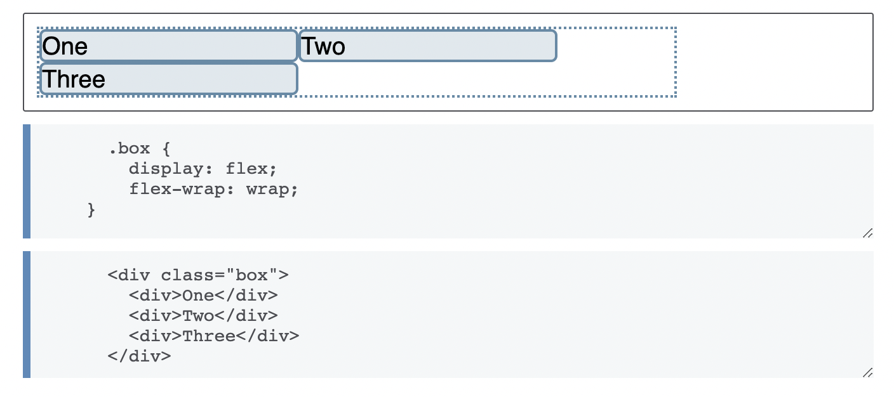
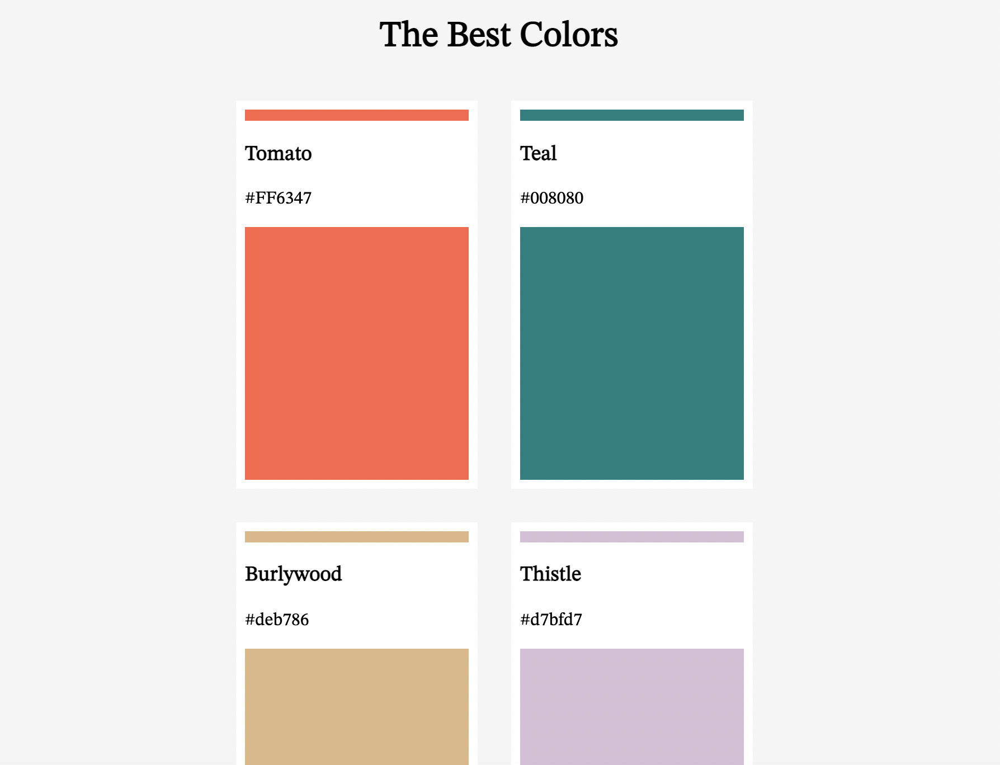

# Nomad HTML/CSS Chanllenge
#TIL/javascript

### day4
라벨을 활용한 html 태그 조작
```html
<body>
    <h1>Create An Account</h1>
    <form>
      <label for="firstName">First name</label>
      <input id="firstName" type="text" required placeholder="First name" />
      <br />
      <label for="last">First name</label>
      <input id="last" type="text" required placeholder="Last name" />
      <br />
      <label for="email">Email</label>
      <input id="email" type="email" required placeholder="Email" />
      <br />
      <label for="username">Username</label>
      <input id="username" type="text" required placeholder="Username" />
      <br />
      <label for="passwd">Password</label>
      <input
        id="passwd"
        type="passwd"
        required
        placeholder="Password"
        minlength="10"
      />
      <br />
      <label for="birth">Birth date</label>
      <input id="birth" type="date" required" />
      <br />
      <label for="happy">How happy are you?</label>
      <input id="happy" type="range" required" />
      <br />
      <label for="color">What is your fav. color?</label>
      <input id="color" type="color" required" />
      <br />
      <input type="submit" value="Create Account" />
    </form>
  </body>
</html>


```


**화면 동일하게 구현하기**


index.html

```html
  <body>
    <div class="container">
      <div class="pluss">
        <div class="inbox box1"></div>
        <div class="inbox box2"></div>
        <div class="inbox box3"></div>
      </div>
    </div>
  </body>
```

style.css

```css
.container {
  width: 100vw;
  height: 100vh;
  background-color: #ff6446;
  display: flex;
  flex-direction: column;
  justify-content: center;
  align-items: center;
}
.pluss {
  width: 300px;
  height: 300px;
  background-color: #f5deb3;
  border: 3px solid black;
  display: flex;
  flex-direction: column;
  justify-content: space-evenly;
  align-items: center;
}

.inbox {
  height: 20%;
}

.box1 {
  width: 60px;
  background-color: #008080;
  border: 3px solid white;
}

.box2 {
  width: 200px;
  background-color: #008080;
  border: 3px dotted white;
}

.box3 {
  width: 60px;
  background-color: #008080;
  border: 3px solid white;
}
```


## Position, Pseudo Selector

```css
position : relative
// 처음 위치를 기준으로 상대적으로 이동, left, top, bottom ...
position : absolute
// 가장 가까운 relative 부모를 기준으로 이동
```


### pseudo selector

`div:first-child` 등의 selector를 사용하여 잡아준다
`span:nth-child(2)` : 2번째 요소를 잡아준다, even -> 짝수

```css
p span{
}
// p태그 안의 span 태그 선택, 부모 자식
div > span {
	text-decoration : underline;
}
// div 밑의 바로 아래 자식에게 
p + span {
}
// p 바로 다음에 오는 형제 태그를 찾는다
p ~ span
{}
//p 다음에 있을 형제 태그 선택
input : required{
}
// requred되어진 input을 선택
input[type="password"]{
}
// 속성으로 찾기
input[placeholder ~= "name"]{
	background-color : pink;
}
// name이 포함된 placeholder 속성을 가진 input 태그 선택
```


## flex-wrap을 이용한 복수 행 flex 컨테이너 지정




### 화면 구현하기



Index.html

```html
<!DOCTYPE html>
<html lang="en">
  <head>
    <meta charset="UTF-8" />
    <meta http-equiv="X-UA-Compatible" content="IE=edge" />
    <meta name="viewport" content="width=device-width, initial-scale=1.0" />
    <title>Pseudo Selectors</title>
    <link rel="stylesheet" href="style.css" />
    <link
      href="https://fonts.googleapis.com/css2?family=STIX+Two+Text&display=swap"
      rel="stylesheet"
    />
  </head>
  <body>
    <div class="container">
      <h1>The Best Colors</h1>
      <div class="frames">
        <div class="colorFrame">
          <div class="textbox">
            <h3>Tomato</h3>
            <span>#FF6347</span>
          </div>
        </div>
        <div class="colorFrame">
          <div class="textbox">
            <h3>Teal</h3>
            <span>#008080</span>
          </div>
        </div>
        <div class="colorFrame">
          <div class="textbox">
            <h3>Burlywood</h3>
            <span>#deb786</span>
          </div>
        </div>
        <div class="colorFrame">
          <div class="textbox">
            <h3>Thistle</h3>
            <span>#d7bfd7</span>
          </div>
        </div>
      </div>
    </div>
  </body>
</html>
```

style.css

```css
.container {
  width: 100vw;
  height: 150vh;
  background-color: #f5f5f5;
  display: flex;
  flex-direction: column;
  align-items: center;
  font-family: "STIX Two Text", serif;
}

.frames {
  width: 500px;
  height: 50%;
  display: flex;
  flex-wrap: wrap;
}

.colorFrame {
  width: 200px;
  height: 60%;
  position: relative;
  border: 8px solid white;
  margin: 15px;
}

.colorFrame:nth-child(1) {
  background-color: #ff6347;
}

.colorFrame:nth-child(2) {
  background-color: #008080;
}

.colorFrame:nth-child(3) {
  background-color: #deb786;
}

.colorFrame:nth-child(4) {
  background-color: #d7bfd7;
}

.textbox {
  position: absolute;
  height: 80px;
  width: 100%;
  top: 10px;
  padding-bottom: 15px;
  background-color: white;
  display: flex;
  flex-direction: column;
}
```

