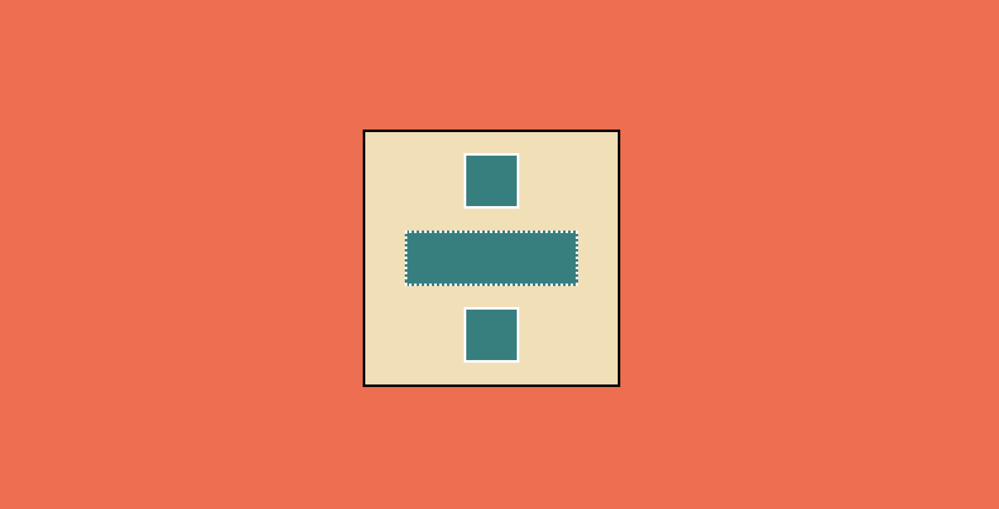

# Nomad HTML/CSS Chanllenge
#TIL/javascript

### day4
라벨을 활용한 html 태그 조작
```html
<body>
    <h1>Create An Account</h1>
    <form>
      <label for="firstName">First name</label>
      <input id="firstName" type="text" required placeholder="First name" />
      <br />
      <label for="last">First name</label>
      <input id="last" type="text" required placeholder="Last name" />
      <br />
      <label for="email">Email</label>
      <input id="email" type="email" required placeholder="Email" />
      <br />
      <label for="username">Username</label>
      <input id="username" type="text" required placeholder="Username" />
      <br />
      <label for="passwd">Password</label>
      <input
        id="passwd"
        type="passwd"
        required
        placeholder="Password"
        minlength="10"
      />
      <br />
      <label for="birth">Birth date</label>
      <input id="birth" type="date" required" />
      <br />
      <label for="happy">How happy are you?</label>
      <input id="happy" type="range" required" />
      <br />
      <label for="color">What is your fav. color?</label>
      <input id="color" type="color" required" />
      <br />
      <input type="submit" value="Create Account" />
    </form>
  </body>
</html>


```


**화면 동일하게 구현하기**



index.html

```html
  <body>
    <div class="container">
      <div class="pluss">
        <div class="inbox box1"></div>
        <div class="inbox box2"></div>
        <div class="inbox box3"></div>
      </div>
    </div>
  </body>
```

style.css

```css
.container {
  width: 100vw;
  height: 100vh;
  background-color: #ff6446;
  display: flex;
  flex-direction: column;
  justify-content: center;
  align-items: center;
}
.pluss {
  width: 300px;
  height: 300px;
  background-color: #f5deb3;
  border: 3px solid black;
  display: flex;
  flex-direction: column;
  justify-content: space-evenly;
  align-items: center;
}

.inbox {
  height: 20%;
}

.box1 {
  width: 60px;
  background-color: #008080;
  border: 3px solid white;
}

.box2 {
  width: 200px;
  background-color: #008080;
  border: 3px dotted white;
}

.box3 {
  width: 60px;
  background-color: #008080;
  border: 3px solid white;
}
```

