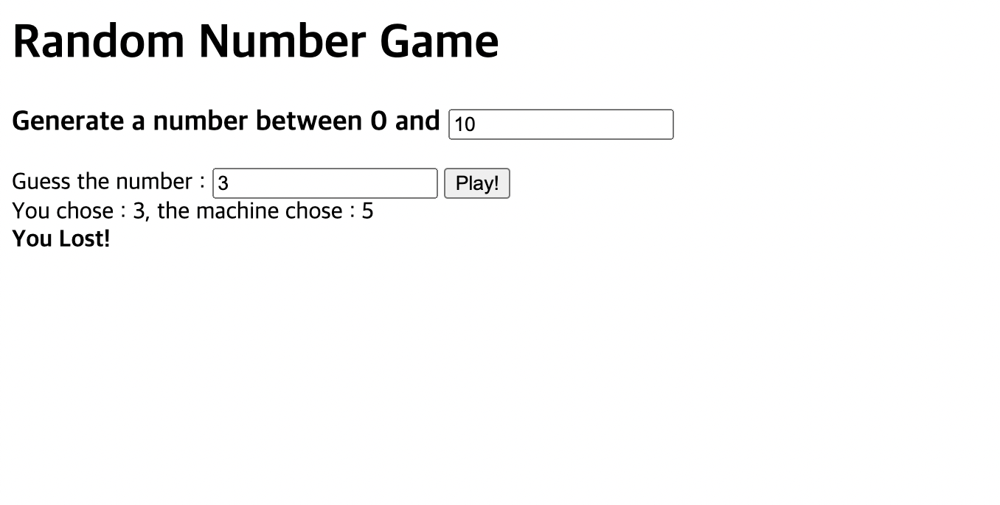

# # Nomad Chanllenge #2
#TIL/javascript


<br/>

## day8-9
### 랜덤 숫자 맞추기 게임



<br/><br/>

index.html

```html
<!DOCTYPE html>
<html lang="en">
  <head>
    <meta charset="UTF-8" />
    <meta http-equiv="X-UA-Compatible" content="IE=edge" />
    <meta name="viewport" content="width=device-width, initial-scale=1.0" />
    <title>Document</title>
  </head>
  <body>
    <h1>Random Number Game</h1>
    <h3>
      Generate a number between 0 and <input class="rangeNumber" type="text" />
    </h3>
    <form action="" class="jsForm">
      <span>Guess the number : </span>
      <input type="number" class="jsInput" />
      <button type="submit">Play!</button>
    </form>
    <span class="choiceNum"></span>
    <span class="resultNum"></span>
    <script src="app.js"></script>
  </body>
</html>
```

<br/><br/>

app.js

```javascript
const form = document.querySelector(".jsForm"),
  input = document.querySelector(".jsInput"),
  btnSub = document.querySelector("button"),
  rangeNum = document.querySelector(".rangeNumber"),
  userChoice = document.querySelector(".choiceNum"),
  result = document.querySelector(".resultNum");

function handleSubmit(event) {
  event.preventDefault();
}

function handleClickEvent() {
  if (input.value === "") {
    alert("값을 넣어주세요");
  } else {
    let userNumber = rangeNum.value;
    let randomNumber = Math.floor(Math.random() * (parseInt(userNumber) + 1));
    userChoice.innerHTML = `You chose : ${input.value}, the machine chose : ${randomNumber}`;
    if (randomNumber === parseInt(input.value)) {
      result.innerHTML = "<br/><b>You Win!</b>";
    } else {
      result.innerHTML = "<br/><b>You Lost!</b>";
    }
  }
}
function init() {}

form.addEventListener("submit", handleSubmit);
btnSub.addEventListener("click", handleClickEvent);

init();
```