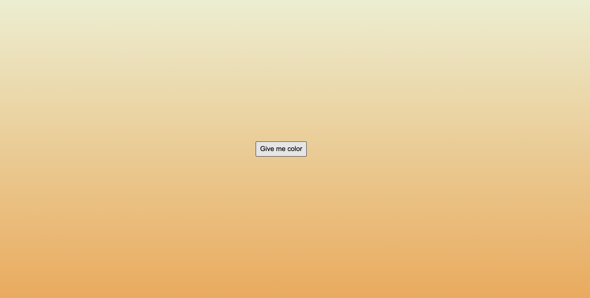

# # Nomad Chanllenge #2
#TIL/javascript

## day8-9
### 랜덤 숫자 맞추기 게임


<br/><br/>

index.html

```html
<!DOCTYPE html>
<html lang="en">
  <head>
    <meta charset="UTF-8" />
    <meta http-equiv="X-UA-Compatible" content="IE=edge" />
    <meta name="viewport" content="width=device-width, initial-scale=1.0" />
    <title>Document</title>
  </head>
  <body>
    <h1>Random Number Game</h1>
    <h3>
      Generate a number between 0 and <input class="rangeNumber" type="text" />
    </h3>
    <form action="" class="jsForm">
      <span>Guess the number : </span>
      <input type="number" class="jsInput" />
      <button type="submit">Play!</button>
    </form>
    <span class="choiceNum"></span>
    <span class="resultNum"></span>
    <script src="app.js"></script>
  </body>
</html>
```

<br/><br/>

app.js

```javascript
const form = document.querySelector(".jsForm"),
  input = document.querySelector(".jsInput"),
  btnSub = document.querySelector("button"),
  rangeNum = document.querySelector(".rangeNumber"),
  userChoice = document.querySelector(".choiceNum"),
  result = document.querySelector(".resultNum");

function handleSubmit(event) {
  event.preventDefault();
}

function handleClickEvent() {
  if (input.value === "") {
    alert("값을 넣어주세요");
  } else {
    let userNumber = rangeNum.value;
    let randomNumber = Math.floor(Math.random() * (parseInt(userNumber) + 1));
    userChoice.innerHTML = `You chose : ${input.value}, the machine chose : ${randomNumber}`;
    if (randomNumber === parseInt(input.value)) {
      result.innerHTML = "<br/><b>You Win!</b>";
    } else {
      result.innerHTML = "<br/><b>You Lost!</b>";
    }
  }
}
function init() {}

form.addEventListener("submit", handleSubmit);
btnSub.addEventListener("click", handleClickEvent);

init();
```


<br />

### Intervals

```javascript
const clock = document.querySelector("h2#clock");

function sayHello(){
	console.log('Hello');
}

setInterval(sayHello, 5000); #5sec
#기존 동작이 반복적으로 일어난다
```

<br />

### Timeouts and Dates

```javascript
const clock = document.querySelector("h2#clock");

function sayHello(){
	console.log('Hello');
}

setTimeout(sayHello, 5000); #5sec
#기존 동작이 한번 일어난다
```

<br />

### 

### day10 task

크리스마스까지 D-day 타이머 만들기

```javascript
const clockContainer = document.querySelector(".jsClock");
const clockTitle = clockContainer.querySelector(".jsTitle");

function getTime() {
  const now = new Date().getTime();
  const xmasDay = new Date("2021-12-24:00:00:00").getTime();
  const remain = xmasDay - now;

  const days = Math.floor(remain / (1000 * 60 * 60 * 24));
  const hours = Math.floor((remain % (1000 * 60 * 60 * 24)) / (1000 * 60 * 60));
  const minutes = Math.floor((remain % (1000 * 60 * 60)) / (1000 * 60));
  const seconds = Math.floor((remain % (1000 * 60)) / 1000);

  clockTitle.innerText = `${days < 10 ? `0${days}` : days}d ${
    hours < 10 ? `0${hours}` : hours
  }h ${minutes < 10 ? `0${minutes}` : minutes}m ${
    seconds < 10 ? `0${seconds}` : seconds
  }s`;
}

function init() {
  getTime();
  setInterval(getTime, 1000);
}
init();
```

[Date 객체와 날짜](


## 버튼 클릭 후 그라데이션 적용
클릭할 때 마다 body의 style 적용 (linear-gradient)



index.html

```html
<!DOCTYPE html>
<html lang="en">
  <head>
    <meta charset="UTF-8" />
    <title>Document</title>
    <link rel="stylesheet" href="style.css" />
  </head>
  <body>
    <div>
      <button class="btn">Give me color</button>
    </div>
    <script src="app.js"></script>
  </body>
</html>
```

style.css

```css
body {
  width: 100vw;
  height: 100vh;
}

div {
  display: flex;
  flex-direction: column;
  align-items: center;
  justify-content: center;
  height: 100%;
}

.btn {
  width: 100px;
  height: 30px;
}
```

app.js

```javascript
const btn = document.querySelector("button");

colors = ["#ebf8e1", "#9198e5", "#3f87a6", "#e66465", "#f69d3c", "#ffc048"
];

function color() {
  const color1 = colors[Math.floor(Math.random() * colors.length)];
  const color2 = colors[Math.floor(Math.random() * colors.length)];
  document.body.style.background = `linear-gradient(${color1}, ${color2})`;
}

btn.addEventListener("click", color);
```