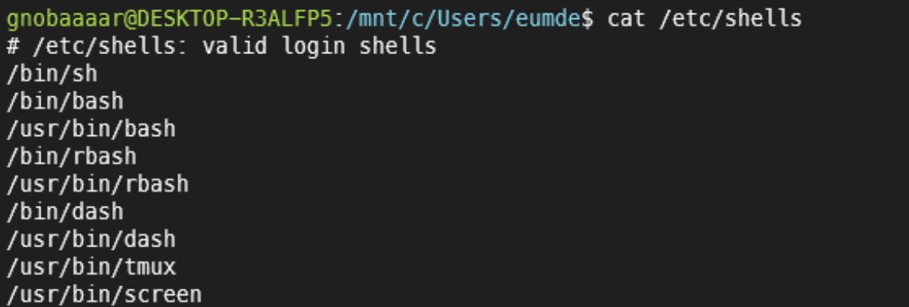
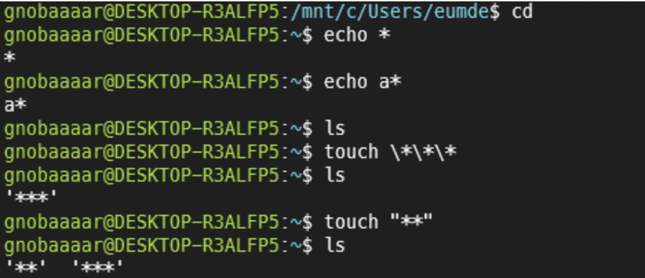
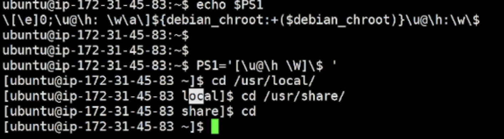
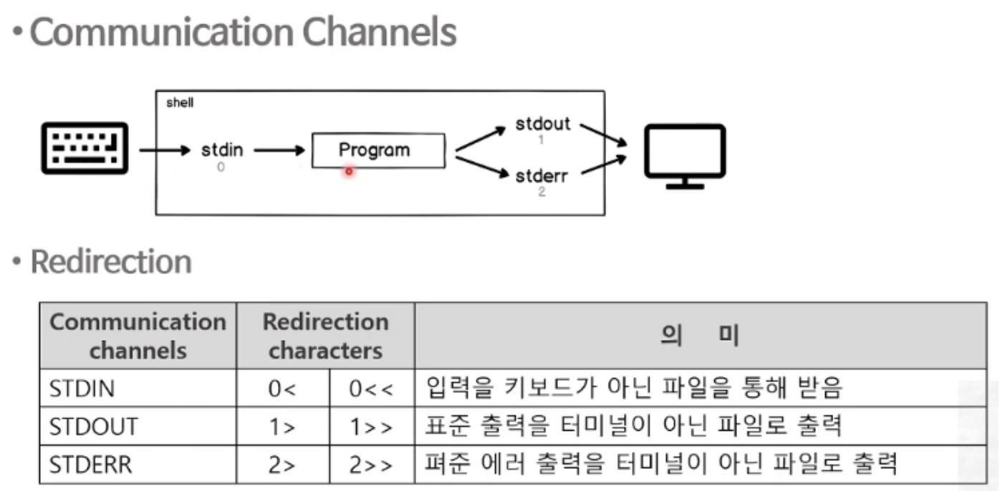
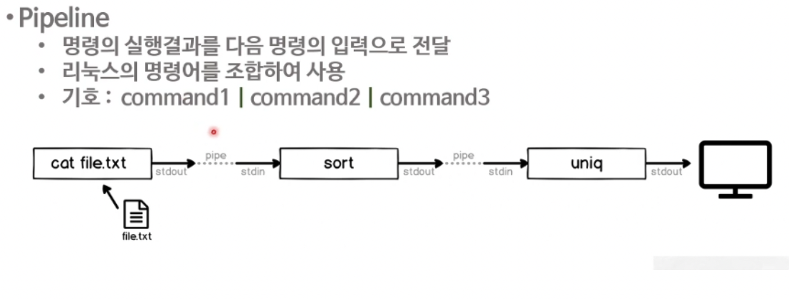

# 리눅스 shell이란

### Shell의 역할

- 사용자 명령어 해석기
- 사용자가 프롬프트에 입력한 명령을 해석하여 운영체제에 전달


1. Bourne shell(sh) : AT&T의 벨 연구소의 스티븐 본의 오리지날 셸
2. C shell(csh, tcsh) : Bill Joy가 C언어 기술을 넣어서 만든 Shell
3. Korn shell(ksh) : David Korn이 AT&T에서 C shell의 기능을 추가하여 생성
4. Bourne-agin shell(bash) : GNU프로젝트로 만들고 csh, ksh가 가진 기능을 포함하여 리눅스, MAC OS의 기본 shell이다. 윈도우에서도 가능




<br/>

<br/>

## 02. Bash Shell과 변수

변수 : 데이터를 넣는 그릇

시작은 반드시 문자나 _로 설정

변수는 알아서 설정된다!(bash셸)

**변수 선언 : varname=value**

**변수 확인 : echo, set (모든 변수명 표시)**

**변수 제거 : unset varname**

```bash
**echo $lname**
```

<br/>

### Shell의 환경변수

Shell의 환경변수 : **동작이 되는 프로그램에 영향을 주는 변수**

선언 : **export varName=value**

시스템에서 적용된 환경변수만 확인 : **env**

```bash
$ export NAME=lee
$ echo $NAME
$ env | grep NAME

$ echo $PATH -> 커널에게 전달해줄 경로
```

**기억해야할 환경변수**

**HOME** : 홈 디렉토리의 경로. cd 명령 실행시 적용

**USER** : 로그인 사용자 이름

**SHELL** : 로그인 쉘이름

<br/>

<br/>

## 03. Bash shell과 Rules

### 1. Quoting Rule

- Metacharacters
  - shell에서 특별히 의미를 정해놓은 문자들
  - $ | () ...
  - - : 와일드카드문자
  - ? : Any Single Character(글자수용)
  - touch myfile{1..3} : 컬리브레이스- 집합
- **메타문자의 의미를 제거하고 단순한 문자로 변경하는 것**
  - Backslash(\) : \바로 뒤의 메타문자는 의미제거
  - Double Quotes(””) : “”내의 메타문자의미제거, 단 $, ` 제외
  - Single Quotes(’’) : ‘’내의 메타문자의미제거



<br/>

### 2.  Nesting Commands

- Command 치환 : 명령어의 실행 결과를 치환하여 명령을 실행
- Nesting Commands
  - $(command)
  - `command`
- 싱글 Quotes는 모두 제거해버리지만 Double Quotes는 네스팅 커맨드의 의미는 살려준다

```bash
date +%Y%m%d
touch report-$(date +%Y%m%d) -> report-20220224 생성
```

<br/>

### 3. Alias

- Shell의 명령에 새로운 이름을 부여
- 명령들을 조합하여 새로운 이름의 명령을 생성
- alias name=’command’
- alias or alias name
- unalias name

```bash
alias rm='rm -i' -> 항상 물어본다
alias h='history'
```

<br/>

### 4. prompt

```bash
echo $PS1 -> prompt
```






*키보드에서 터미널

- 0과 1번은 생략이 가능하다

- **mailx [계정명]**

  - 계정에게 메일보내기

  ```bash
  echo "This is a sample mail. bye" > message.txt
  mailx -s "SAMPLE MAIL" jackson@localhost 0< message.tx
  
  date 1> date.out
  cat date.out
  date >> date.out -> 기존내용에 추가
  
  ls dmskdms.txt 2> error.txt
  ```

<br/>

### 5.Pipeline



- `wc -l hosts` hosts 몇개 라인?

```bash
ls -l | wc -l

cat passwd | cut -d: -f 1 -> 유저 이름 출력
cat passwd | cut -d: -f 1 | sort | wc -l -> 총 유저 개수

alias usercount='cat passwd | cut -d: -f 1 | sort | wc -l'
usercount -> alias로 실행
```
