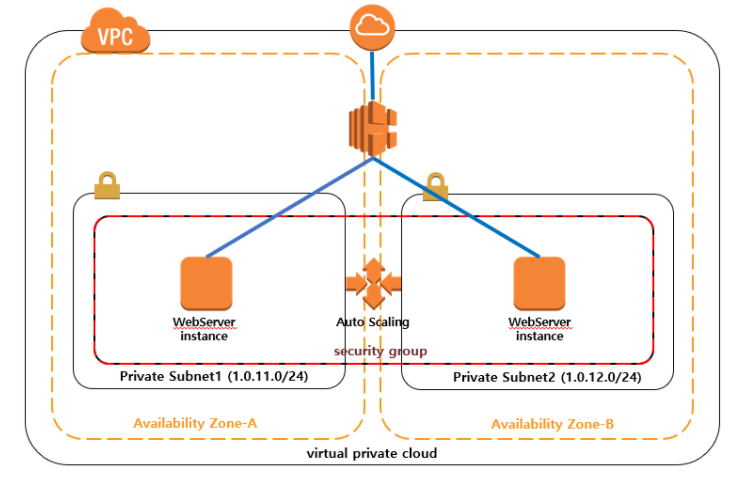

## Creating an Auto Scaling Group and Application Load Balancer in AWS

`Lab에 대한 반복이 필요하다`

  

### Create an Application Load Balancer

 EC2 > 로드 밸런서 > 로드 밸런서 생성

최소 2개 이상의 가용영역 설정

- 대상 그룹(Target group)
  - 일반적으로 오토스케일링을 위한 단위
  - 각 대상 그룹에 있는 인스턴스들은 정의된 상태 검사를 수행

 

**A Cloud Guru 예제**

> 1. Navigate to **EC2** > **Load Balancers**.
> 2. Click **Create Load Balancer**.
> 3. In the *Application Load Balancer* card, click **Create**.
> 4. In the Basic Configuration section, set the following values:
>    - *Name*: **HOLALB**
>    - *Scheme*: **internet-facing**
>    - *IP address type*: **ipv4**
> 5. Leave the settings in the *Listeners* section as-is.
> 6. In the *Availability Zones* section, select the listed VPC.
> 7. Select **us-east-1a** and **us-east-1b**.
> 8. Click **Next: Configure Security Settings**.
> 9. Click **Next: Configure Security Groups**.
> 10. For *Assign a security group*, select **Create a new security group**.
> 11. Give it a *Security group name* and *Description* of "ALBSG".
> 12. Leave the custom TCP rule set.
> 13. Click **Next: Configure Routing**.
> 14. In the Target group section, set the following values:
>     - *Target group*: **New target group**
>     - *Name*: **ALBTG**
>     - *Target type*: **Instance**
>     - *Protocol*: **HTTP**
>     - *Port*: **80**
> 15. Leave the *Health checks* section settings as-is.
> 16. In the *Advanced health check settings* section, change the *Healthy threshold* to "2".
> 17. Click **Next: Register Targets**.
> 18. Leave the settings as-is.
> 19. Click **Next: Review**.
> 20. Click Create
>     - It will take about 5–10 minutes to be created.
> 21. On the load balancer dashboard, with the ALB selected, copy the DNS name listed in the *Description* section.
> 22. Paste it into a new browser tab, which will result in an error.

   

### Create a Launch Template

이후 오토스케일링을 진행할 EC2 시작 템플릿을 생성한다

기존 EC2의 AMI 생성 후 기존의 보안그룹을 사용하여 생성

A Cloud Guru에서는 새로운 EC2 시작 템플릿을 만들고 진행

   

### Create an Auto Scaling Group

로드밸런서가 active인지 확인 후 오토스케일링 그룹에서 생성

시간이 지나면 EC2 인스턴스가 생성되고 ALB's DNS 이름을 통해 정상작동을 확인한다

아마 끝나고 나면 요런 그림이지 않을까