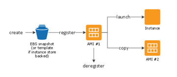
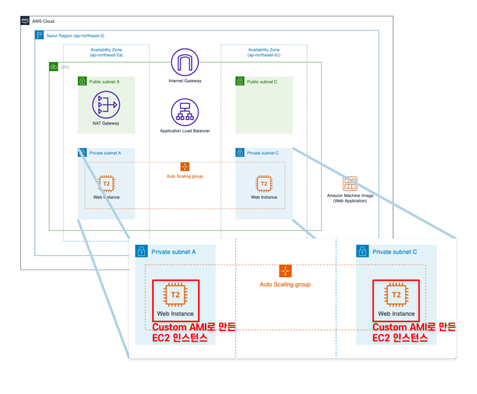

## AMI

Amazon 머신 이미지(AMI)는 인스턴스를 시작하는 데 필요한 정보를 제공

인스턴스를 시작할 때 AMI를 지정해야함.

동일한 구성의 인스턴스가 여러 개 필요할 때는 한 AMI에서 여러 인스턴스를 시작할 수 있음.

서로 다른 구성의 인스턴스가 필요할 때는 다양한 AMI를 사용하여 인스턴스를 시작

< AMI >

●1개 이상의 EBS (e-business suite)스냅샷 또는, 인스턴스 저장 지원 AMI의 경우, 인스턴스의 루트 볼륨에 대한 템플릿(예: 운영 체제, 애플리케이션 서버, 애플리케이션)

●AMI를 사용하여 인스턴스를 시작할 수 있는 AWS 계정을 제어하는 시작 권한

●시작될 때 인스턴스에 연결할 볼륨을 지정하는 블록 디바이스 매핑

AMI를 생성 및 등록한 다음 새 인스턴스를 시작하기 위해 사용할 수 있음

 (AMI 소유자가 시작 권한을 부여한 경우 AMI에서 인스턴스를 시작할 수 있습니다.) 

AMI를 동일 리전 또는 다른 리전으로 복사할 수 있음. 

더 이상 필요 없는 AMI는 등록 취소할 수 있음

인스턴스의 기준을 충족하는 AMI를 검색할 수 있고, AWS에서 제공하는 AMI 또는 커뮤니티에서 제공하는 AMI를 검색할 수 있다.

AMI에서 인스턴스 시작한 이후에 인스턴스를 연결할 수 있고, 인스턴스에 연결되면 사용자는 인스턴스를 다른 서버와 동일한 방식으로 사용할 수 있다.

AMI 수명 주기를 요약하여 설명  =>

### 인스턴스 및 AMI

인스턴스는 클라우드의 가상 서버. 

시작 시 구성은 인스턴스를 시작할 때 지정한 AMI의 사본

*Amazon 머신 이미지(AMI)*는 소프트웨어 구성이 기재된 템플릿

(예: 운영 체제, 애플리케이션 서버, 애플리케이션). 

AMI에서 *인스턴스*를 바로 시작하실 수 있는데, 이 인스턴스는 AMI의 사본으로, 클라우드에서 실행되는 가상 서버

한 AMI로 여러 인스턴스를 실행할 수 있음

인스턴스는 중단하거나 최대 절전 모드로 전환하거나 종료할 때까지 또는 오류가 발생하지 않는 한 계속 실행되고, 인스턴스가 실패하면 AMI에서 새로 실행할 수 있다.

### 커스텀 AMI

●자신이 인스턴스에서 구성해놓은 환경 그대로를 이미지로 만들어두는 것

●만들어 놓은 이미지를 사용하면 이전 환경 그대로 인스턴스를 생성할 수 있다.

●즉, 운영중인 EC2 인스턴스를 커스텀 AMI로 만들어두면 동일한 환경으로 구성된 EC2를 빠르게 시작 할 수 있으며 이 AMI를 다른 리전에서 런칭해서 사용할 수도 있다.

●또한 커스텀 AMI를 사용하여 시작 템플릿을 만들고 Auto Scaling 그룹에 추가해두면 스케일아웃 이벤트 발생시 동일한 환경의 인스턴스가 추가되고 사용자들에게 일관성 있는 서비스를 제공할 수 있게 된다.

