## Creating a Basic Lambda Function to Shut Down an EC2 Instance(team2)


### Create a Basic Lambda Function and a Custom IAM Policy for an IAM Role

Navigate to **EC2** > **Instances**.

Select the **Running instances** section uned *Resources*.

Select the running instance.

Copy its instance ID in the *Description* section, and paste it into a text file. We'll need it later in the lab.

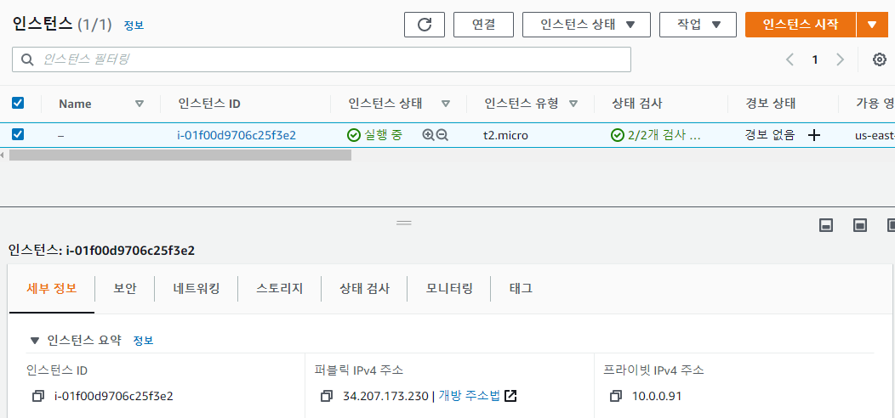


Navigate to *Lambda*.

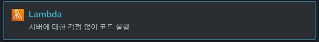

Click **Create function**.


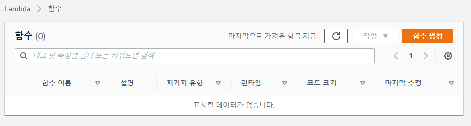


Make sure the Author from scratch(처음부터 작성) option at the top is selected, and then use the following settings:

- *Function name*: **EC2shutdown**
- *Runtime*: **Python 3.6**

Expand **Choose or create an execution role**.


Click the **IAM console** link to create a custom role. A new tab will open.


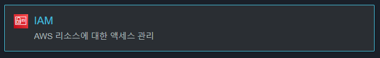

Click the **IAM console** link to create **a custom role**. A new tab will open.


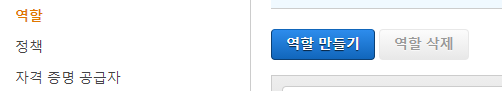

Select **AWS service**, and then select **Lambda**.

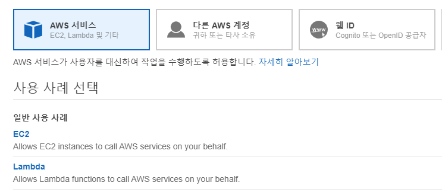


Click **Next: Permissions**.

Click **Create policy**.

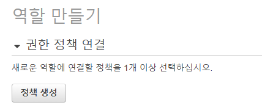


On the policy creation page, select the **JSON** tab.

```json
{
  "Version": "2012-10-17",
  "Statement": [
    {
      "Effect": "Allow",
      "Action": [
        "logs:CreateLogGroup",
        "logs:CreateLogStream",
        "logs:PutLogEvents"
      ],
      "Resource": "arn:aws:logs:*:*:*"
    },
    {
      "Effect": "Allow",
      "Action": [
        "ec2:Stop*"
      ],
      "Resource": "*"
    }
  ]
}
```

Click **Review policy**.

Give it a *Name* and *Description* of "EC2shutdown".

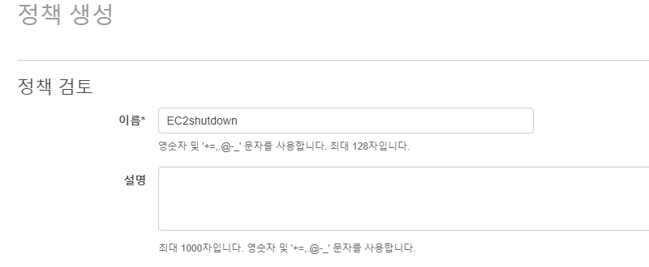


Click **Create policy**.


Head back to the IAM Management Console browser tab (the *Create role* page).

In the *Attach permissions policies* section, in the *Filter policies* box, search for for the newly created **EC2shutdown** role. (You may need to click the refresh icon so it finds it.)


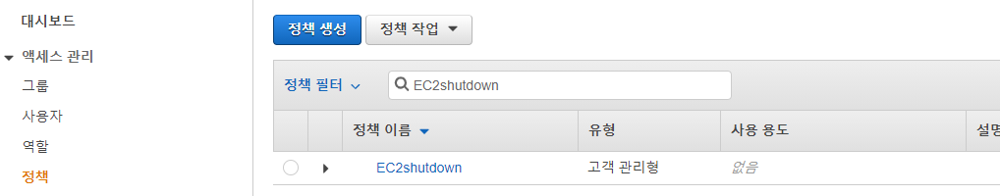


Select its checkbox, and click **Next: Tags**.

On the tags page, set the following values:

- *Key*: **role**

- *Value*: **EC2shutdownlambda**

  


Click **Next: Review**.

On the review page, give it a *Role name* of "EC2shutdownrole".

Click **Create role**.


Back in the *Lambda Management Console* page, set the *Execution role* dropdown to **Use an existing role**.

Hit refresh next to the *Existing role* dropdown, and then click to select **EC2shutdownrole**.

Click **Create function**.

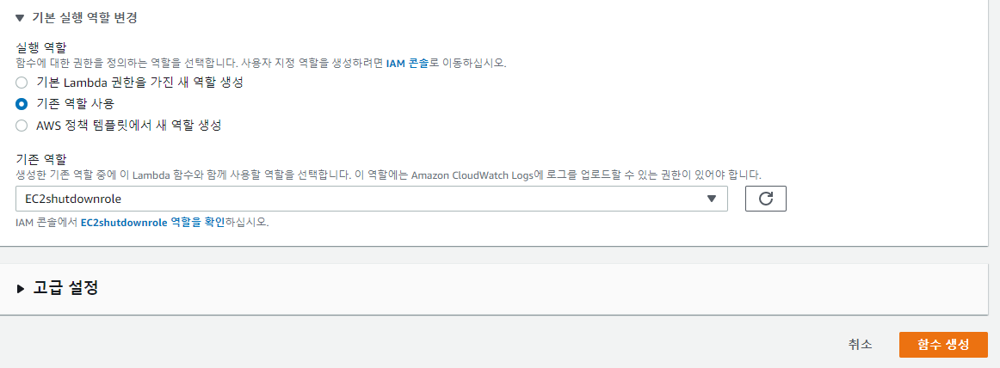


### Create a Test in the Lambda Console

On the *EC2shutdown* page, click **Test**.

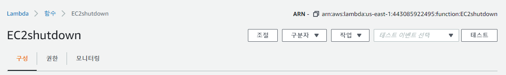


In the *Configure test event* dialog, give it an *Event name* of "EC2shutdown".


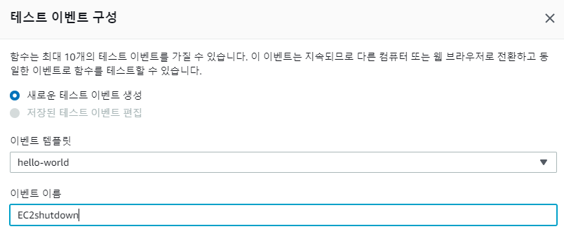

Click **Create**. We should receive verification that the test was successful.


Back on the *EC2shutdown* page, scroll down to the *Function code* section, and delete the existing code.

Paste in the following Lambda function code:

```
import boto3
#This simple lambda function is available from AWS with instructions on starting and stopping an instance at regular intervals using Lambda and CloudWatch: https://aws.amazon.com/premiumsupport/knowledge-center/start-stop-lambda-cloudwatch/
# Enter the region your instances are in. Include only the region without specifying Availability Zone; e.g., 'us-east-1'
region = 'us-east-1'
# Enter your instances here: ex. ['X-XXXXXXXX'] you can comma separate the instance IDs for more than one instance: i.e. ['X-XXXXXXXXX', 'X-XXXXXXXXX"]
instances = ['인스턴스id']
#i-01f00d9706c25f3e2

def lambda_handler(event, context):
    ec2 = boto3.client('ec2', region_name=region)
    ec2.stop_instances(InstanceIds=instances)
```

Replace the instance ID currently in the `instances` line with the EC2 instance ID you copied earlier.

Click **Deploy**.

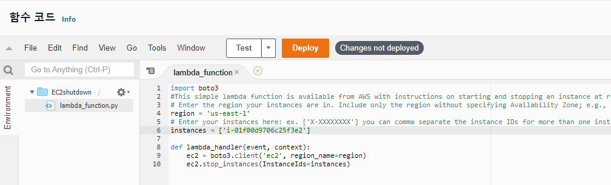

In a new browser tab, navigate to **EC2** > **Instances** > **Running instances**. Our instance should still be running.

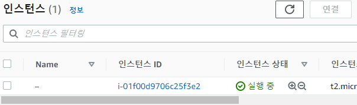


Using the *Services* dropdown, go to **Lambda** and select our function.

On the *EC2shutdown* page, click **Test** again. We should receive verification that the test was successful.

Back in the EC2 instances page, we should see our instance has stopped running.


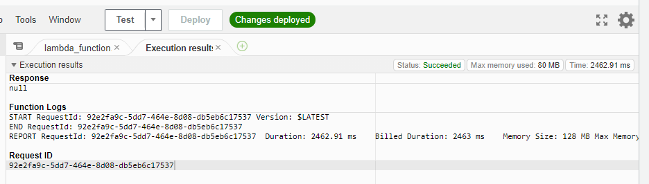


Back in the EC2 instances page, we should see our instance has stopped running.


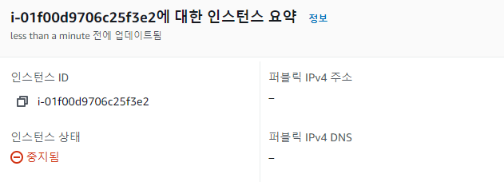