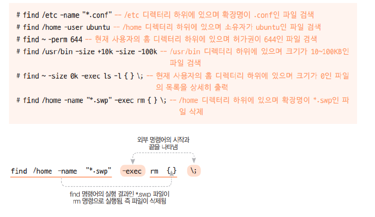

### find

find 경로 옵션 조건 action

- 옵션 : -name, -user( 소유자 ), -newer( 전 , 후 ), -perm( 허가권 ), -size( 크기)
- action: -print( 기본 값 ), -exec( 외부 명령 실행 {}\;)





### echo

##### echo 명령어로 파일 생성하기

echo 명령어와 > 를 사용하면 간단히 파일을 만들 수 있습니다.

```python
pi@raspberrypi:~ $ echo -e abcdefg\\n123456 > newfile
pi@raspberrypi:~ $ cat newfile
abcdefg
123456
```

\> 를 사용하면 이미 존재하는 파일의 경우 이전에 들어 있던 내용은 모두 삭제됩니다.

```python
pi@raspberrypi:~ $ echo -e abcdefg\\n123456 > newfile
pi@raspberrypi:~ $ cat newfile
abcdefg
123456
pi@raspberrypi:~ $ echo 98765 >> newfile
pi@raspberrypi:~ $ cat newfile
abcdefg
123456
98765
```

기존에서의 추가는 >> 사용한다


### Link

윈도우로 치면 "바로가기" 같은 개념으로, 리눅스에도 링크 기능이 있다. 특정 파일이나 디렉터리를 링크 걸어 사용할 수 있는데, 링크에는 두 종료가 있다.

- 하드 링크를 생성하는 명령은 `ln 원본파일 링크파일명`
- 심벌릭 링크를 생성하는 명령은 `ln -s 원본파일 링크파일명`

#### 심볼릭링크(symbolic link)

원본파일의 이름을 가르키는 링크. 원본파일이 삭제되면 역할을 수행할 수 없다. 전혀 다른 파일이라도 원본파일과 이름이 같으면 계속 사용할 수 있다. 원본파일에 대한 정보가 포함되어 있지 않으며 파일 위치에 대한 포인터만 포함되며 새로운 inode를 가진 링크 파일이 생성된다.


[[시스템해킹\] 레이스 컨디션 공격 기법 ( Race Condition) : 네이버 블로그 (naver.com)](https://m.blog.naver.com/kky564/80188027120)


#### 하드링크(hard link)

원본파일과 동일한 inode를 가진다. 원본파일이 삭제 되더라도 원본파일의 inode를 갖고 있는 링크 파일은 사용가능하다.


- inode
  파일 시스템 내에서 파일이나 디렉토리는 고유한 inode를 가지고 있으며 inode번호를 통해 구분을 할 수 있다. 사용자가 파일 또는 파일과 관련된 정보에 접근하려 하면 파일 이름을 사용하지만 내부적으로 파일 이름은 먼저 디렉토리 테이블에 저장된 inode번호로 매핑이 된다. 그 다음 해당 inode번호를 통해 해당 inode에 액세스 된다.


### 파일 소유권과 허가권

drwxr-xr-x 4 mark staff 128 4 3 0066.


> 1. 제일 앞에 있는 d는 파일type을 나타냄.
>    'd'-> dir , '-' -> 일반파일
> 2. rwxr-xr-x: 권한정보를 나타냄
>    해당 파일에 어떤 권한이 부여되어 있는지 확인가능.
> 3. 4 링크수
> 4. mark : 해당 파일의 소유자
> 5. staff: 소유그룹
> 6. 128: 파일의 용량
> 7. 4 3 0066: 생성날짜
> 8. .: 파일의 이름


> - 퍼미션의 종류
>   - r(읽기): 파일의 읽기 권한
>   - w(쓰기): 파일의 쓰기 권한
>   - x(실행): 파일의 실행 권한


- 디렉터리 폴더 를 해당 디렉터리로 이동하려면 실행 (x) 권한이 반드시 있어야 함

- 일반적으로 디렉터리에는 소유자 , 그룹 , 그 외 사용자의 실행 (x) 권한이 설정됨