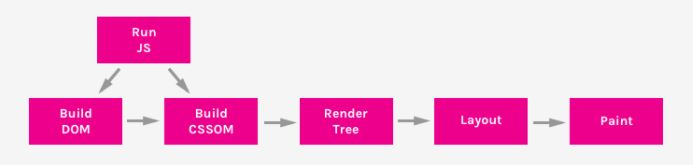

## 01. JavaScript


단순한 브라우저 용이 아니라 백엔드도 다루기에 프론트엔드도 사이즈가 터지고 문법이 규정되고 있다

- **ECMA** : 표준화 -> 5,6버전

- **JavaScript**는 유연하지만 디버깅이 어려워지는 단점이 생긴다. 객체지향언어로 목적

- **TypeScript** : MS
- **Node.js**는 v8 엔진 이후 브라우저 뿐 아니라 확장 -> **jQuery**(크로스브라우징 목적, 라이브러리)
- **Ajax** : XML기반의 JavaScript. 자바스크립트를 통해 서버에 데이터 요청. 전체 새로고침X. 일부만
- **DOM**
  - 문서 객체 모델(The Document Object Model) HTML, XML 문서의 프로그래밍 interface
  - 브라우저 개발자 툴에서 보이는 것이 DOM
  - 원본 HTML 문서의 객체 기반 표현 방식, 노드 Tree구조로 구성

- **객체지향개발원칙(SOLID)**

- **웹페이지 생성순서(Critical Rendering Path)**

  - DOM(Document Object Model) – HTML 요소들의 표현

  - CSSOM(Cascading Style Sheets Object Model)

    




1. `console.log()`

2. `async` : 순서대로 로드 되지 않고 실행 순서가 보장이 되지 않는다

3. `defer` : 로드 되는 순서에 대한 파싱

   

   

   ```javascript
   //변수 선언
   //var
   //ECMA6 -> let, const(상수값) 사용
   ```

   ```javascript
   // var x;
   x =6;
   x="6" //이러한 식도 가능하다 -> 유연성이 강하다 -> 프론트의 역할이 커질 수록 좋지 않다
   document.getElementById("data").innerHTML = "<h3>variable x = " +x+ "</h3>";
   ```

   ```javascript
   // var x;
   //변수선언은 let 사용(이유 : 유효범위 구분)
   //상수선언은 const(값 변경없이 read Only로 사용)
   x =6;
   const constVariable = 10;
   
   let globalVariable = 5;
   {
       let localVariable = 5;
       var y=5;
       console.log("localVariable ", localVariable);
   	console.log("globalVariable ", globalVariable);
       console.log("var x", x);
       console.log("var y", y);
   }
   
   //constVariable = 100; 상수는 값할당X
   console.log("localVariable ", localVariable);
   console.log("globalVariable ", globalVariable);
   console.log("var x", x);
   console.log("var y", y);
   
   
   document.getElementById("data").innerHTML = "<h3>variable x = " +x+ "</h3>";
   ```

   - 가능하면 var을 let으로 수정하여 써 주어야 한다
   - `var` : 변수 유효 범위 구분이 되지 않기 때문에 `let` 을 사용 
   - `const` : 상수 값으로 사용, 많이 사용된다

   

4. **데이터 타입**

   - primitive(int, float, char, boolean)
   - Reference(Class, Array)

   ```javascript
   let intV =10;
   let floatV = 10.5;
   let stringV = "10";
   let booleanV = true;
   console.log("data type", intV, floatV, stringV, booleanV);
   
   //바닐라JS에선 type을 주석으로 명시하는 경우도 꽤 있다
   //코딩가이드
   ```


5. **연산자**

   1. 산술 연산자 : + , - , *, / , %

      ```javascript
      let x = 10;
      let y = 20;
      
      // console.log(x, "+", y "=", x+y);
      console.log('${x}+${y}=${x+y}');
      console.log('${x}-${y}=${x-y}');
      console.log('${x}*${y}=${x*y}');
      console.log('${x}/${y}=${x/y}');
      console.log('${x}%${y}=${x%y}');
      
      ```

      

   2. 대입 연산자
   3. 비교 연산자
   4. 논리 연산자
      - &&, ||, ~
   5. 비트 연산자
      - &, |, ^, ~, <<, >>
   6. 삼항 연산자
      - 조건 ? 참 : 거짓


6. **Command.js**

   - `if`

     ```javascript
     let month = prompt("월 입력 : ", "");
     
     if(month ==1 || month ==3 || month ==3 ||month ==5 ||month ==7 ||month ==8 ||month ==10 ||month ==12){
         console.log('${month}월은 31까지 있습니다.');
     }else if(month==2){
         console.log('${month}월은 28까지 있습니다.');
     }
     else if(month==4||month==6||month==9||month==11){
         console.log('${month}월은 30까지 있습니다.');
     }
     else{
         console.log('${month}월이 맞는지 확인하세요');
     }
     ```

     

   - `switch`

     ```javascript
     switch(month){
         case 1:
             ...
         case 12:
         	console.log('${month}월은 31일까지 있습니다.');
             break;
         default:
             console.log('${month}월이 맞는지 확인하세요');
             break;
     }
     ```

     

   - `for(초기값; 조건식; 증감식){ 실행문; }`

   - `for( 데이터 in/of 리스트데이터){ 실행문; }`

     ```javascript
     let index =1;
     let sum =0;
     
     for(index=0; index<10; index++){
         sum+=index;
     }
     ```

   

   - `while`

     ```javascript
     let index =1;
     let sum =0;
     while(index<11){
         sum+=index;
         index++;
     }
     console.log('1~10 합 : ${sum}');
     
     #do while
     do{
         sum+=index;
         index++;
     }while(index<11);
     console.log('1~10 합 : ${sum}');
     ```


7. **Function**

   - `정의` : **function**(parameter, parameter, ... ){ 구현; (return data;)}

   - `호출` : let data = 함수명(parameter, ...)

   - parameter나 return data에 함수 사용도 가능하다

   - `arrow function` : (parameter, parameter, ... ) => {구현 [return data;]} : **일회용**

     ```javascript
     function add(x,y){
         return x+y;
     }
     
     //함수사용
     let sum = add(10,20);
     console.log("add(10,20 = " sum);
     
     //익명함수
     let substract = function(x,y){
         return x-y;
     }
     console.log("substract(20,10)=", substract(20,10), typeof substract, substract);	//substract는 함수내용이 출력된다
     
     let substract = (x,y)=>{ return x-y};	//익명함수보다 더 많이 사용된다
     
     //arrow function
     let devide = (x,y)=>console.log('devide(${x}, ${y} :', x/y);
     devide(20,10);	//람다식으로 다른 언어에서도 제공된다
     
     //함수선언 및 실행
     let multiply = ((x,y)=>{ console.log('multiply(${x}, ${y} :', x/y), x*y) }) (20,10);	//함수객체를 바로 선언 및 실행
     
     //클로저
     //함수에서 다른 함수 리턴
     function makeAdder(x){
         let y = 1;	//makeAdder function local variable
         return function(z){
             y=100;	//외부함수 local variable 사용
             return x+y+z;
         }
     }
     
     let add5 = makeAdder(5);	//익명의 function객체가 된다
     let add10 = makeAdder(10);	//익명의 function객체가 된다
     console.log(add5(2));
     console.log(add10(2));
     //lifecycle이 끝나고도...
     ```

   

   - `closure` : 만들어진 함수는 환경을 기억한다 -> function도 객체

     ```javascript
     function multi(n){
         return function(){
             return n*n;
         }
     }
     
     let multis5 = multi(5);
     let multi10 = multi(10);
     ```

     

   - `factorial` : 재귀함수

     - 함수 안에서 자신의 함수를 다시 호출하는 함수

     ```javascript
     function factorial(n){
         if(n===0){
             console.log('호출 끝');
         }else{
             console.log('호출'+n);
             result*= n;
             factorial(n-1);
         }
         
         return result
     }
     
     console.log("10!", factorial(10));
     ```

     

*목업툴 고민하기*


## 02. Vanilla JavaScript (feat. Nomad Coder)


- `let`
  - 변수지정
- `const` 
  - constant, 상수를 의미한다

- `var` 
  - variable, 변수를 의미 -> 예전의 변수 선언 방식
- 데이터타입들
  - int
  - float
  - string
  - boolean


- `array`

  - 배열은 **인덱스 0**부터 시작

    ```javascript
    const daysOfWeek = ["Mon", "Tue" ...]
    //array는 []
    
    console.log(daysOfWeek[4]);
    ```


- `object`

  ```javascript
  const eumInfo= {
      name : "eum",
      age : 100,
      gender : "Male",
      isHandsome:false,
      favMovie: ["Along the gods", "Oldboy", "LOTR"],
      favFood: [
          {
              name:"Kimchi", fatty:false
          },
          {
              name:cheesebuger, fatty:true
          }
      ]
  }
  
  eumInfo.age = 200;
  
  //호출방법
  console.log(eumInfo.gender);
  
  console.log(eumInfo);
  console.log(eumInfo.favFood[0].name);
  ```

  

