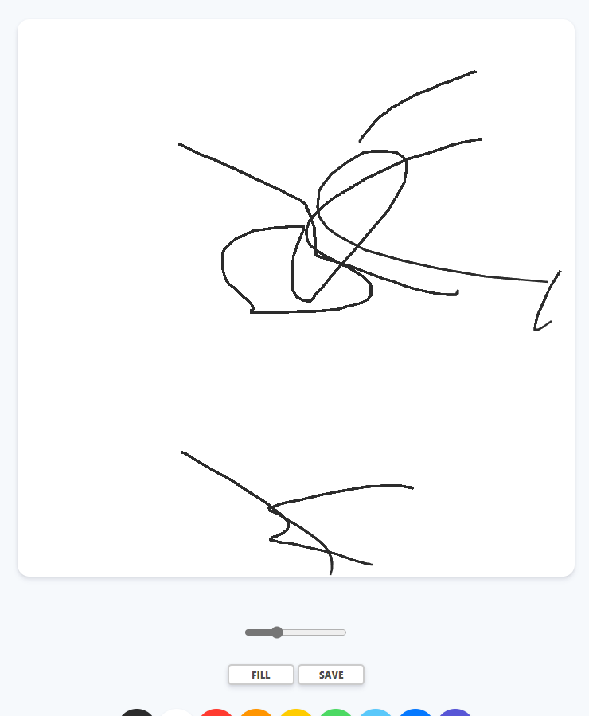

### 캔버스 painJS

`html5` 요소인 캔버스를 활용하여 본격적으로 드로잉

캔버스 내의 픽셀을 조정하여 드로잉을 하는 것이 목적

<br /><br />

**마우스 움직임을 감지하는 event작성**

```javascript
const canvas = document.getElementById("jsCanvas");

//true, false를 통해 마우스 동작이 멈췄는지 확인(드로잉)
let painting = false;

function stopPainting() {
  painting = false;
}

function startPainting() {
  painting = true;
}

//2d 평면에서 x축과 y축을 가져오기
//console.log(x,y)를 통해 드로잉을 이해하는지 확인하자
function onMouseMove(event) {
  const x = event.offsetX;
  const y = event.offsetY;
}

function onMouseDown(event) {
  painting = true;
}

//canvas에서 각종 마우스 움직임을 이해하는 함수 작성
//mousedown : 클릭
//mouseup : 클릭중지
//mouseleave : 캔버스 밖으로 마우스가 나갔을 경우
if (canvas) {
  canvas.addEventListener("mousemove", onMouseMove);
  canvas.addEventListener("mousedown", startPainting);
  canvas.addEventListener("mouseup", stopPainting);
  canvas.addEventListener("mouseleave", stopPainting);
}

```

<br /><br /><br />

### 2d context

[CanvasRenderingContext2D - Web APIs | MDN (mozilla.org)](https://developer.mozilla.org/en-US/docs/Web/API/CanvasRenderingContext2D) : **MDN 페이지**

`<canvas></canvas>` 라는 html tag를 가지고 있다면 2d context를 활용할 수 있다

아래의 `getContext('2d')`를 통해서 랜더링 context와 그리기 함수를 활용할 수 있다

```javascript
<canvas id="my-house" width="300" height="300"></canvas>
```

```javascript
const canvas = document.getElementById('my-house');
const ctx = canvas.getContext('2d');

canvas.width = document.getElementsByClassName("canvas")[0].offsetWidth;
canvas.height = document.getElementsByClassName("canvas")[0].offsetHeight;


//canvas.width = 700;
//canvas.height = 700;
```

<br /><br />

**mdn예제**

```javascript
// Set line width
ctx.lineWidth = 10;

// Wall
ctx.strokeRect(75, 140, 150, 110);

// Door
ctx.fillRect(130, 190, 40, 60);

// Roof
ctx.beginPath();
ctx.moveTo(50, 140);
ctx.lineTo(150, 60);
ctx.lineTo(250, 140);
ctx.closePath();
ctx.stroke();
```


<br /><br /><br />

**mdn을 통한 동작이해**

>  뭔말이여ㅋㅋㅋ

<br />



<br />

```javascript
ctx.strokeStyle = "#2c2c2c";	//stroke 색상
ctx.lineWidth = 2.5;			//range설정

function onMouseMove(event) {
  const x = event.offsetX;
  const y = event.offsetY;
    
  if (!painting) {
    ctx.beginPath();
    ctx.moveTo(x, y);
  } else {
    ctx.lineTo(x, y);
    ctx.stroke();
  }
}
```

- CanvasRenderingContext2D.beginPath()
  - Starts a new path by emptying the list of sub-paths. Call this method when you want to create a new path.

- CanvasRenderingContext2D.moveTo()
  - Moves the starting point of a new sub-path to the (x, y) coordinates.
- CanvasRenderingContext2D.lineTo()
  - Connects the last point in the current sub-path to the specified (x, y) coordinates with a straight line.

- CanvasRenderingContext2D.strokeStyle
  - Color or style to use for the lines around shapes. Default #000 (black).

<br /><br />

### Array  from

[Array.from() - JavaScript | MDN (mozilla.org)](https://developer.mozilla.org/ko/docs/Web/JavaScript/Reference/Global_Objects/Array/from)

`Array.from()` 메서드는 유사 배열 객체(array-like object)나 반복 가능한 객체(iterable object)를 얕게 복사해새로운`Array` 객체를 만듭니다.

```javascript
console.log(Array.from('foo'));
// expected output: Array ["f", "o", "o"]

console.log(Array.from([1, 2, 3], x => x + x));
// expected output: Array [2, 4, 6]
```

<br />

**color색상변경 코드**

```javascript
// 캔버스 아래 색상 div를 가져옴
//html 안에 inline으로 색상이 지정되어있다
const colors = document.getElementsByClassName("jsColor"); 

//변경한 array를 가지고 event를 발생
function handleColorClick(event) {
  const color = event.target.style.backgroundColor;
  ctx.strokeStyle = color;
}

//색상 div 객체를 array로 변경
Array.from(colors).forEach((color) =>
  color.addEventListener("click", handleColorClick)
);

```

<br /><br />

> backgroundColor를 html에 인라인스타일으로 적용안하고 css 외부파일로 작성한 경우엔 js로 값을 가져올때 어떻게 해야하나요? 
>
> You can do **event.target.style.backgroundColor = "black"**
>
> **window.getComputedStyle(e.target).backgroundColor**

- Window.getComputedStyle()
  - `Window.getComputedStyle()` 메소드는 인자로 전달받은 요소의 모든 CSS 속성값을 담은 객체를 회신합니다. 이 속성값들은, 해당 요소에 대하여 활성 스타일시트와 속성값에 대한 기본 연산이 모두 반영된 결과값입니다. 개별 CSS속성 값은 객체를 통해 제공되는 API 또는 CSS 속성 이름을 사용해서 간단히 색인화해서 액세스할 수 있습니다.
  - [Window.getComputedStyle() - Web API | MDN (mozilla.org)](https://developer.mozilla.org/ko/docs/Web/API/Window/getComputedStyle)

<br /><br />

**range바 만들기**

index.html

```html
<canvas id="jsCanvas" class="canvas"></canvas>
    <div class="controls">
      <div class="controls">
        <div class="controls__range">
          <input
            type="range"
            id="jsRange"
            min="0.1"
            max="5.0"
            value="2.5"
            step="0.1"
          />
        </div>
```

app.js

```javascript
ctx.lineWidth = 2.5;		//override하자

const range = document.getElementById("jsRange");

function handleRangeChange(event) {
//  console.log(event.target.value);
    const size = event.target.value;
    ctx.lineWidth = size;
}

if (range) {
  range.addEventListener("input", handleRangeChange);
}
```

<br /><br /><br />

### Fill mode

- CanvasRenderingContext2D.fillRect(x좌표, y좌표, 가로, 세로)
  - Draws a filled **rectangle** at *(x, y)* position whose size is determined by *width* and *height*.

```javascript
let filling = false;

function handleModeClick(event) {
  if (filling === true) {
    filling = false;
    mode.innerText = "Fill";
  } else {
    filling = true;
    mode.innerText = "Paint";
  }
}

function handleCanvasClick() {
  if (filling) {
    ctx.fillRect(0, 0, canvas.width, canvas.height);
  }
}

if (canvas) {
  canvas.addEventListener("mousemove", onMouseMove);
  canvas.addEventListener("mousedown", startPainting);
  canvas.addEventListener("mouseup", stopPainting);
  canvas.addEventListener("mouseleave", stopPainting);
  canvas.addEventListener("click", handleCanvasClick);
}
```

<br /><br />

**Contextmenu**

- 우클릭 금지

```javascript
function handleCM(event) {
  event.preventDefault();
}

if (canvas) {
  canvas.addEventListener("mousemove", onMouseMove);
  canvas.addEventListener("mousedown", startPainting);
  canvas.addEventListener("mouseup", stopPainting);
  canvas.addEventListener("mouseleave", stopPainting);
  canvas.addEventListener("click", handleCanvasClick);
 //이벤트
  canvas.addEventListener("contextmenu", handleCM);
}
```

<br /><br /><br />

### SaveImage

- HTMLCanvasElement.toDataURL()
  - The **`HTMLCanvasElement.toDataURL()`** method returns a **data URI** containing a representation of the image in the format specified by the `type` parameter (**defaults** **to** **PNG**). The returned image is in a resolution of 96 dpi.
  - [HTMLCanvasElement.toDataURL() - Web APIs | MDN (mozilla.org)](https://developer.mozilla.org/en-US/docs/Web/API/HTMLCanvasElement/toDataURL)
  - `canvas.toDataURL(type, encoderOptions);`

```javascript
//클릭버튼 html 태그
const saveBtn = document.getElementById("jsSave");

//toDataURL을 통해 캔버스를 이미지 데이터화
//html link download

function handleSaveClick(event) {
//URL을 지우면 PNG로 다운로드 된다
  const image = canvas.toDataURL("image/png");
//비어있는 link생성
  const link = document.createElement("a");
  link.href = image;
  link.download = "PaintJS";
  link.click();
}

if (saveBtn) {
  saveBtn.addEventListener("click", handleSaveClick);
}
```

> 'event' only comes when we use a function from 'addEventListener'

<br />