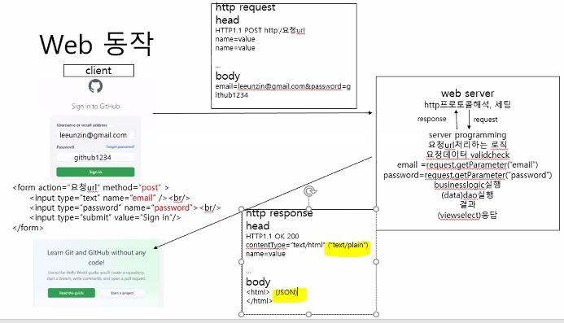
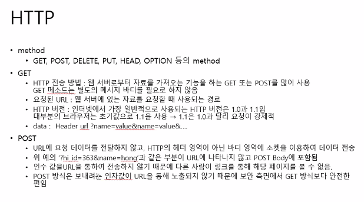
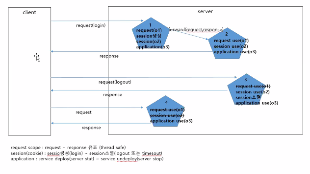
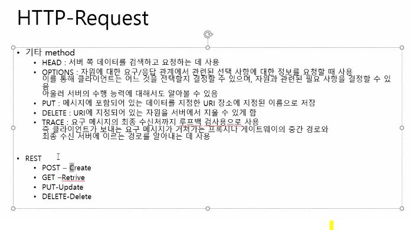
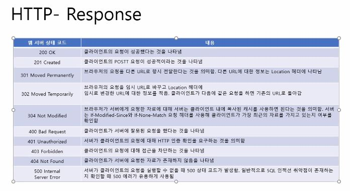

### Client -> http프로토콜 -> Server




**client**

```html
<form action="요청url" method="past">
    <input type="text" name="email" /><br />
    <input type="password" name="password" /><br />
    
</form>
```


**http 프로토콜**

- header
  - POST http:/요청url
  - name=value
  - name= value
- body 
  - email = leeunzin@gmail.com&password=github123

- 스펙에 맞춰서 브라우저가 세팅해준다

  

**server**

1. http프로토콜 해석(web server)

2. request(로직요청)

3. 요청url을 처리하는 로직

4. 요청 데이터 vaildcheck

5. email=request.getParameter("email")

   password=request.getParameter("password")

6. 비즈니스로직 호출

7. dao 호출

8. (viewselect) 응답


**XHR**


## HTTP 헤더


- HTTP의 비연결성 -> 리소스의 감소, 오버헤드 증가

  [[HTTP\] HTTP 특성(비연결성, 무상태)과 구성요소 그리고 Restful API :: victolee (tistory.com)](https://victorydntmd.tistory.com/286#:~:text=1)

- hidden tag
- Cookie 의 등장(브라우저 로컬 정보 저장) : 사용자 정보의 유지 가능




[코딩 면접 질문들 - 사용자가 웹브라우저를 통해 서버에 이미지를 요청해서 사용자에게 보여주기까지 과정 (tistory.com)](https://krksap.tistory.com/1148)

[[HTTP\] 쿠키( Cookie )와 세션( Session ) :: victolee (tistory.com)](https://victorydntmd.tistory.com/34)

[[WEB\] 쿠키, 세션이란?. 웹의 기초중 하나인 쿠키와 세션에 대해 알아봅니다. | by chrisjune | Medium](https://chrisjune-13837.medium.com/web-쿠키-세션이란-aa6bcb327582#:~:text=쿠키는 로컬에%2C 세션,과 서버에 저장됩니다.&text=쿠키는 탈취와 변조,때문에 상대적으로 안전합니다.&text=쿠키는 파일에서 읽기,하기 때문에 비교적 느립니다.)


### 쿠키과 세션의 차이


**Session Management**

- Http stateless라 응답속도는 빠르나 사용자 정보를 정장할 수 없음
- 대안
  - html hidden tag
  - Cookie
  - Session
  - URL Rewriting

- Cookie는 Client에 정보를 저장하고 보안 취약, 네트워크 스팀으로 문자열정보 저장 단점
- 보안 HtttPOnly, SecureCookie

- Session 사용 권고



- 세션과 쿠키는 같은 것이다


### HTTP REST






