## Creating an EC2 Instance with Lambda in AWS


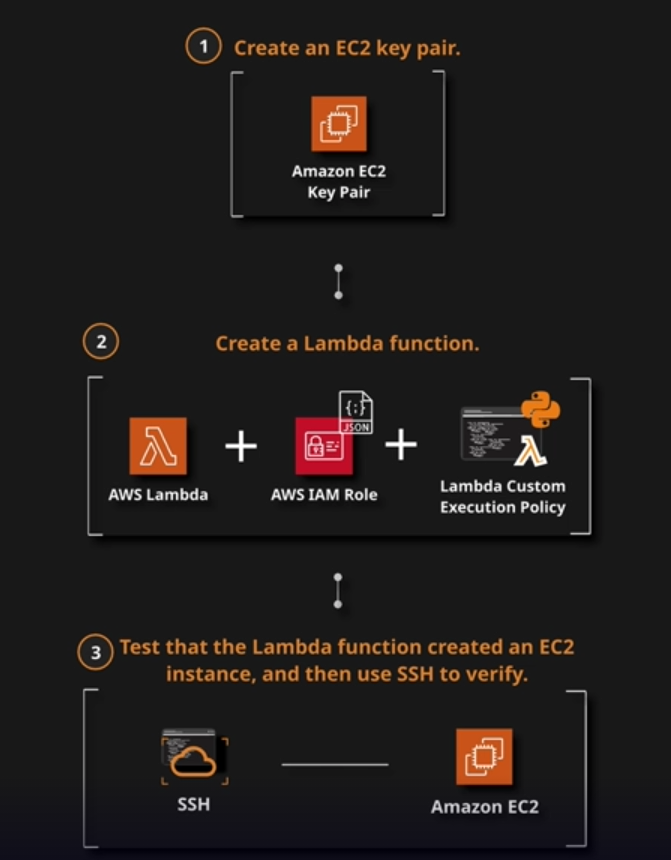


### Create EC2 Key Pair

Navigate to EC2.

In the navigation pane, under **NETWORK & SECURITY**, choose **Key Pairs**.

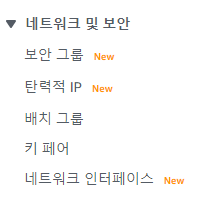


Choose **Create Key Pair**.


Enter a name for the new key pair (e.g., "LambdaEC2keypair") in the **Key pair name** field of the **Create Key Pair** dialog box, and then choose **Create**.

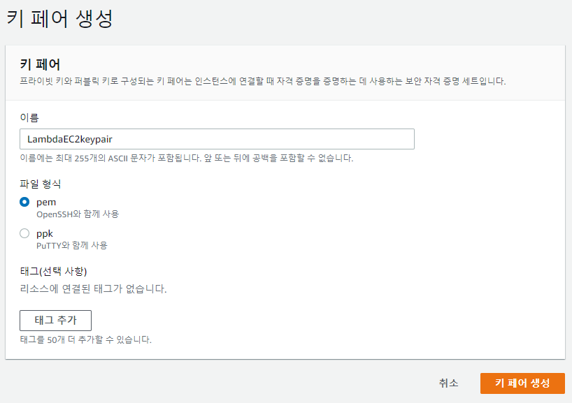


Save the private key file in a safe place. 

**Note**: Make sure you remember the name of your private key file and save it somewhere easily accessible.


### Create a Lambda Function

Navigate to Lambda.


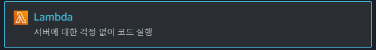

Click **Create a function**.

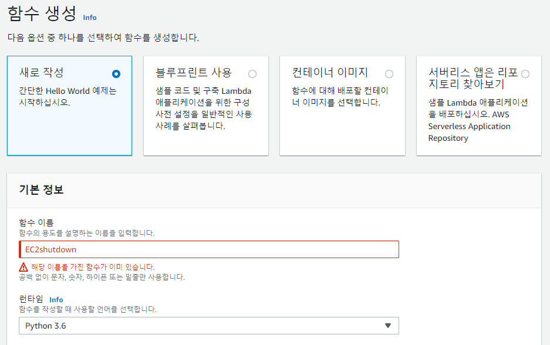


Choose Author from scratch and use the following settings:

- *Name*: **CreateEC2**
- *Runtime*: **Python 3.7**
- *Role*: **Create a custom role**

Expand *Choose or create an execution role*.

Set *Execution role* to **Create a new role with basic Lambda permissions**.

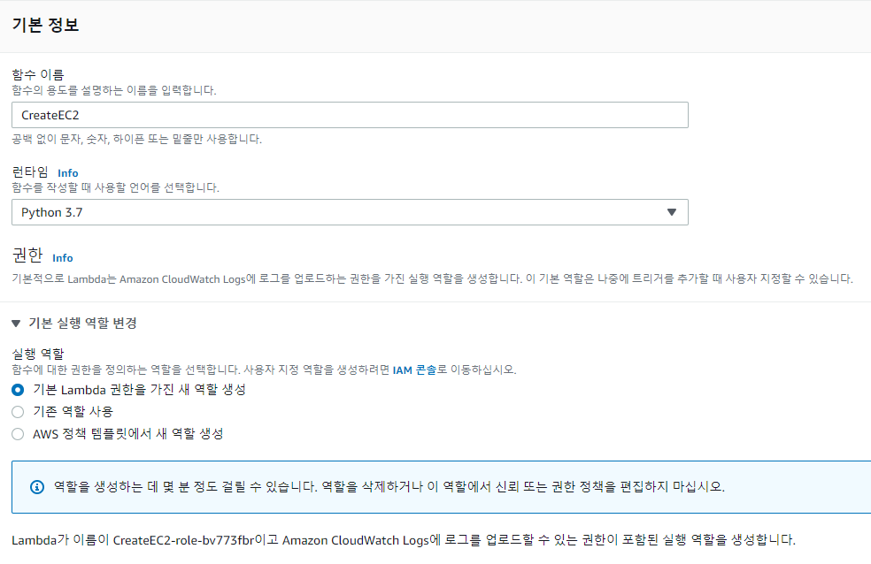

CreateEC2-role-bv773fbr


Copy the execution role name that appears (it will be something like *CreateEC2-role-*). Paste it into a text file for use later in the lab.

Click **Create function**.


In a new browser tab, navigate to IAM.

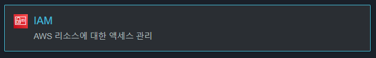


Click **Roles** in the left-hand menu.

In the search box, type in the name of the role we just created.

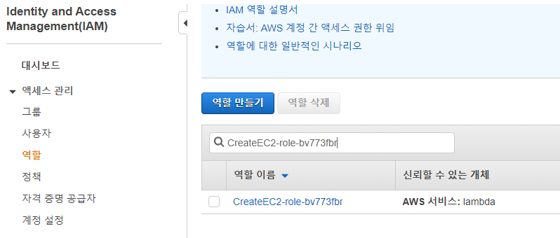


Select the role.

Click the policy that's currently attached to the role.

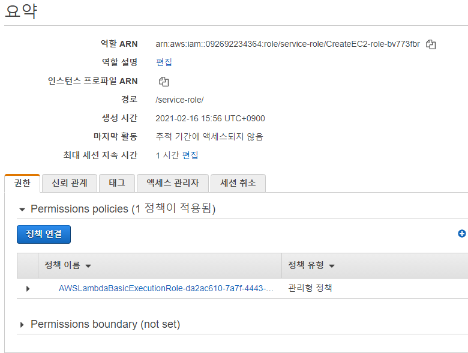


Click **{} JSON**.


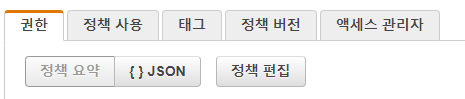

Click **Edit policy** > **JSON**.

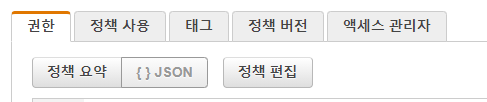


Paste in the follwing policy:

```
{
  "Version": "2012-10-17",
  "Statement": [{
      "Effect": "Allow",
      "Action": [
        "logs:CreateLogGroup",
        "logs:CreateLogStream",
        "logs:PutLogEvents"
      ],
      "Resource": "arn:aws:logs:*:*:*"
    },
    {
      "Action": [
        "ec2:RunInstances"
      ],
      "Effect": "Allow",
      "Resource": "*"
    }
  ]
}
```

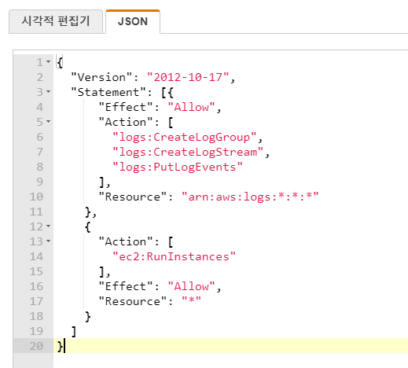

Click **Review policy** and then **Save changes**.


Back in the Lambda console, refresh the page.

On the CreateEC2 function page, scroll down to the *Function code* section.

Paste in the Python source code from [this file](https://raw.githubusercontent.com/linuxacademy/content-lambda-boto3/master/Lab-Create-an-EC2-Instance-Using-Lambda/lambda_function.py) on GitHub.

```
import os
import boto3

AMI = os.environ['AMI']
INSTANCE_TYPE = os.environ['INSTANCE_TYPE']
KEY_NAME = os.environ['KEY_NAME']
SUBNET_ID = os.environ['SUBNET_ID']

ec2 = boto3.resource('ec2')


def lambda_handler(event, context):

    instance = ec2.create_instances(
        ImageId=AMI,
        InstanceType=INSTANCE_TYPE,
        KeyName=KEY_NAME,
        SubnetId=SUBNET_ID,
        MaxCount=1,
        MinCount=1
    )

    print("New instance created:", instance[0].id)
```

Click **Save**.


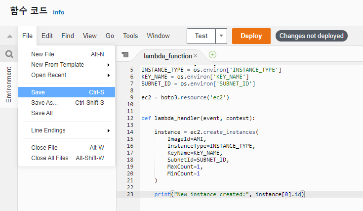


Scroll down to the **Environment variables** section.


Set the following environment variables:

- ```
  AMI
  ```

  - *Key*: **AMI**
  - *Value*: Open **EC2** in a new browser tab, click **Launch Instance**, and copy and paste the `ami` value listed after Amazon Linux 2.


- ```
  INSTANCE_TYPE
  ```

  - *Key*: **INSTANCE_TYPE**
  - *Value*: **t2.micro**

- ```
  KEY_NAME
  ```

  - *Key*: **KEY_NAME**
  - *Value*: The name of the EC2 key pair you created earlier.


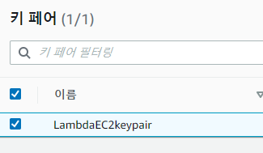

- ```
  SUBNET_ID
  ```

  - *Key*: **SUBNET_ID**
  - *Value*: Navigate to **VPC** > **Subnets**, and copy and paste the ID of one of the public subnets in your VPC.


Save the Lambda function.


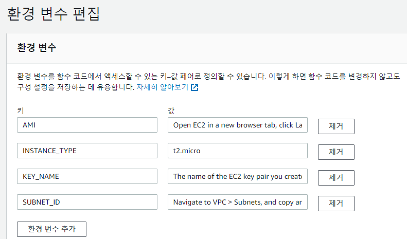

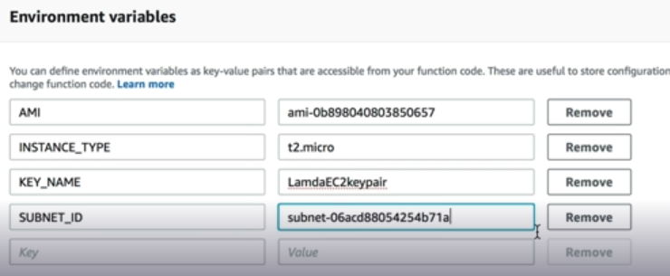


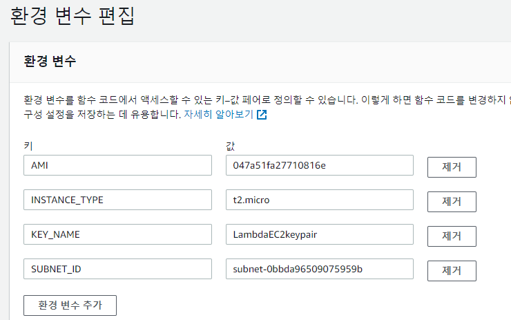

### Test Lambda Function

Click **Test**.

Define an empty test event. Its contents can simply be `{}`.

Give it any name you like.

Click **Create**.

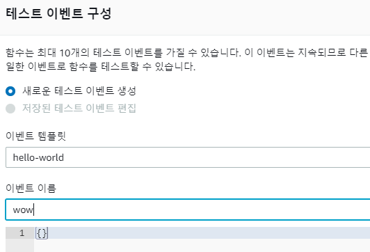


Click **Test**.


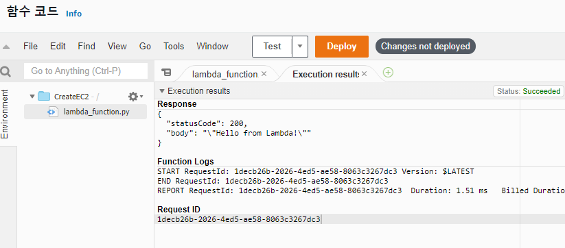

Navigate to **EC2** > **Instances**, and observe that an EC2 instance is initializing.


