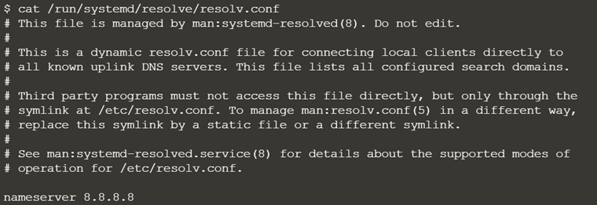
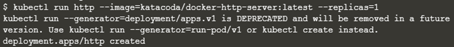

## Launch Single Node Kubernetes Cluster

### 개념이해

**쿠버네티스 클러스터**

> **쿠버네티스는 컴퓨터들을 연결하여 단일 형상으로 동작하도록 컴퓨팅 클러스터를 구성하고 높은 가용성을 제공하도록 조율한다.** 사용자는 쿠버네티스의 추상화 개념을 통해 개별 머신에 얽매이지 않고 컨테이너화된 애플리케이션을 클러스터에 배포할 수 있다. 이렇게 새로운 배포 모델을 활용하려면, 애플리케이션을 개별 호스트에 독립적인 방식으로 패키징할 필요가 있다. 즉, 컨테이너화가 필요하다. 예전 배치 모델인 설치형 애플리케이션이 특정 머신의 호스트와 밀접하게 통합되는 패키지인 것에 비해, 컨테이너화된 애플리케이션은 유연성(flexible)과 가용성(available)이 훨씬 높다. **쿠버네티스는 이러한 애플리케이션 컨테이너를 클러스터에 분산시키고 스케줄링하는 일을 더욱 효율적으로 자동화한다.** 쿠버네티스는 오픈소스 플랫폼이며 운영 수준의 안정성(production-ready)을 제공한다.

- 형태

  - **마스터** : 클러스터를 조율

    > 실행중인 어플리케이션을 호스팅하기 위해 사용되는 노드와 클러스터를 관리

  - **노드** : 어플리케이션을 구동하는 작업자(worker)

    > **클러스터 내 워커 머신으로 동작하는 VM 또는 물리적인 컴퓨터다.** 각 노드는 노드를 관리하고 쿠버네티스 마스터와 통신하는 Kubelet이라는 에이전트를 갖는다. 노드는 컨테이너 운영을 담당하는 containerd 또는 도커와 같은 툴도 갖는다. 운영 트래픽을 처리하는 쿠버네티스 클러스터는 최소 세 대의 노드를 가져야 한다

 

- 어플리케이션 배포 : 마스터에게 지시 -> 마스터는 어느 노드를 할지 스케줄 -> 노드는 마스터가 제공하는 쿠버네티스 API를 통해서 마스터와 통신 -> 최종 사용자도 쿠버네티스 API를 사용하여 클러스터와 직접 상호작용 가능

`minikube start` 

  

**쿠버네티스 API**

쿠버네티스 [컨트롤 플레인](https://kubernetes.io/ko/docs/reference/glossary/?all=true#term-control-plane)의 핵심은 [API 서버](https://kubernetes.io/ko/docs/concepts/overview/components/#kube-apiserver)이다. API 서버는 최종 사용자, 클러스터의 다른 부분 그리고 외부 컴포넌트가 서로 통신할 수 있도록 HTTP API를 제공한다

   

## Deploy Containers Using Kubectl

`minikube start`

`kubectl get nodes`

 

**kubelet.resolv-conf=/run/systemd/resolve/resolv.conf**

●클러스터 안에서 사용자의 DNS 파드를 설정하고 사용자 정의하는 방법

●로컬 클라이언트를 직접 연결할 수 있는 동적 resolv.conf파일

●알려진 모든 uplink DNS 서버

  

**kubectl RUN**

`kubectl run http --image=katacoda/docker-http-server:latest --replicas=1`

○ 실행명령은 이미지로 지정된 파라미터에 기초하여 배치 생성

○ 이 배포는 kubernetes 마스터에 발급

○ 명령 형식: **kubectl run <배포 이름> <properties>**

○ **http라는 배포를 도커이미지 katacoda/docker-http-server:latest를 기반으로 컨테이너 시작**

  

### Kubectl Expose

● 특정 포트에서 Pod를 노출하는 서비스를 생성

● kubectl expose를 통해 http deployment를 노출

**kubectl expose deployment http --external-ip="172.17.0.28" --port=8000 --target-port=80**

● 호스트 8000의 컨테이너 포트 80을 호스트의 **외부 ip에 바인딩**

**curl** **http://179.17.0.50:8000**

● http 서비스 결과 확인

 

●kubectl run을 이용해 deployment 생성과 동시에 expose

● 8001포트에 노출될 두번째 http 서비스 만들기

**kubectl run httpexposed --image=katacoda/docker-http-server:latest --replicas=1 --port=80 --hostport=8001**

`kubectl get svc` : http만 있고 리스트에 없다 -> 내부적 포트 포워딩을 통해 포트를 expose

  

### 개념이해

**서비스**

Pod의 경우에 지정되는 Ip가 랜덤하게 지정이 되고 리스타트 때마다 변하기 때문에 고정된 엔드포인트로 호출이 어렵다, 또한 여러 Pod에 같은 애플리케이션을 운용할 경우 **이 Pod 간의 로드밸런싱을 지원**해줘야 하는데, 서비스가 이러한 역할을 한다.

 

**포트 매핑 = 포트포워딩**

HTTP 요청을 받는 애플리케이션을 사용하려면 컨테이너 밖에서 온 요청을 컨테이너 안에 있는 어플리케이션에게 전달하는 포트포워딩이 필요하다

   

## **Deploy Containers Using YAML**

- Deployment는 쿠버네티스 객체 중 하나이며, 컨테이너 스펙, 이름, 라벨을 정의한다.

- `deployment.yaml`에서 webapp1이라는 앱을 실행하는 방법을 정의한다. 

- kubectl create -f deployment.yaml을 이용하여, 클러스터에 배포한다.

- `kubectl get deployment`을 이용하여, Deployment 객체들을 확인한다.

- `kubectl describe deployment webapp1`을 이용하여, Deployment 객체의 자세한 정보를 확인할 수 있다.

 

**서비스 생성**

- 쿠버네티스는 어플리케이션 간 통신을 제어하는 강한 네트워킹 기능을 지녔고, 이 네트워크 configuration은 YAML을 통해 제어할 수 있다.

- service definition을 에디터에 복사해라. Service는 라벨 *webapp1* 와 함께 모든 어플리케이션을 선택한다.

- 복수의 replicas나 instances가 배포되면 라벨에 근거하여 자동으로 로드 밸런싱된다. Service는 NodePort를 통해 어플리케이션을 이용 가능하게 한다.

- 모든 쿠버네티스 객체들은 *kubectl* 를 이용하여 같은 방식으로 배포된다.

- `kubectl create -f service.yaml` 로 Service 를 배포한다. 

- `kubectl get svc` 로 모든 Service 객체의 세부사항을 배포한다.

- `kubectl describe svc webapp1-svc` 로 객체를 묘사함으로써 configuration에 관한 더 많은 세부사항을 알 수 있다. `curl host01:30080`

   

## **Deploy Guestbook Web App Example**

 

**핵심개념**

쿠버네티스 기초

- 파드(Pods)
  - Pod 는 쿠버네티스에서 가장 기본적인 배포 단위로, 컨테이너를 포함하는 단위이다.
  - 쿠버네티스의 특징중의 하나는 컨테이너를 개별적으로 하나씩 배포하는 것이 아니라 Pod 라는 단위로 배포하는데, Pod는 하나 이상의 컨테이너를 포함한다.

- 레플리케이션 컨트롤러(Replication Controllers)
  - 레플리케이션 컨트롤러는 파드를 관리하며 파드의 개수가 항상 일정하도록 유지
  - 파드의 장애 혹은 다른 이유에 의해 컨테이너가 중지된 경우, 레플리케이션 컨트롤러는 이를 감지하고 새로운 파드를 실행
  - 한층 발전해서 집합 기반의 셀렉터를 지원하는 레플리카 세트가 있다
  - 레플리카셋은 rolling-update를 지원하지 않기에 rolling-update를 위해서는 deployment를 함께 사용해야 합니다

- 서비스(Services)

- 노드포트(NodePorts)

 

 

### 개념이해

**레플리케이션 컨트롤러의 동작과정**

1. 레플리케이션 컨트롤러가 실행
2. 자신이 가진 라벨셀렉터와 일치하는 라벨셀렉터를 가진 포드를 검색
3. 검색된 포드의 수와 자신이 원하는 수의 포드의 수가 일치하는지 확인
4. 원하는 수의 포드보다 더 많은 경우 실행 중인 포드 중 랜덤으로 지정하여 삭제함 (어떤 포드가 삭제될지는 알 수 없음, 다만 나중에 다른 글에서 설명하겠지만 종료 규칙을 지정하여 포드가 삭제되게 하도록 할 수 있다)
5. 원하는 수보다 포드의 수가 적은 경우 정의된 템플릿대로 원하는 수와 일치하는만큼 포드를 실행함 (템플릿이란 레플리케이션 컨트롤러 매니페스트[yaml 파일] 에 정의된 내용)
6. 이제 이 과정을 마쳤다면 다시 검색단계로 돌아가 지속적으로 위의 단계를 반복함

 

**레플리케이션 컨트롤러 요소**

1. 라벨 셀렉터 : 레플리케이션 컨트롤러 범위에 있는 포드를 결정

2. 복제본 수 : 실행하고 싶은 포드의 수
3. 3. 포드 템플릿 : 새로운 포드 (복제본) 를 생성할 때 사용

레플리케이션 컨트롤러는 이렇게 세 가지의 요소를 가지고 있는데 이 요소들은 언제든 수정이 가능하다.

 