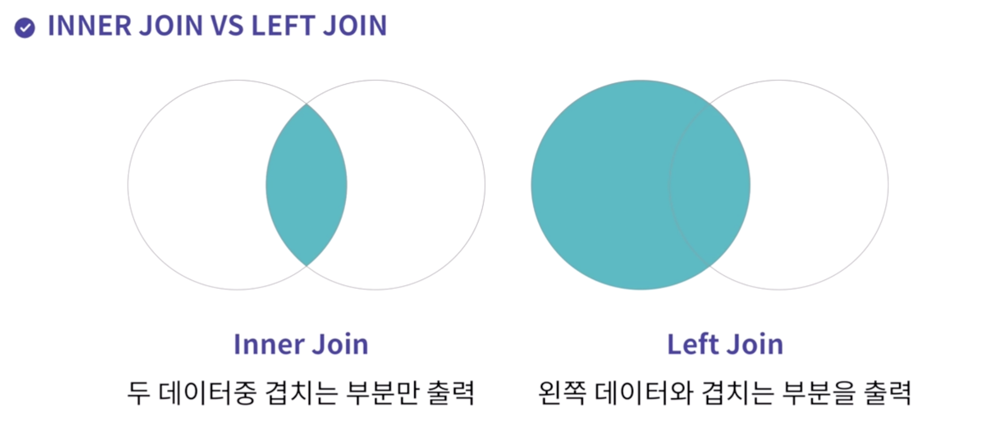
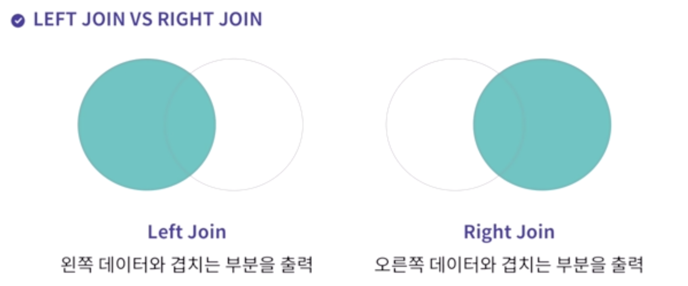
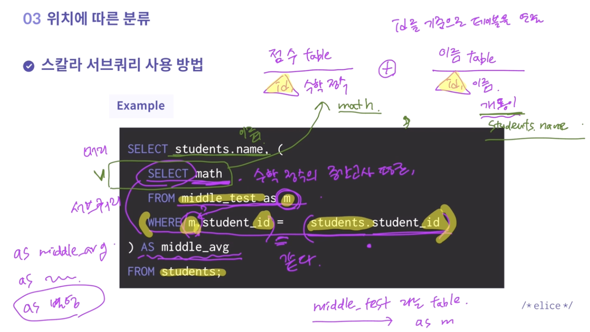

# SQL 정리
#TIL/velog

## 테이블구조

*desc* : 테이블 구조를 출력

*관계형 데이터베이스* : SQL로 제어
*비관계형 데이터베이스*


칼럼 : 주제, 제목	/	레코드 : 내용, 값

* SELECT + 검색할 대상(칼럼) + FROM + 테이블명 + WHERE + 조건
* SELECT * FROM book -> 모든 데이터를 검색한다

<br />


### DISTINCT 
::뒤에 나오는 칼럼의 중복을 제거하고 보여준다::
2개 이상의 칼럼을 적으면 한쪽 중복이 있어도 다른 쪽 칼럼 값이 다르면 다르게 취급한다

검색할 데이터 앞에 *DISTINCT*를 입력하여 사용한다

```sql
SELECT DISTINCT title, author
FROM book;
```

<br />

### IN

```sql
-- 해당하는 작가가 쓴 책만 골라서 출력합니다.
SELECT * FROM book
WHERE author in ('William Shakespeare', 'John Ronald Reuel Tolkien', 'Joanne Kathleen Rowling');
```

<br /><br />

## SQL 명령어

DML : 데이터 조작어
DDL : 데이터 정의어
DCL : 데이터 제어어
TCL : 트랜잭션 제어어

*키워드 검색*
`SELECT * FROM book WHERE title LIKE ‘어린왕자’;`
LIKE의 다양한 형태(와일드카드)
`SELECT * FROM book WHERE title LIKE ‘%왕자';`

<br />

### ORDER BY

`SELECT * FROM score ORDER BY math DESC;`
값이 높은 데이터부터 정렬하여 검색
ASC - 오름차순 / DESC - 내림차순

<br />

### INSERT

`INSERT INTO book(id, title, author, publisher) VALUES('3', '햄릿', '윌리엄', '엘리스 출판');`
컬럼에 맞는 value를 작성해준다

<br />

### UPDATE

`UPDATE book SET title='돈키호테 1' WHERE title='돈키호테';`

<br />

### DELETE

`DELETE FROM book WHERE title = '돈키호테 1';`

<br /><br />

## SQL과 함수
* 데이터 값을 계산하거나 조작 : 행 함수
* 행의 그룹을 계산하거나 요약 : 그룹 함수
* 열의 데이터 ㅌ타입을 변환

<br />

### COUNT
검색한 결과의 데이터의 개수를 가져오는 내장함수
NULL인 데이터는 제외

`SELECT COUNT(id) FROM book;`
book 테이블 안에 있는 id 칼럼의 개수를 개수
`*` : 모든 데이터를 검색하는 와일드 카드

### LIMIT
데이터의 일부만 보고 싶다면, 출력하고자하는 데이터 개수를 제한
```sql
//book 테이블에서 데이터를 5개만 가져오기
SELECT * FROM book LIMIT 5;
//2번째 데이터부터 5개를 가져오기
SELECT * FROM book LIMIT 1, 5;
```

`LIMIT 1, 5` 는 2번째 칼럼부터 5개를 가져오라는 의미이다

<br />

### SUM & AVG

SUM : 지정한 *컬럼값*을 모두 더하여 총점을 구해주는 내장함수
AVG : 지정한 *컬럼*들의 평균값을 구해주는 내장함수

```sql
SELECT SUM(math) FROM book;
SELECT AVG(korean), AVG(english) FROM grade;
```

<br /><br />

## 데이터 그룹 짓기
### 다수의 테이블 제어하기
데이터를 그룹화한다면?
```sql
SELECT user_id, COUNT(*)
FROM rental
GROUP BY user_id;
```
<br />

그룹의 기준칼럼으로 테이블 내의 컬럼을 그룹짓는다

```sql
SELECT user_id, SUM(칼럼명) FROM rental GROUP BY user_id;
-- user_id가 같은 열에서 컬럼의 내용을 다 더한 값을 출력
```

<br />

두번 이상 대여한 사람들을 그룹화 된 것에서 그룹화를 어떻게?
**1번 이상의 대여를 한 사람을 구하는 sql문**

```sql
SELECT user_id, COUNT(*)
FROM rental
GROUP BY user_id
HAVING COUNT(user_id) > 1;
```

<br />

여러 테이블의 정보를 한번에 조회한다면?

```sql
SELECT *
FROM rental
INNER JOIN user;
```
JOIN : 여러 테이블을 서로 연결한다
inner join, left join, right join

조건을 적용하여 두개의 테이블을 조회하기
*테이블이름.컬럼명*으로 구분한다
```sql
SELECT *
FROM rental
INNER JOIN user
ON user.id = rental.user_id;
```

<br />

*LEFT JOIN*
왼쪽 테이블의 모든 값을 포함하여 연결하기

```sql
SELECT *
FROM user
LEFT JOIN rental
ON user.id = rental.user_id;
```



<br />

*RIGHT JOIN*
오른쪽 테이블의 모든 값을 포함하여 연결하기

```sql
SELECT *
FROM user
RIGHT JOIN rental
ON user.id = rental.user_id;
```




> 데이터 그룹 짓기 : group by
> 데이터 그룹 + 조건 추가하기 : having
> 두 개의 테이블 조회하기 : inner join, left join, right join
> 두 개의 테이블 + 조건 추가하기 : on
> on A테이블.컬럼 = B테이블.컬럼

<br /><br />

## 서브쿼리
하나의 쿼리 안에 포함된 또 하나의 쿼리
::메인 쿼리가 서브 쿼리를 포함하는 종속적인 관계::
::문제를 풀 때 메인쿼리와 서브쿼리를 분리해서 풀어내야 한다::

* *알려지지 않은 기준*을 이용한 검색에 유용
	* 연봉이 상위 5퍼센트인 남자 사원
* 메인 쿼리가 실행되기 이전에 *한 번만 실행*
* 한 문장에서 *여러 번 사용* 가능

```sql
SELECT * FROM employee
WHERE 급여 >
(SELECT 급여 FROM employee WHERE 이름='elice');
```
: 사원 elice의 급여를 알지 못해도 검색이 가능하다

*주의 사항*
1. 서브 쿼리는 괄호와 함께 사용
2. ORDER BY 절은 사용할 수 없다
3. 서브 쿼리는 연산자의 온쪽에 사용되어야 한다
4. 오로지 SELECT문으로만 작성 할 수 있다

::다양한 연습을 해두자::

<br />


## 단일 행 서브쿼리
*결과가 한 행만 나오는 서브쿼리*
서브 쿼리가 결과를 1개의 값만 반환하고, 이 결과를 메인쿼리로 전달하는 쿼리
```sql
SELECT * FROM employee
WHERE 급여 >
(SELECT 급여 FROM employee WHERE 사원번호 = 1);
```
사원번호는 기본적으로 1개만 있으므로 한 개의 행만 반환한다 = 단일 행

## 다중 행 서브쿼리
결과가 한 행만 나오는 단일 행 서브쿼리와는 다르게 서브쿼리가 결과를 2개 이상 반환하고, 이 결과를 메인쿼리로 전달하는 쿼리
```sql
SELECT * FROM employee
WHERE 급여 IN (
SELECT max(급여) FROM employee GROUP BY 부서번호);
```

* IN : 하나라도 만족하면 반환 `1 in (1,2,3,4)` -> 참
* ANY : *하나라도 만족*하면 반환, 비교 연산 가능 `10 < any (1,2,3,4)` -> 거짓
* ALL : *모두 만족*하면 반환, 비교 연산 가능 `99 >= all(99,100,101)` -> 거짓

<br />

### 문제들
```sql
-- 각 부서별 나이가 제일 많은 사원을 조회하는 쿼리를 작성해주세요.
select * from emp 
where birthdate in
(select min(birthdate) from emp group by deptno);

-- salaries 테이블에서 from_date가 2000-12-31 이전인 사람들의 급여 중 하나의 급여 보다 더 적은 급여를 받은 직원의 급여 정보를 모두 출력해보세요.
select * from salaries
where salary <any
(select salary from salaries where from_date<='2000-12-31');

-- salaries 테이블에서 from_date가 2000-12-31 이전인 사람들의 급여 중 모든 급여보다 적은 급여를 받은 직원의 급여 정보를 모두 출력해보세요.
select * from salaries
where salary <all
(select salary from salaries where from_date<='2000-12-31');
```

<br /><br />

## 스칼라 서브쿼리

*SELECT절에서 사용하는 서브쿼리*
스칼라 서브쿼리는 *오로지 한 행만 반환*
마치 *JOIN을 사용한 것과 같은 결과*를 나타낸다

```sql
SELECT students.name, (
	SELECT math
	FROM middle_test as m
	WHERE m.student_id = students.student_id
) AS middle_avg
FROM students;
```
수학점수의 중간고사 평균을 AS를 통해 별명을 지어준다
점수 테이블과 이름 테이블(students)를 연결한다
ID를 비교하기 위해 서브 쿼리에서 사용하고 수학점수를 가져온다



<br />

### 문제들
```sql
-- salaries 테이블에서 직원 번호와 한 직원의 평균 급여를 중복없이 출력해보세요.
select distinct emp_no,(
    select avg(salary) from salaries as A
    where A.emp_no = B.emp_no
) as avg_salary
from salaries as B;
-- 하나의 테이블 이지만 마치 두 개의 테이블 처럼

-- join을 사용하여 두 테이블을 연결하고 10504보다 높은 수학성적 조회
-- 1. 경민이보다 중간고사 수학점수를 높거나 같게 받은 학생들을 조회해 주세요.
select * from middle_test as m left join students as s
on m.student_id = s.student_id
where m.math >=all (
    select math from middle_test where student_id = 10504
);
```