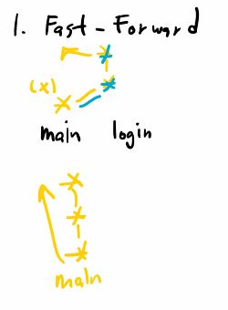
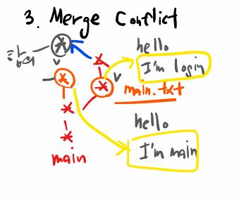

## 08. Merge Branch

1. Fast-Forward

   

   메인을 아무 작업하지 않고 가지작업을 합치면 원래 main처럼 적용된다

   ```bash
   (main)  $ git switch -c login
   (login) $ git touch login.txt -> add/commit
   (login) $ git switch main
   ```

   ```bash
   $ git merge login
   Updating f5dd448..7bc49d8
   Fast-forward
    login.txt | 0
    1 file changed, 0 insertions(+), 0 deletions(-)
    create mode 100644 login.txt
   ```

   ```bash
   $ git log --oneline --graph --all
   * 7bc49d8 (HEAD -> main, login) login add
   * f5dd448 c추가
   * 96d5453 a 추가
   ```

   `git branch -d login` : login 브랜치를 삭제

2. 3-Way Merge


3. Merge Conflict

   

- 3-Way 상황에서 충돌이 발생한 상황

- 특정 지점에서 같은 부분을 건드리다가 충돌발생

  

  같은 이름의 파일을 만들고 merge를 시도하면...

  ```bash
  ************** ~/multicampus/git-merge (main)
  $ git merge signup
  CONFLICT (add/add): Merge conflict in README.md
  Auto-merging README.md
  Automatic merge failed; fix conflicts and then commit the result.
  
  ************** ~/multicampus/git-merge (main|MERGING)
  $
  ```

  README.md로 들어가면

  ```bash
  # Merge Branch
  
  <<<<<<< HEAD
  - main에서 작성한 코드!
  =======
  - signup에서 작성한 코드!
  >>>>>>> signup
  ```

  → 이후 코드를 수정해서 합의, 삭제, 선정을 한다

  ```bash
  # Merge Branch
  
  - main과 signup이 합의해서 작성한 코드!
  ```