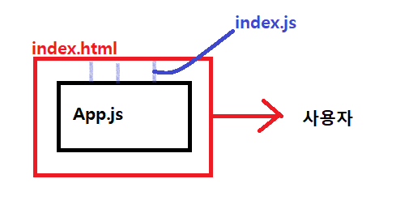
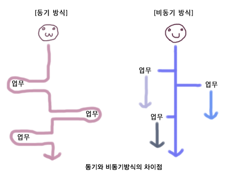

# React Basics

install node -> react doc -> npx

```
npm iinstall -g create-react-app
creact-react-app my-app

npx create-react-app my-app
cd my-app
npm start
```

<br/>

### NPM vs YARN

npm install == yarn

npm install package --save == yarn add package

npm install package --save-dev == yarn add package --dev

npm update --save == yarn upgrade

npm uninstall package --save == yarn remove package

npm install package -g == yarn global add package

<br/>

<br/>

### npm vs npx

- **[npm](https://www.npmjs.com/)**은 *Node.js*의 **의존성**과 **패키지 관리**를 위한 패키지 매니저	
  - 자바스크립트 런타임 환경 Node.js의 기본 패키지 관리자
  - nodeJS의 모듈
  - package.json에 해당 패키지를 지정해서 사용가능

- **[npx](https://www.npmjs.com/package/npx)**는 **Node 패키지를 실행시키는 하나의 도구**이고 *npm5.2* 버전부터 함께

  - 패키지 임시 설치 및 실행

  - npm 으로 설치할 명령어를 줄여줌

  - 다른 버전의 노드 실행 가능

  - gist 에 스크립트 공유 가능

<br/>

<br/>

### Package.json

최소한의 구동 라이브러리 설명

<br/>

### react-scripts

start -> react 구동

```
import React from 'react';	//'react' -> engine
import ReactDOM from 'react-dom'; //엔진이 어플리케이션과 관련 웹으로 갈수있게 안내
```

```javascript
ReactDOM.render(		//reder
  <React.StrictMode>
    <App />	//전체 react application
  </React.StrictMode>,
  document.getElementById('root')		//index.html에서 가져와서 render
);
```

<br/>

### 원리

**Virtual DOM 원리**

- 웹사이트 로드시 index.html 이라는 껍데기가 먼저 로드된다(DOM).
- 여기에 react가 내용(Component)를 rendering하여 보여준다(App.js/index.js).
- 실제로 우리가 보여지는 부분은 그러한 내용적인 부분이고(Virtual DOM), 기존과 바뀐 부분이 있다면 바뀐 부분만 반영되어 rendering된다.



<br/>

<br/>

### React Build

React 프로젝트는 기본적으로 spa(single page application)

한페이지내의 js파일을 불러와 화면을 구축한다

`npm run build` -> 정적 파일들로 구축 -> build폴더의 index.html은 결과물을 확인 가능

<br/>

<br/>

### Babel and Webpack

react eject -> 쓸일은..

**Babel** : es6 -> es5

**Webpack** : 모듈 번들러. 여러개의 모듈을 묶어 하나로 보내는 것. 하나의 js 파일로

-> 최적화

### manifest.json

웹앱 매니페스트란 앱에 대한 정보를 담고 JSON 파일

배경색, 아이콘, 앱 이름 등

<br/>

<Br/>

### App.js

function은 html을 반환

UI를 하나의 `큰 덩어리`로 생각한다면 컴포넌트는 그 덩어리를 이루는 `아주 작은 요소들`

```js
function App() {
  return (
    <div className="App">
      <header className="App-header">
        
        <p>
          Edit <code>src/App.js</code> and save to reload.
        </p>
        <a
          className="App-link"
          href="https://reactjs.org"
          target="_blank"
          rel="noopener noreferrer"
        >
          Learn React
        </a>
      </header>
    </div>
  );
}
```

<br/>

<br/>

### eject 란?

기본적으로 CRA로 만든 프로젝트에서 `yarn eject`를 하면 숨겨져 있던 웹팩, 바벨 등의 설정을 보여주고 이것을 커스터마이징 할 수 있도록 해주는 명령어

<br/><br/>

### Classes Compontents

state의 접근

```react
import React, { Component } from "react";
import logo from "./logo.svg";
import "./App.css";

class App extends Component {
  constructor() {
    super();

    this.state = {
      string: "Hello EUM",
    };
  }
  render() {
    return (
      <div className="App">
        <header className="App-header">
          
          <p>{this.state.string}</p>
          <button onClick={() => this.setState({ string: "Hello Jackson" })}>
            Change Text					<!-- onclick = html / onClick = JSX -->
          </button>
        </header>
      </div>
    );
  }
}

export default App;

```

### setState

State의 값을 update하기 위해서 사용한다.
하지만 Class-Component와 Functional-Component에서 사용 차이가 있다.

state를 직접적으로 변경X

**WHY**

유저가 버튼 클릭 -> 리액트 DOM친구가 인터셉트 -> what am i doing? -> onClick 으로 setState, 이름 변경시켜 -> 적용 -> declarative -> render() -> 표시됨

<br/>

<br/>

### Thinking in JSX

**html을 모방한 JS** -> virtual DOM

<br/>

<br/>

### Practice

```react
class App extends Component {
  constructor() {
    super();

    this.state = {
      monsters: [
        {
          name: "Frankenstein",
          id: "asc1",
        },
        {
          name: "Dracula",
          id: "asc2",
        },
        {
          name: "Zombie",
          id: "asc3",
        },
      ],
    };
  }
  render() {
    return (
      <div className="App">
        {this.state.monsters.map((monster) => (
          <h1 key={monster.id}>{monster.name}</h1>
        ))}
      </div>
    );
  }
}
```

위에서 **unique KEY**를 필요로 해서 h1에 작성해 주었다

react가 이해하는데 도움을 준다 -> 필요한 부분만 찾아가서 변경 -> smart -> rerender -> 최적화

<br/>

<br/>

### SPA (Single Page Application)

컴포넌트는 React라이브러리에 포함되어 있다(property)

>  Super() helps us with this by calling React.Componetnt's constructor()

서버와 통신을 위해서 필요하다

API를 통해 JS파일은 데이터를 받는다(서버와 일일이 통신X, 과거방식)

프론트단에 직접 데이터 있지는 않으므로 JSON으로 된 data를 주고 받는다 -> API를 통해 endpoint와 통신

**리액트는 AJAX를 구현하기 위해 따로 내장 XMLRequest, HTTP Client(Fetch, Axios)가 없기에 관련 라이브러리를 사용해야 한다**

<br/>

<br/>

### AJAX (Asynchronous Javascript And XML)

- AJAX란, Javascript의 라이브러리중 하나

- Asynchronous Javascript And Xml(비동기식 자바스크립트와 xml)
- XMLHttpRequest 객체를 이용 -> **전체 페이지를 새로 고치지 않고도** 페이지의 일부만을 위한 데이터를 로드하는 기법
- 자바스크립트를 통해서 서버에 데이터를 요청하는 것이다.
- 비동기 통신



<br/>

<br/>

### Life Cycle Methods

컴포넌트가 render될때 상태 관리 메소드

**Component Lifecycle의 세 가지**

1. Mounting : 컴포넌트 호출 -> **DOM에 렌더링**
2. Updating : state, props 변화에 의해 컴포넌트가 바뀜
3. Unmounting : 컴포넌트가 DOM에서 지워질 때

<br/>

<br/>

```react
import React, { Component } from "react";
import "./App.css";

class App extends Component {
  constructor() {
    super(props);

    this.state = {
      monsters: [],
    };
  }

  componentDidMount() {
    fetch("https://jsonplaceholder.typicode.com/users")
      .then((response) => response.json())
      .then((users) => this.setState({ monsters: users }));
  }

  render() {
    return (
      <div className="App">
        {this.state.monsters.map((monster) => (
          <h1 key={monster.id}>{monster.name}</h1>
        ))}
      </div>
    );
  }
}

export default App;
```

<br/>

<br/>

### Props

```react

  render() {
    return (
      <div className="App">
        <CardList name="EUM">
          {this.state.monsters.map((monster) => (
            <h1 key={monster.id}>{monster.name}</h1>
          ))}
        </CardList>
      </div>
    );
  }
```

<CardList>안으로 들어가면 Props.children으로 불러와 진다

```react
import React from "react";
import "./card-list.styles.css";

export const CardList = (props) => {
  // console.log(props); props의 직접 사용
  return <div className="card-list">{props.children}</div>;
};
```

<br/>

<br/>

### Component Divide

app.js -> card-list -> card

```react
render() {
    return (
      <div className="App">
        <CardList monsters={this.state.monsters}></CardList>
      </div>
    );
  }
```

```react
import React from "react";
import "./card-list.styles.css";
import { Card } from "../card/card.component";

export const CardList = (props) => {
  return (
    <div className="card-list">
      {props.monsters.map((monster) => (
        <Card key={monster.id} monster={monster} />
      ))}
    </div>
  );
};
```

```react
import React from "react";
import "./card.styles.css";

export const Card = (props) => (
  <div className="card-container">
    
    <h1>{props.monster.name}</h1>
  </div>
);
```

**WHY?**

언제 나눌까?

1. 컴포넌트를 정한다 -> 좋은 리액트 개발자의 덕목

**유연성을 얻어 재사용이 가능하다**