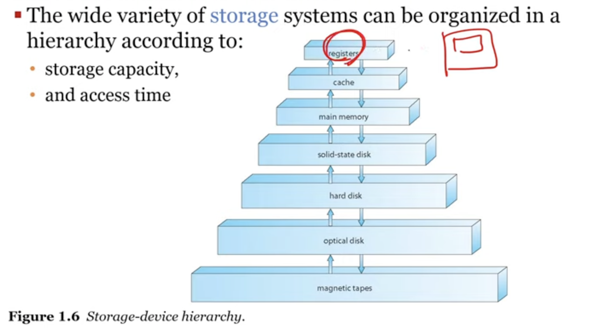

운영체제

#TIL/CS

*운영체제* : 컴퓨터 하드웨어를 다루는 소프트웨어
운영체제는 컴퓨터의 성능을 높이고(*performance*), 사용자에게 편의성 제공(*Convenience*)을 목적으로 하는 *컴퓨터 하드웨어 관리하는 프로그램*이다.

### 용어들
**부트스트랩**
펌웨어로 불려지고 ROM이나 EPROM에 저장되어있다
부트스트랩 > 부트로더 > 커널 순서이다

**커널(kernel)**
os의 핵심을 담당

### 멀티태스킹 = 멀티프로세싱
하나의 cpu를 가지고 여러 작업을 진행할 수 있다
스케줄링 방식에 따라 조금씩 번갈아가면서 수행

동기화문제의 해결이 필요 -> 데드락 발생

