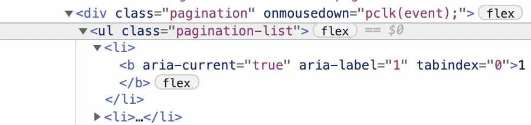
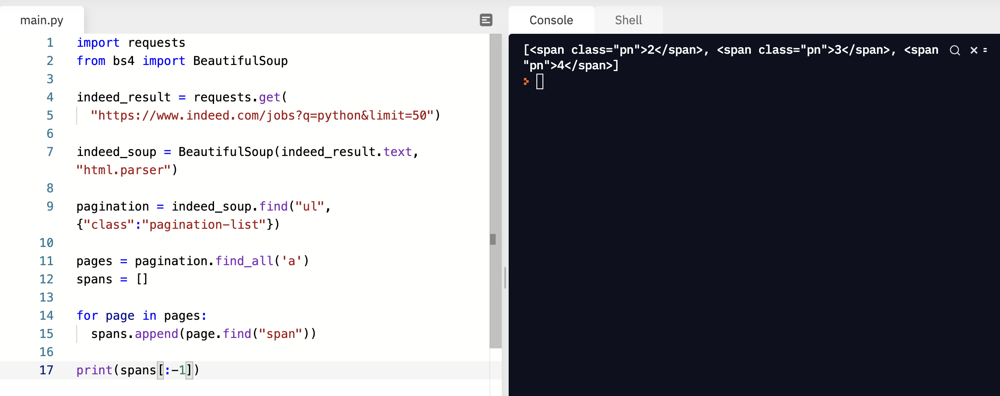
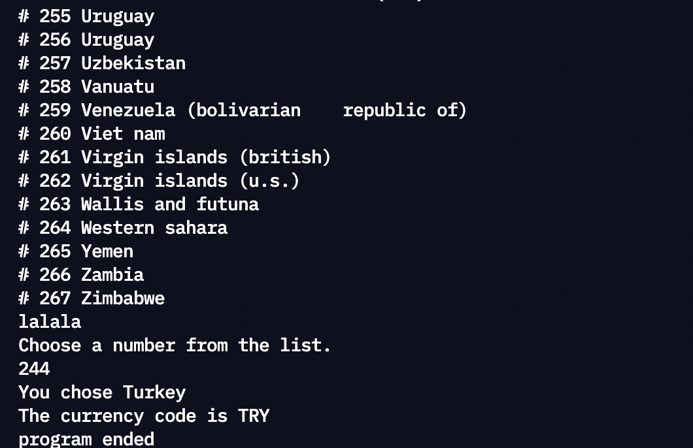

# Nomad Web Scrapper
#TIL/python

1. 모듈설치
2. 가져올 페이지의 url요청 (get .text)
3. 원하는 html 파트 가져오기 (Beautiful Soup)
4. pagination 찾기
5. pagination 안의 모든 앵커 찾기
loop를 이용해 각 페이지의 “span” 모두 찾기
6. 불러올 페이지 넘버 지정해주기

#1. Import Packages (모듈설치)
	* 영상에서 쓰인 모듈 :
	ㄴRequest (사이트 정보 가져오기 (text))
	ㄴBeautiful Soup (html 내 필요한 부분 추출하기 (html))
#2. 가져올 페이지의 url요청 (request.get)
	* 페이지.text 가져왕
#3. 원하는 html 파트 가져오기 (Beautiful Soup)
	* 위 .text에서 HTML 불러왕 (html.parser)
#4. HTML 내에서 내가 원하는 정보의 pagination(페이지 네비게이터)을 찾기(indeed_soup.find)
	ㄴ”div” 를 찾아서 “pagination” 클래스 불러와줭
#5-1. pagination 안의 모든 앵커(‘a href’ 형태로 되어있는 링크들) 찾아주기
	ㄴpagination.find_all(‘a’))
#5-2. 페이지 링크마다 있는 태그를 각각 모두 불러와줘야 하므로 loop(for-in) 사용
	ㄴfor link in links: pages.append(link.find(“span”))
#6. 어디서부터 어디까지 불러올건지 페이지 넘버 지정해주기
	ㄴpages = pages[0:-1]

<br />

<br />

## 

## BeautifulSoup
[Beautiful Soup Documentation — Beautiful Soup 4.9.0 documentation](https://www.crummy.com/software/BeautifulSoup/bs4/doc/#quick-start)



```python
import requests
from bs4 import BeautifulSoup 

indeed_result = requests.get(
  "https://www.indeed.com/jobs?q=python&limit=50")

indeed_soup = BeautifulSoup(indeed_result.text, "html.parser")

pagination = indeed_soup.find("ul", {"class":"pagination-list"})

pages = pagination.find_all('a')
spans = []

for page in pages:
  spans.append(page.find("span"))

spans = spans[:-1]
```

결과화면



<br />

<br />

## 

## 함수로 분류하기


indeed.py

```python
import requests
from bs4 import BeautifulSoup 

LIMIT = 50
URL = f"https://www.indeed.com/jobs?q=python&limit={LIMIT}"

def extract_indeed_pages():
  result = requests.get(URL)

  soup = BeautifulSoup(result.text, "html.parser")

  pagination = soup.find("ul", {"class":"pagination-list"})

  links = pagination.find_all('a')
  pages = []

  for link in links[:-1]:
    pages.append(int(link.string))

  pages = pages[:-1]
  max_page = pages[-1]
  # 5는 인식하지 못한다 -> why?
  return max_page


def extract_indeed_jobs(last_pages):
  for page in range(last_pages):
    result = requests.get(f"{URL}&start={page*LIMIT}")
    
    print(result.status_code)
```


main.py
```python
from indeed import extract_indeed_pages, extract_indeed_jobs

last_indeed_page = extract_indeed_pages()
extract_indeed_jobs(last_indeed_page)
```

<br />

<br />

## day5 챌린지

국가코드 스크래핑




```python
import os
import requests
from bs4 import BeautifulSoup

os.system("clear")
URL = "https://www.iban.com/currency-codes"

def country_list():
  result = requests.get(URL)
  soup = BeautifulSoup(result.text, "html.parser")

  links = soup.find_all('tr')
  list=[]

  for i in links[1:]:
    tmp = i.find_all('td')
    tmp_list = []
    if tmp[3]:
      tmp_list.append(tmp[0].string)
      tmp_list.append(tmp[2].string)
    list.append(tmp_list)
  
  return list

def user_input(list):
  print("Hello! Please choose select a country by number:")
  for fin_nation in enumerate(list):
    print(f"# {fin_nation[0]} {fin_nation[1][0]}")

  # 사용자 입력폼
  while(1):
    try:
      number = int(input())
      print(f"You chose {list[number][0]}")
      print(f"The currency code is {list[number][1]}")
      break
    except:
      print("Choose a number from the list.")
      continue
```