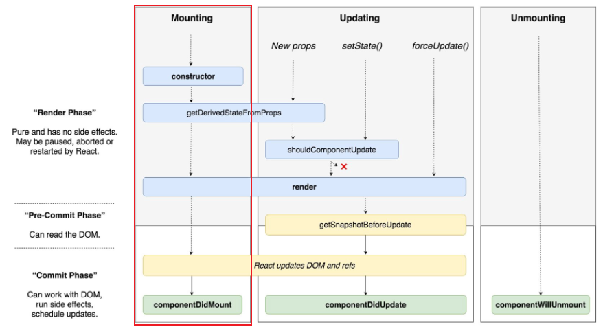

# Lifecycle Methods

### prevState, prevProps

setState 콜백 함수에 전달된 인수에 지정한 이름 -> setState가 리액트에 의해 트리거 되기 전의 상태값

```react
handleClick = () => {
  this.setState((prevState, prevProps) => {
    return {number:prevState.number + prevProps.increment}	//prevProps.increment = 1
  }, () => console.log(this.state.number))
}
//두번째 인자로 비동기 해결(console.log)
```

<br/>

> state update는 비동기적이다

<br/>

```react
state = {
	meaningOfLife = 47;	//constructor없이 가능
}
```

<br/>

<br/>

- `will` 접두사가 붙은 메서드 👉 **`어떤 작업을 작동하기 전`에 실행**
- `Did` 접두사가 붙은 메서드 👉 **`어떤 작업을 작동한 후`에 실행**


<br/>



<br/>

 ### static getDerivedStateFromProps(props, state)

```null
static getDerivedStateFromProps(nextProps, prevState) {
  console.log('getDerivedStateFromProps');
  if (nextProps.color !== prevState.color) {  // 조건에 따라
    // 특정 값 동기화하여 state 변경이 필요한 경우, 새로운 state return
    return { color: nextProps.color };  
  }
  return null;    // state 변경 필요가 없으면 null 반환
}
```

- 컴포넌트 최초 마운트와 업데이트 시 호출되는 메서드로, render() 호출 직전에 호출됨.
- 시간의 흐름에 따라 변하는 props에 state가 의존하는 드문 예를 위하여 존재. props로 받아온 값을 state에 동기화시키는 용도.

### shouldComponentUpdate(nextProps, nextState)

```null
shouldComponentUpdate(nextProps, nextState) {
  console.log('shouldComponentUpdate', nextProps, nextState);

  // 숫자 마지막 자리가 4면 리렌더링 안함.
  return nextState.number % 10 !== 4;
  // netProps.text !== this.props.text; -> 가능
}
```

- props 또는 state가 새로운 값으로 갱신되어 렌더링이 발생하기 직전에 호출됨.
- 현재 state 또는 props의 변화가 컴포넌트 출력 결과에 영향을 미치는지 리액트에게 알려주고, **state 또는 props의 변경이 있는 상황에서 리렌더링을 할지 지정하는 메서드**로 **'성능 최적화'**를 위한 것임.
- return은 true or false로 default는 true. false를 반환하면 업데이트 과정 중지.
- 현재 props와 state는 this.props, this.state로 접근하고 새로 설정될 props와 state는 nextProps, nextState로 접근.

<Br/>

### getSnapshotBeforeUpdate(prevProps, prevState)

```null
getSnapshotBeforeUpdate(prevProps, prevState) {
        console.log('getSnapshotBeforeUpdate');
        if (prevProps.color !== this.props.color) {
            return this.myRef.style.color;
        }
        return null;
    }
  
```

- 가장 마지막으로 렌더링된 결과가 DOM 등에 반영되었을 때, render()에서 만들어진 결과물이 브라우저에 실제로 반영되기 직전에 호출됨.
- componentDidUpdate()의 세 번째 파라미터인 snapshot으로 반환하는 값이 전달됨.
  스냅샷 값을 반환하거나 null을 반환한다.
  주로 업데이트하기 직전에 값을 참고할 일이 있을 때 활용된다.