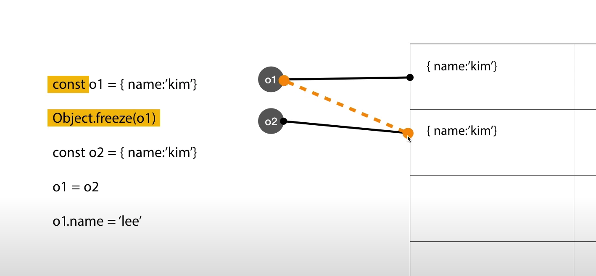
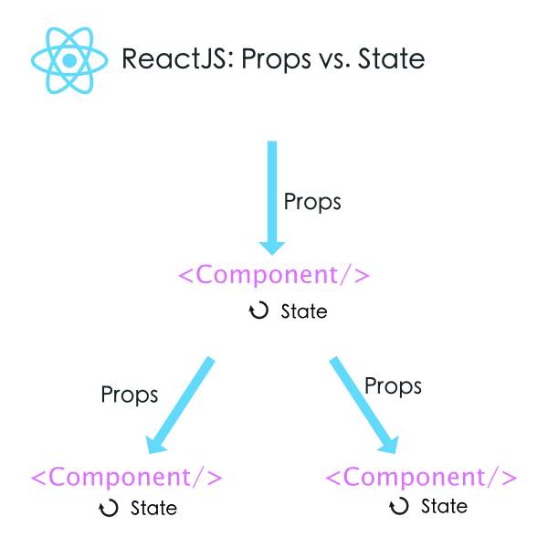

## React

<br/>

### JavaScript Immutability

---

[JavaScript Immutability (opentutorials.org)](https://opentutorials.org/module/4075)

말그대로 불변성에 대한 것으로 데이터를 불변하게 다루는 것

CRUD 작업 시 불변성의 보장은 중요하다

<br />

**이름에 대한 불변**

```javascript
var v = 1; // v는 name, 1은 value를 뜻한다.
v = 2;
console.log(v); // 2

const a = 1;
a = 2; // error
```

const를 사용하여 선언한 변수에 대한 수정을 막는다

<br />

**내용에 대한 불변**

JavaScript는 값이 바뀌지않는 원시데이터 타입과 변경 가능한 객체 타입을 다르게 취급

 **원시 데이터 타입 (Primitive)** : Number, String, Boolean, Null, Undefined, Symbol...

 **객체 타입 (Object)** : Object, Array, Function...

```javascript
var p1 = 1;
var p2 = 1;
console.log(p1===p2); // 같은 값이면 같은 영역을 가리킨다
 
var o1 = {name:'kim'}
var o2 = {name:'kim'}
console.log(o1===o2); // 같은 객체라도 별도로 생성하여 따로 취급
```

<br />

**객체의 복사**

```javascript
var o1 = {name:'kim'}
var o2 = Object.assign({}, o1); // 첫 번째 파라미터와 두 번째 파라미터를 합쳐서 return
o2.name = 'lee';
console.log(o1, o2, o1 === o2); // {name:'kim'} {name:'lee'} false
```

<br />

**중첩된 객체의 복사**

```javascript
var o1 = {name:'kim', score:[1,2]}
var o2 = Object.assign({}, o1);
o2.score = o2.score.concat(); // o2.score를 복제 리턴
o2.score.push(3);
console.log(o1, o2, o1 === o2, o1.score === o2.score);
// {name:'kim', score:[1,2]} {name:'kim', score:[1,2,3]} false false
```

<br />

>  **- Nested Data의 복제 (concat)**
>
>  Object가 Object 형태로 내부 property를 갖고 있는 경우 **Nested Data (중첩된 데이터)라고** 부른다.
>
>  아래와 같이 Array(Object)를 property로 가지고 있는 경우, 해당 값 변경 시 원본 데이터 값이 영향을 받게 된다.
>
>  따라서 Object와 내부 property 값도 복제(concat)해서 사용해야 원본 데이터를 유지할 수 있다.
>
>  
>
>  이렇게 JS는 함수의 파라미터의 인자가 원시 데이터인지 객체인지에 따라 동작 방법이 달라진다.
>
>  따라서 아래와 같이 함수를 정의할 때 원본 데이터를 유지할 것인지 아닌지에 따라 **assign, concat** 함수를 통해 불변성을 유지해야 한다.

```javascript
// function fn(person){
//     person = Object.assign({}, person);
//     person.name = 'lee';
//     return person;
// }
// var o1 = {name:'kim'}
// var o2 = fn(o1);
// console.log(o1, o2);
 
function fn(person){
    person.name = 'lee';
}
var o1 = {name:'kim'}
var o2 = Object.assign({}, o1);
fn(o2);
console.log(o1, o2);
```

<br />

**가변과 불변의 API 비교**

```javascript
var score = [1,2,3];
var a = score;
var b = score;
// 1~
// score.push(4); 원본의 데이터를 변경
var score2 = score.concat(4);
console.log(score, score2, a, b);	//[1,2,3] [1,2,3,4] ...
```

<br />

**Object.freeze**

const : name이 **가리키는 값을 다른 것으로 못 바꾸게 하는 것**

Object.freeze : **값 자체를 못 바꾸게 하는 것**

 ```javascript
const o1 = {name:'kim'}
Object.freeze(o1);
const o2 = {name:'lee'}
// o1 = o2;
o1.name = 'park';
console.log(o1);
 ```


따라서 const와 freeze를 적재적소에 활용하면 값을 불변하게 유지할 수 있다.



<br /><br /><br /><br />

### Virtual DOM

**How Does Virtual DOM Work?**

1. 데이터가 업데이트 되면, 전체 UI를 Virtual DOM에 리렌더링
2. 이전 Virtual DOM에 있던 내용과 현재의 내용을 비교
3. 바뀐 부분만 실제 DOM에 적용


### JSX

React에서는 이벤트가 처리되는 방식, 시간에 따라 state가 변하는 방식, 화면에 표시하기 위해 데이터가 준비되는 방식 등 렌더링 로직이 본질적으로 다른 UI 로직과 연결된다는 사실을 받아들입니다.
React는 별도의 파일에 마크업과 로직을 넣어 기술을 인위적으로 분리하는 대신, 둘 다 포함하는 “컴포넌트”라고 부르는 느슨하게 연결된 유닛으로 관심사를 분리합니다. 이후 섹션에서 다시 컴포넌트로 돌아오겠지만, JS에 마크업을 넣는 게 익숙해지지 않는다면 이 이야기가 확신을 줄 것입니다.
React는 JSX 사용이 필수가 아니지만, 대부분의 사람은 JavaScript 코드 안에서 UI 관련 작업을 할 때 시각적으로 더 도움이 된다고 생각합니다. 또한 React가 더욱 도움이 되는 에러 및 경고 메시지를 표시할 수 있게 해줍니다.

<br /><br />

### props

props는 부모 컴포넌트가 자식 컴포넌트에 값을 전달할 때 사용하는 것이다. 읽기 전용

함수형이 클래스형 컴포넌트보다 미세하게 더 빠르다



<br />

default Props

```javascript
import React, { Component } from "react";

class Name extends Component {
  static defaultProps = {
    first: "defaultProps 값 전달 : first",
    last: "defaultProps 값 전달 : last"
  };
  render() {
    return (
      <span>
        이름 : {this.props.first} {this.props.last}
      </span>
    );
  }
}
export default Name;
```

```javascript
import React, { Component } from "react";

class Name extends Component {
  render() {
      const { first, last } = this.props;
      return (
        <span>
          이름 : {first} {last}
        </span>
      );
    }
}
Name.defaultProps = {
  first: "defaultProps 값 전달 : first  ",
  last: "defaultProps 값 전달 : last"
};

export default Name;
```

<br /><br /><br />

### State

`state` 내부 값은 직접 수정이 불가능하다. **불변성을 유지해야 한다**.  **JS Immutability** 개념

- push, slice, *map, filter
- map : key 고유 값으로 구분. 

`props`가 매개변수마냥 컴포넌트에 던져진다면, `state`는 컴포넌트 안에서 관리된다

- 컴포넌트 생성자에서  `super`을 호출해서 `this`를 사용
- 캡슐화를 통해 코드를 리펙토링하기 좋게 만들어 준다

<br /><br />

`state`는 컴포넌트 자기 자신이 가지고 있는 값이다. 변화가 필요할 경우 setState()함수를 통해 값을 변경해줄 수 있다.

<br />

배열을 렌더링 하게 될 때에는 꼭 고유값을 key 로 사용해야 한다. 불변성 유지를 위하여 데이터를 조작 할 때에는 기존의 배열을 건들이지 않는 방식으로 처리해야 한다. 만약 state 배열 값을 무작위로 변경하게 되면 필요치 않은 값 변경을 통해 프로젝트를 망치게 된다.

 <br />

여기서 말하는 state, 즉 상태 관리를 효과적으로 처리하도록 하는 방법이 바로 Redux 이다. Store라는 개념을 토대로 컴포넌트의 부품화를 통한 간편한 상태 관리가 가능

<br /><br />

app.js

```javascript
import React, { Component } from 'react';
import Counter from './Counter';

class App extends Component {
  render() {
    return <Counter />;
  }
}
export default App;
```

Counter 컴포넌트를 import 하고 render 함

<br />

counter.js

```javascript
import React, { Component } from 'react';

class Counter extends Component {
  state = {
    number: 0
  };

  handleIncrease = () => {
    this.setState({
      number: this.state.number + 1
    });
  };
  handleDecrease = () => {
    this.setState({
      number: this.state.number - 1
    });
  };
  render() {
    const { number } = this.state;
    return (
      <div>
        <h1>Count</h1>
        <h2>값 : {number}</h2>
        <button onClick={this.handleIncrease}>Plus</button>
        <button onClick={this.handleDecrease}>Minus</button>
      </div>
    );
  }
}

export default Counter;
```

위와 같이 화살표 함수(arrow function)를 사용한 이유는 일반적인 function handleIncrease() {} 사용했을 경우 this가 뭔지 모르게됨


<br />

해결방법

```javascript
class Counter extends Component {
  state = {
    number: 0
  };

  constructor(props) {
    super(props);
    this.handleIncrease = this.handleIncrease.bind(this);
  }
  handleIncrease() {
    console.log(this)
    this.setState({
      number: this.state.number + 1
    });
  }
```

**메서드를 바인딩하거나 state를 초기화하는 작업이 없다면, 굳이 컴포넌트에 생성자를 구현하지 않아도 된다.**

하지만 화살표 함수를 사용하지 않았기 때문에 this를 찾지 못함 이런 경우 생성자를 구현하여 컴포넌트가 마운트 되기 전에 handleIncrease 메서드를 바인딩 해줘야한다.

constructor 는 컴포넌트가 생성될 때마다 자동으로 생성되는 함수로 컴포넌트가 마운트되기 전에 호출된다.

React.Component를 상속한 컴포넌트의 생성자를 구현할 땐 그 안에 super(props)를 호출해야한다. 그렇지 않으면 this.props가 생성자 내에서 정의되지 않아 버그로 이어질 수 있다.

constructor 안에서 this.props에 접근하고 싶을 땐 super(props) 를 부르면 된다.

<br /><br /><br />

[[React\] ref란? - DOM에 이름 달기 | ChanBLOG (chanhuiseok.github.io)](https://chanhuiseok.github.io/posts/react-7/)

[[React\] 리액트 기초 개념 정리 | Jess2.xyz](https://jess2.xyz/react/react-tip-0/#12-ref-속성값으로-자식-요소에-접근하기)

<br /><br /><br />

### 자바스크립트 기초

**function**

1. 함수는 리터럴에 의해 생성된다

2. 함수는 함수의 인자로 전달이 가능하다

3. 변수나 배열의 원소, 객체의 프로퍼티 등에 할당이 가능하다

4. 함수는 함수의 리턴값으로 리턴이 가능하다

5. 함수는 동적으로 프로퍼티를 생성 및 할당이 가능하다

<br/>

```
nodeJS` + `npm` + `npx
```

<br/>

npx설치

```jsx
npm install npx -g
```

npx를 이용하여 리액트 앱을 생성해준다

그리고 VSCode에서 실행

```
npx create-react-app movie_app
```

```
npm start
```

GitHub연동

<br/><br/>

### 간단한 컴포넌트

컴포넌트는 반환한다 -> html 함수

React 컴포넌트는 `render()`라는 메서드를 구현하는데, 이것은 데이터를 입력받아 화면에 표시할 내용을 반환하는 역할을 합니다. 이 예제에서는 XML과 유사한 문법인 JSX를 사용합니다. 컴포넌트로 전달된 데이터는 `render()` 안에서 `this.props`를 통해 접근할 수 있습니다.

<br/>

```react
class HelloMessage extends React.Component {
  render() {
    return (
      <div>
        Hello {this.props.name}
      </div>
    );
  }
}

ReactDOM.render(
  <HelloMessage name="Taylor" />,
  document.getElementById('hello-example')
);
```

<br/>

**React를 사용하기 위해서 JSX가 꼭 필요한 것은 아닙니다.** JSX를 컴파일한 JavaScript 코드를 확인하려면 **Babel REPL**을 이용

<br/><br/><br/>

React 는 사용자 인터페이스를 만들기 위한 컴포넌트 기반의 JavaScript 라이브러리

1. function으로 생성하는 방법 rsf
2. class로 생성하는 방법 rcc

<br/><br/><br/>

### React-hooks API 마스터

<br/>
먼저 React-hooks는 Function Component에서 사용가능하고, Lifecycle Method를 이용할 수 있는 최신 문법

즉 기존에 함수형 컴포넌트에서 못하던상태값 관리, 컴포넌트의 생명 주기 함수를 이용할 수 있게 되었다

<br/>

**리액트 property**

prop.fav = {fav}


