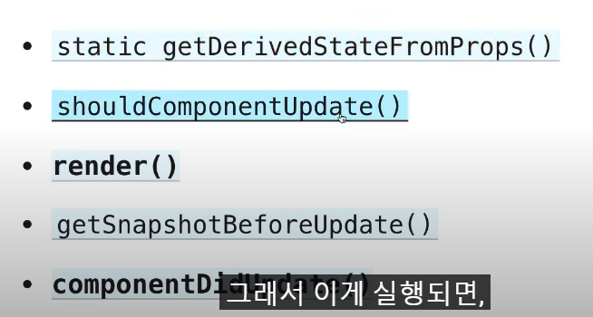

**class_plus_minus**

```react
import React, { Component } from "react";

class App extends Component {
  state = {
    count: 0,
  };

  add = () => {
    console.log("add");
  };
  minus = () => {
    console.log("minus");
  };

  render() {
    return (
      <div>
        <h1>The number is : {this.state.count}</h1>
        <button onClick={this.add}>Add</button>
        <button onClick={this.minus}>Minus</button>
      </div>
    );
  }
}

export default App;

```

<br />

**react는 render function을 refresh하지 않는다**

-> `setState ` : 리액트는 내가 호출할 때 마다 다시 render해준다 new state와함께..

-> immutable을 위한 선택

<br />

```react
  add = () => {
    this.setState({ count: this.state.count + 1 });
  };
  minus = () => {
    this.setState({ count: this.state.count - 1 });
  };
```

위 코드는 좋은 코드는 아니다 -> state에 너무 의존적

<br />외부 상태에 의존하지 않는 state : `function`을 전달

```react
  add = () => {
    this.setState(current => ({count: current.state.count +1}));
  };
  minus = () => {
    this.setState(current => ({count: current.state.count -1}));
  };
```

[컴포넌트 State – React (reactjs.org)](https://ko.reactjs.org/docs/faq-state.html#what-is-the-difference-between-passing-an-object-or-a-function-in-setstate)

<br /><br />

### Life Cycle 

**Mounting** : 컴포넌트 생성

- 클래스가 생성되고 난 뒤에 리엑트의 컴포넌트를 extends하면서 마운트

- **constructor**

  ```
  constructor(props){
  	super(props)
  }
  ```

- static getDerivedStateFromProps() -> 나중에

- **render()**

- componentDidMount

  - **After first render**

<br />

**Updating**

- 컴포넌트가 업데이트 될때 호출된다
- state 변경 -> render호출



<br />

**UnMounting** : 페이지 교체시, state... 등등 

- componentWillUnmount

<br /><br />

**ES6활용**

- timeout -> 자바스크립트 코드이다

````react
import React, { Component } from "react";

class App extends Component {
  state = {
    isLoading: true,
  };

  componentDidMount() {
    setTimeout(() => {
      this.setState((isLoading: false));
    }, 6000);
  }

  render() {
    const { isLoading } = this.state;
    return <div>{isLoading ? "Loading" : "We are ready"}</div>;
  }
}

export default App;

````

<br /><br /><br />

### Axios

땅콩 주위의 초콜릿..?

`npm install axios`

노마드코더 YTS

https://yts-proxy.nomadcoders1.now.sh/list_movies.json


```react
  getMovies = async () => {
    const movie = await axios.get(
      "https://yts-proxy.nomadcoders1.now.sh/list_movies.json"
    );
  };

  componentDidMount() {
    this.getMovies();
  }
```

- **비동기 함수의 호출(async - await)**

<br />

**ES6문법을 사용...**

```react
import React, { Component } from "react";
import axios from "axios";

class App extends Component {
  state = {
    isLoading: true,
    movies: [],
  };

  getMovies = async () => {
    const {
      data: {
        data: { movies },
      },
    } = await axios.get(
      "https://yts-proxy.nomadcoders1.now.sh/list_movies.json"
    );
    this.setState({ movies, isLoading: false });
  };

  componentDidMount() {
    this.getMovies();
  }

  render() {
    const { isLoading } = this.state;
    return <div>{isLoading ? "Loading" : "We are ready"}</div>;
  }
}

export default App;

```

> function Movies( id, year, title, summary, poster) { ... } // X
> function Movies( {id, year, title, summary, poster}) {...} // O
>
> function component의 인자로 props 말고 props의 특정 값만 가져올 때는 꼭 curly bracket으로 감싸주세요 당연한 건데 놓쳐가지고 어리둥절

`   "https://yts-proxy.nomadcoders1.now.sh/list_movies.json?sort_by=ratig"`

sort by가 가능해서 rating 으로 정렬

<br /><br />

**App.js**

```react
import React, { Component } from "react";
import axios from "axios";
import Movies from "./Movies";

class App extends Component {
  state = {
    isLoading: true,
    movies: [],
  };

  getMovies = async () => {
    const {
      data: {
        data: { movies },
      },
    } = await axios.get(
      "https://yts-proxy.nomadcoders1.now.sh/list_movies.json?sort_by=ratig"
    );
    this.setState({ movies, isLoading: false });
  };

  componentDidMount() {
    this.getMovies();
  }

  render() {
    const { isLoading, movies } = this.state;
    return (
      <div>
        {isLoading
          ? "Loading"
          : movies.map((movie) => {
              console.log(movie);
              return (
                <Movies
                  key={movie.id}
                  id={movie.id}
                  year={movie.year}
                  title={movie.title}
                  summary={movie.summary}
                  poster={movie.medium_cover_image}
                />
              );
            })}
      </div>
    );
  }
}

export default App;
```

**Movies.js**

```react
import React from "react";
import PropTypes from "prop-types";

function Movies({ id, year, title, summary, poster }) {
  return <h4>{title}</h4>;
}

Movies.prototype = {
  id: PropTypes.number.isRequired,
  year: PropTypes.number.isRequired,
  title: PropTypes.string.isRequired,
  summary: PropTypes.string.isRequired,
  poster: PropTypes.string.isRequired,
};

export default Movies;
```

<br />

**Warning: Each child in a list should have a unique "key" prop.**

- key를 넣어준다 Movie 뒤에..


**라우트 사용법**

HashRouter 추천

app.js

```react
function App(props) {
  return (
    <HashRouter>
      <Navigation />
      <Route path="/" exact={true} component={Home} />
      <Route path="/about" component={About} />
    </HashRouter>
  );
}
```

Link (라우터 안에) : html처럼 새로고침을 하지 않는다

Link는 라우터 안에 있어야하며 to와 같이 쓴다

Navigation.js

```react
import React from "react";
import { Link } from "react-router-dom";

function Navigation(props) {
  return (
    <div>
      <Link to="/">Home</Link>
      <Link to="/about">About</Link>
    </div>
  );
}

export default Navigation;
```


### 라우트를 이용 props 전송

```react
<div className="nav">
      <Link to="/">Home</Link>
      <Link
        to={{
          pathname: "/about",
          state: {
            fromNavigation: true,
          },
        }}
      >
        About
      </Link>
```

