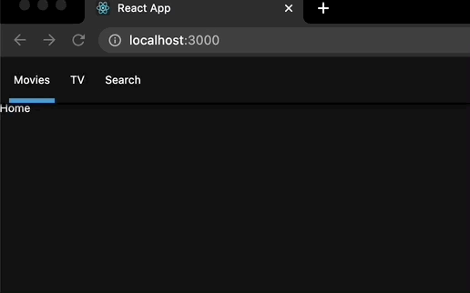

## Nomad React #1

#TIL/React

<br />

## Arrow Functions
argument 두 개 이상이면 괄호를 사용

```javascript
//Arrow Function은 리턴이 함축되어있다
const btn = document.querySelector("button");

const handleClick = event => console.log(event);

btn.addEventListener("click", handleClick);
```

<br />

<br />

## 

## Template Literals

템플릿들과 변수들, 문자열들을 다루기 좋은 방법
backticks를 사용한다
```javascript
const sayHello = (name="gnobaaaar") => `Hello ${name}`;
```


## Object Destructuring
### Structuring
새로운 변수들은 object에 기반하여 생성된다
`const {nationality : difName} = human` 으로 기존 변수 이름을 사용하지 않을 수도 있다 

```javascript
const human ={
	name:"gnobaaaar",
	nation : "US",
  age : 12,
	favFood : {
		dinner : 'kimchi',
		breakfast : 'none',
		lunch : 'hambuger'
	}
}
const name = human.name;
const nation = human.nation

// 같은 행동을 반복하므로 비효울적이다 -> structuring 사용
// 객체에 기반하여 변수 생성

const { name, nation, age: realAge, favFood : { dinner, breakfast, lunch} } = human;

console.log(name, nation);
```

<br /><br />

## Spread Operator

배열, Object, Argument, Function
```javascript
const days = ["Mon", "Tue", "Wed"];
const otherDays = ["Thu", "Fri", "Sat"];

const allDays = days + otherDays
//위의 방식은 두 배열을 string으로 만든다 (console.log 확인)

//Unpack을 우선 해주어야 한다

const allDays = [...days, ...otherDays]

//Object
const ob = {
	first : "hi",
	second : "hello"
}
const ab = {
	third : "bye bye"
}

const two = { ...ob, ...ab};

```

<br /><br />

## Classes

생성자를 통해 초기값으로 클래스를 생성한다
청사진과 같다 -> extends를 통해 확장이 가능하다

```javascript
class Human{
	constructor(name, lastName){
		this.name = name;
		this.lastName = lastName;
	}
}
const Jacoson = new Human("Jacoson", "Serro");
console.log(Jacoson.name);

//extends
const Baby extends Human{
	cry(){
		console.log('WAAAAAAAA');
	}
}

const myBaby = new Baby("Elies", "Kas");
console.log(myBaby.cry());
```

<br /><br />

## Array map
```javascript
const days = ["Mon", "Tue", "Wed", "Thurs", "Fri"];

const smileDays = days.map((day,index) => `🤣 #{index} ${day}`);
//arrow =>는 리턴을 함축하고 있다`

const addSmile = day => `🤣 ${potato}`;
cpmst smilingDays = days.map(addSmile);
```

<br /><br />

## Array filter

주어진 Function을 통과한 요소들로 배열을 만든다
map과 달리 살펴보고 true이면 배열에 넣는다

```javascript
const numbers = [2, 35, 12, 23, 33, 111, 3, 6, 90]
const biggerThan15 = numbers.filter(number => number > 15)

//위와 동일하다
const testCondition = (number) => number > 15;
const biggerThan15 = numbers.filter(testConditon);
```

<br /><br />

## ForEach and Include

각각의 아이템에 대해 어떠한 시행만 하는 것을 의미한다
로컬스토리지저장, API 실행 등 여러 곳에서 사용된다

```javascript
let posts = ["Hi", "Hello", "Bye"];

posts.forEach(post => console.log(post));

post.push("new")	//추가된다
```

```javascript
let posts = ["Hi", "Hello", "Bye"];

if(posts.includes("Hi")){
	posts.push("go");
}

console.log(posts);
```

<br />

<br />

## Set up
*npx*
`yarn global add npx`
`npm i npx -g`
`npx create-react-app app이름`

폴더 정리 후
.env파일 생성 -> `NODE_PATH = src`

`yarn add prop-types`

<br /><br />

## React Router
react-router-dom
`yarn add react-router-`dom`

<br />


## Hash Router
```javascript
import React from "react";
import { HashRouter as Router, Route } from "react-router-dom";
import Home from "Routes/Home";
import TV from "Routes/TV";
import Search from "Routes/Search";

export default () => (
  <Router>
    <Route path="/" exact component={Home} />
    <Route path="/tv" exact component={TV} />
    <Route path="/tv/popular" render={() => <h1>Popular</h1>} />
    <Route path="/search" exact component={Search} />
  </Router>
);
```

위에서 처럼 composition을 통해서 두 화면을 동시에 랜더링 할 수 있다

<br /><br />

## CSS in React
*styled-components*
`yarn add styled-components`
vscode 사용하시는 분들 extension에서 “vscode-styled-components” 설치

Header.js
```javascript
import React, { Component } from "react";
import styled from "styled-components";

const List = styled.ul`
  display: flex;
  &:hover {
    background-color: blue;
  }
`;

export default () => (
  <header>
    <List>
      <li>
        <a href="/">Movies</a>
      </li>
      <li>
        <a href="/tv">TV</a>
      </li>
      <li>
        <a href="/search">Search</a>
      </li>
    </List>
  </header>
);
```

<br />

*global화 시키기*
`yarn add styled-reset`

<br />

GlobalStyles.js -> App.js에 import시키고 사용 
```javascript
import { createGlobalStyle } from "styled-components";
import reset from "styled-reset";

const globalStyles = createGlobalStyle`
    ${reset};
    a{
       text-decoration:none;
        color: inherit;
    }
    *{
        box-sizing : border-box;
    }
    body{
        font-family: -apple-system, BlinkMacSystemFont, 'Segoe UI', Roboto, Oxygen, Ubuntu, Cantarell, 'Open Sans', 'Helvetica Neue', sans-serif;
        font-size:12px;
        background-color: rgba(20,20,20,1);
        color:white;
        padding-top:50px;
    }
`;

export default globalStyles;
```

*styled-components에 porps*
```javascript
import React, { Component } from "react";
import { Link } from "react-router-dom";
import styled from "styled-components";

const Header = styled.ul`
  color: white;
  position: fixed;
  top: 0;
  left: 0;
  width: 100%;
  height: 50px;
  display: flex;
  align-items: center;
  padding: 0px 10px;
  background-color: rgba(20, 20, 20, 0.8);
  z-index: 10;
  box-shadow: 0px 1px 5px 2px rgba(0, 0, 0, 0.8);
`;

const List = styled.ul`
  display: flex;
`;

const Item = styled.li`
  width: 50px;
  height: 50px;
  text-align : center;
  border-bottom: 5px solid ${(props) =>
    props.current ? "#3498db" : "transparent"};
  }
`;

const SLink = styled(Link)`
  height: 50px;
  display: flex;
  align-items: center;
  justify-content: center;
`;

export default () => (
  <Header>
    <List>
      <Item current={false}>
        <SLink to="/">Movies</SLink>
      </Item>
      <Item current={true}>
        <SLink to="/tv">TV</SLink>
      </Item>
      <Item current={false}>
        <SLink to="/search">Search</SLink>
      </Item>
    </List>
  </Header>
);
```

<br /><br />




위치를 어떻게 주어서 화면을 구성하는가?

### withRouter 사용
다른 컴포넌트를 감싸는 컴포넌트
```javascript
import React, { Component } from "react";
import { Link, withRouter } from "react-router-dom";
import styled from "styled-components";

const Header = styled.ul`
  color: white;
  position: fixed;
  top: 0;
  left: 0;
  width: 100%;
  height: 50px;
  display: flex;
  align-items: center;
  padding: 0px 10px;
  background-color: rgba(20, 20, 20, 0.8);
  z-index: 10;
  box-shadow: 0px 1px 5px 2px rgba(0, 0, 0, 0.8);
`;

const List = styled.ul`
  display: flex;
`;

const Item = styled.li`
  width: 50px;
  height: 50px;
  text-align: center;
  border-bottom: 5px solid
    ${(props) => (props.current ? "#3498db" : "transparent")};
  transition: border-bottom 0.5s linear;
`;

const SLink = styled(Link)`
  height: 50px;
  display: flex;
  align-items: center;
  justify-content: center;
`;

export default withRouter(({ location: { pathname } }) => (
  <Header>
    <List>
      <Item current={pathname == "/"}>
        <SLink to="/">Movies</SLink>
      </Item>
      <Item current={pathname == "/tv"}>
        <SLink to="/tv">TV</SLink>
      </Item>
      <Item current={pathname == "/search"}>
        <SLink to="/search">Search</SLink>
      </Item>
    </List>
  </Header>
));
```

위와 동일
```javascript
const HeaderComponent = (props) => {}
…
export default withRouter(HeaderComponent);
```

<br /><br />