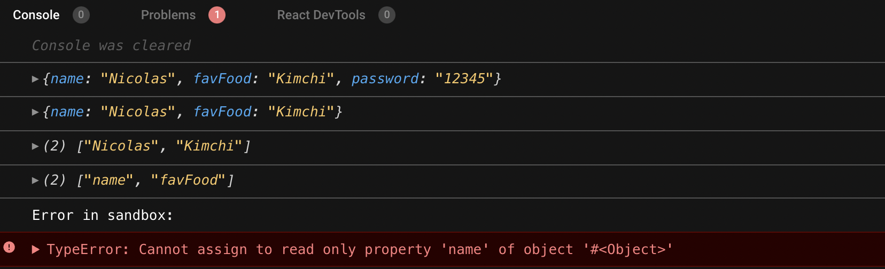
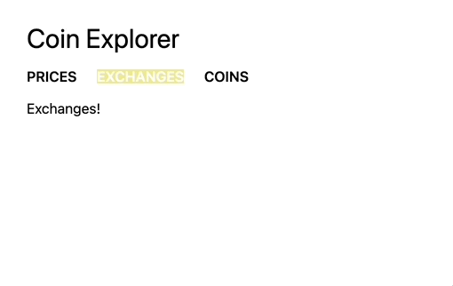

## Nomad Challenge #1


## day1 화면구현

* mergeObjects : spread 연산자를 사용합니다.  [참고 문서](https://developer.mozilla.org/en-US/docs/Web/JavaScript/Reference/Operators/Spread_syntax) 
* removePassword: rest 연산자를 사용합니다.  [참고 문서](https://developer.mozilla.org/ko/docs/Web/JavaScript/Reference/Functions/rest_parameters) 
* freezeObj : Object.freeze() 메서드를 사용합니다.  [참고 문서](https://developer.mozilla.org/ko/docs/Web/JavaScript/Reference/Global_Objects/Object/freeze) 
* getOnlyVlaues : Object.values() 메서드를 사용합니다.  [참고 문서](https://developer.mozilla.org/ko/docs/Web/JavaScript/Reference/Global_Objects/Object/values) 
* getOnlyProperties : Object.keys() 메서드를 사용합니다.  [참고 문서](https://developer.mozilla.org/en-US/docs/Web/JavaScript/Reference/Global_Objects/Object/keys) 



```javascript
class ObjectUtilities {
  static mergeObjects = (objectA, objectB) => ({ ...objectA, ...objectB });
  static removePassword = ({ password, ...rest }) => rest;
  static getOnlyProperties = obj => Object.keys(obj);
  static getOnlyValues = obj => Object.values(obj);
  static freezeObj = obj => Object.freeze(obj);
}

const objA = {
  name: "Nicolas",
  favFood: "Kimchi"
};

const objB = {
  password: "12345"
};

const user = ObjectUtilities.mergeObjects(objA, objB);
console.log(user);

const cleanUser = ObjectUtilities.removePassword(user);
console.log(cleanUser);

const frozenUser = ObjectUtilities.freezeObj(cleanUser);

const onlyValues = ObjectUtilities.getOnlyValues(frozenUser);
console.log(onlyValues);

const onlyProperties = ObjectUtilities.getOnlyProperties(frozenUser);
console.log(onlyProperties);

frozenUser.name = "Hello!"; // This should show an error
```

<br /><br />

## day2 화면구현

This is the desired output.


나의풀이

```javascript
class ArrayUtilities {
  /* Your magic here */
  static addZeros = (numbers) => (numbers.map((num) => parseInt(num + "0")));
  static moreThanFifty = (mores) => (mores.filter((more) => more > 50));
  static removeFirst = ([first, ...list]) => (list.map((n) => n));
  static sumAll = (array) => (array.reduce((accumulator, current) => accumulator + current, 0));
  static divide = (result) => (String(result).split(""));
}

const numbers = [1, 2, 3, 4, 5, 6, 7, 8, 9, 10];

const addZeros = ArrayUtilities.addZeros(numbers);
console.log(addZeros);

const moreThanFifty = ArrayUtilities.moreThanFifty(addZeros);
console.log(moreThanFifty);

const noFirst = ArrayUtilities.removeFirst(moreThanFifty);
console.log(noFirst);

const sumAll = ArrayUtilities.sumAll(noFirst);
console.log(sumAll);

const divided = ArrayUtilities.divide(sumAll);
console.log(divided);
```

* map(): 배열 내의 모든 요소 각각에 대하여 주어진 함수를 호출한 결과를 모아 새로운 배열을 반환합니다.  [참고 문서](https://developer.mozilla.org/ko/docs/Web/JavaScript/Reference/Global_Objects/Array/map) 
* filter(): 주어진 함수를를 통과하는 모든 요소를 모아 새로운 배열로 반환합니다.  [참고 문서](https://developer.mozilla.org/ko/docs/Web/JavaScript/Reference/Global_Objects/Array/filter) 
* rest 파라미터: 사용하여 첫번째 요소를 제외한 나머지를 rest로 정의해 반환합니다.  [참고 문서](https://developer.mozilla.org/ko/docs/Web/JavaScript/Reference/Functions/rest_parameters) 
* reduce(): 배열의 각 요소에 대해 주어진 리듀서(reducer) 함수를 실행하고, 하나의 결과값을 반환합니다.  [참고 문서](https://developer.mozilla.org/ko/docs/Web/JavaScript/Reference/Global_Objects/Array/Reduce) 
* split(): String 객체를 지정한 구분자를 이용하여 여러 개의 문자열로 나눕니다.  [참고 문서](https://developer.mozilla.org/ko/docs/Web/JavaScript/Reference/Global_Objects/String/split) 

<br/><br/>


## Day3 Link

Hash Router와 Link를 사용하여 화면구현

- Link는 Router 내부 코드에 존재해야한다


Headers.js

```javascript
import React from "react";
import { Link } from "react-router-dom";

export default () => (
  <header>
    <ul>
      <li>
        <Link to="/">Prices</Link>
      </li>
      <li>
        <Link to="/exchanges">Exchanges</Link>
      </li>
      <li>
        <Link to="/coins">Coins</Link>
      </li>
    </ul>
  </header>
);
```

Router.js

```javascript
import React from "react";
import {
  HashRouter as Router,
  Route,
  Redirect,
  Switch
} from "react-router-dom";
import Coins from "../Screens/Coins";
import Exchanges from "../Screens/Exchanges";
import Prices from "../Screens/Prices";

export default () => {
  return (
    <Switch>
      <Route path="/" exact component={Prices} />
      <Route path="/coins" component={Coins} />
      <Route path="/exchanges" component={Exchanges} />
      <Redirect from="*" to="/" />
    </Switch>
  );
};
```

index.js

```javascript
import React from "react";
import ReactDOM from "react-dom";
import { HashRouter } from "react-router-dom";
import App from "./Components/App";
const rootElement = document.getElementById("root");

ReactDOM.render(
  <HashRouter>
    <App />
  </HashRouter>,
  rootElement
);
```


<br /><br />

## Day4 styled-components

### styled-components

`yarn add styled-components`
vscode 사용하시는 분들 extension에서 “vscode-styled-components” 설치

<br />

*global화 시키기*
`yarn add styled-reset`

GlobalStyles.js -> App.js에 import시키고 사용 

<br />

### withRouter 사용
다른 컴포넌트를 감싸는 컴포넌트




GlobalStyles.js

```javascript
import { createGlobalStyle } from "styled-components";
import reset from "styled-reset";

const globalStyles = createGlobalStyle`
    ${reset};
    body{
        font-family: -apple-system, BlinkMacSystemFont, 'Segoe UI', Roboto, Oxygen, Ubuntu, Cantarell, 'Open Sans', 'Helvetica Neue', sans-serif;
        margin: 30px 30px;
    }
    
`;

export default globalStyles;
```

App.js

```javascript
import React from "react";
import Router from "./Router";
import GlobalStyles from "./GlobalStyles";

function App() {
  return (
    <>
      <div>
        <Router />
        <GlobalStyles />
      </div>
    </>
  );
}
export default App;
```

Header.js

```javascript
import React from "react";
import { Link, withRouter } from "react-router-dom";
import styled from "styled-components";

const Header = styled.ul`
  margin-bottom: 20px;
`;
const Title = styled.span`
  display: block;
  font-size: 30px;
  margin-bottom: 20px;
`;
const List = styled.ul`
  display: flex;
  width: 250px;
  justify-content: space-between;
`;
const Item = styled.li`
  background-color: ${(props) => (props.current ? "khaki" : "transparent")};
`;
const SLink = styled(Link)`
  text-transform: uppercase;
  text-decoration: none;
  font-weight: 600;
  color: ${(props) => (props.current ? "white" : "black")};
`;

export default withRouter(({ location: { pathname } }) => (
  <Header>
    <Title>Coin Explorer</Title>
    <List>
      <Item current={pathname == "/"}>
        <SLink current={pathname == "/"} to="/">
          Prices
        </SLink>
      </Item>
      <Item current={pathname == "/exchanges"}>
        <SLink current={pathname == "/exchanges"} to="/exchanges">
          Exchanges
        </SLink>
      </Item>
      <Item current={pathname == "/coins"}>
        <SLink current={pathname == "/coins"} to="/coins">
          Coins
        </SLink>
      </Item>
    </List>
  </Header>
));
```

/Routes/Detail.js

```javascript
export default () => "Detail";
```

<br />

<br/>
