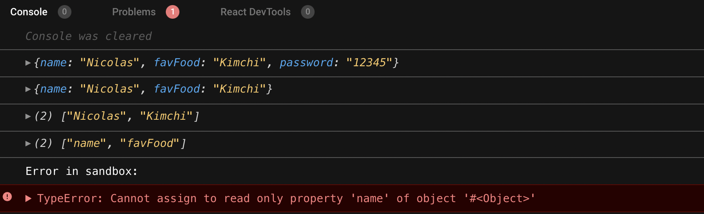
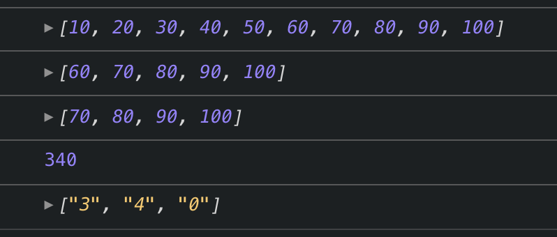

## Nomad Challenge #1


## day1 화면구현

* mergeObjects : spread 연산자를 사용합니다.  [참고 문서](https://developer.mozilla.org/en-US/docs/Web/JavaScript/Reference/Operators/Spread_syntax) 
* removePassword: rest 연산자를 사용합니다.  [참고 문서](https://developer.mozilla.org/ko/docs/Web/JavaScript/Reference/Functions/rest_parameters) 
* freezeObj : Object.freeze() 메서드를 사용합니다.  [참고 문서](https://developer.mozilla.org/ko/docs/Web/JavaScript/Reference/Global_Objects/Object/freeze) 
* getOnlyVlaues : Object.values() 메서드를 사용합니다.  [참고 문서](https://developer.mozilla.org/ko/docs/Web/JavaScript/Reference/Global_Objects/Object/values) 
* getOnlyProperties : Object.keys() 메서드를 사용합니다.  [참고 문서](https://developer.mozilla.org/en-US/docs/Web/JavaScript/Reference/Global_Objects/Object/keys) 



```javascript
class ObjectUtilities {
  static mergeObjects = (objectA, objectB) => ({ ...objectA, ...objectB });
  static removePassword = ({ password, ...rest }) => rest;
  static getOnlyProperties = obj => Object.keys(obj);
  static getOnlyValues = obj => Object.values(obj);
  static freezeObj = obj => Object.freeze(obj);
}

const objA = {
  name: "Nicolas",
  favFood: "Kimchi"
};

const objB = {
  password: "12345"
};

const user = ObjectUtilities.mergeObjects(objA, objB);
console.log(user);

const cleanUser = ObjectUtilities.removePassword(user);
console.log(cleanUser);

const frozenUser = ObjectUtilities.freezeObj(cleanUser);

const onlyValues = ObjectUtilities.getOnlyValues(frozenUser);
console.log(onlyValues);

const onlyProperties = ObjectUtilities.getOnlyProperties(frozenUser);
console.log(onlyProperties);

frozenUser.name = "Hello!"; // This should show an error
```


## day2 화면구현

This is the desired output.

