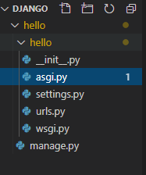
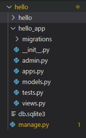

## Django

- 파이썬 언어 기반 프레임워크

- 다양한 라이브러리 제공
- MVC Pattern 기반의 개발환경 제공
- admin 페이지도 기본으로 제공

- 설치
  - python 3.x 설치 http://python.org
  - pip 설치 : python -m pip install Django


### Django First Project

- django-admin startproject hello



- 프로젝트 이름과 같은 폴더 생성(project 관련된 config 모듈 파일들)
- manage.py : Django command line 명령을 실행하기 위한 모듈제공
  - python manage.py [django명령어] -> excute 된다

- Setting.py


**프로젝트 생성**




```
python manage.py startapp hello_app
```

- 폴더 밑에 hello_app으로 생성된다
- application/migrations -> modules.py와 mapping Databvase migration 결과 파일들 저장위치

- 어플리케이션 이름의 패키지가 구성된다(application을 위한 module 포함)
  - modules.py -> **entity**
  - view.py -> **controller**
  - ./templates/*.html -> **view ** (추가)
  - urls.py 추가해서 -> request 들어오는 요청 url별로 views.py의 함수를 mapping (추가)

- 프로젝트의 생성 -> [application 생성] * -> project에 application 등록

- **최종출력**

  ```
  Hello, world. You're at the polls index.
  ```


0. setting.py, project urls.py 수정 
     2. todo_with_django repository에 Todo project생성
     2. Todo project에 my_todo_app application 생성  
     3. HTML/CSS Javascript 수업에서 작성한 todo  
        index.html, js/todo.js 파일을 templates로 하는 App작성
     4. TodoModel : id, content - makemigration, migrate
     5. views(Controller) 작성(index, createTodo, deleteTodo, clearTodo)
     6. templates(View) 수정
     7. application의 urls.py 작성

Django 한그릇 뚝딱 마스터 해보기


**.gitignore**

캐시파일 때문에 사용한다


템플릿에서 % -> 파이썬 코드


0. `django-admin startproject 프로젝트명` -> `.gitignore` -> 내부에 `__pycache__`

1. `python manage.py startapp 앱명`

2. setting.py(기존 프로젝트)안의 INSTALLED_APPS에 앱명 추가

3. ToDoLust의 url.py

   ```python
   from django.contrib import admin
   from django.urls import path, include #include 추가
   
   urlpatterns = [
       path('admin/', admin.site.urls),
       #추가
       path('', include('my_to_do_app.urls'))
   ]
   ```

   

4. my_to_do_app의 urls.py


[예제로 배우는 파이썬 프로그래밍 - Static 파일 (pythonstudy.xyz)](http://pythonstudy.xyz/python/article/314-Static-파일)